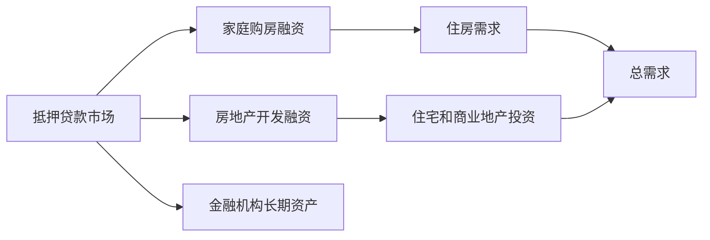
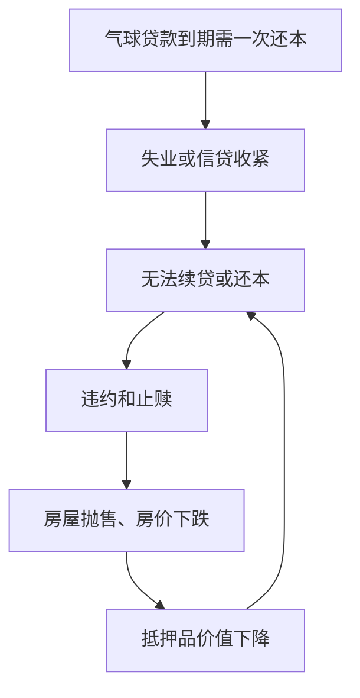

# 23.1 抵押贷款的定义与特征

来源：

- 主线：Mishkin/Eakins Ch.14
- 补充：Mishkin《货币金融学》Ch.12 中 2007-2009 危机、CDO、CDS 案例
- 延伸：Bodie/Kane/Marcus《Investments》Ch.14, Ch.16

## 为什么需要抵押贷款市场

住房是多数家庭一生中最大的支出之一。很少有人能在年轻时一次性支付全部购房款。如果没有长期借款，大多数家庭只能到很晚才可能拥有住房。抵押贷款市场的作用，就是把家庭未来多年收入提前转化为今天购买住房的能力。

企业和开发商也需要抵押贷款。房地产开发商可能用抵押贷款建设办公楼，企业可能用商业地产贷款购买厂房或经营场所。与债券和股票类似，抵押贷款也是资本市场的一部分，因为它提供长期资金；但它又有明显不同。债券市场的主要借款人常是政府和大型企业，股票市场只有公司发行股权；抵押贷款市场中，最典型的借款人是家庭。

抵押贷款市场因此连接了家庭资产负债表、房地产市场、银行体系和宏观经济。抵押贷款利率下降，家庭购房能力上升，住房需求增加，建筑业和耐用品消费可能扩张；抵押贷款利率上升，月供增加，住房需求下降，房地产投资和相关消费可能放缓。

正因为抵押贷款和家庭、银行、房地产价格紧密相连，它一旦出问题，也会成为金融危机的核心传播渠道。

## 抵押贷款是什么

抵押贷款是以房地产作担保的长期贷款。借款人获得资金购买或建设房地产，并承诺在未来按期支付本金和利息。如果借款人违约，贷款人可以依照合同和法律程序取得或出售抵押房地产，用所得弥补贷款损失。

“抵押”意味着贷款不是只依靠借款人信用，而是有具体资产作为担保。家庭购房贷款通常以所购住房作为担保，商业地产贷款可以以办公楼、商铺或其他房地产作为担保。担保品降低了贷款人的风险，因为即使借款人不能偿还，贷款人仍有资产可以处置。

抵押贷款通常是摊还贷款。摊还是指借款人在贷款期限内逐步偿还本金和利息，到期时贷款完全还清。现代住房抵押贷款通常不是到期一次还本，而是每月支付固定或可调整金额，逐步减少未偿本金。

| 特征 | 含义 |
| --- | --- |
| 长期贷款 | 期限通常较长，如 15 年或 30 年 |
| 房地产担保 | 房产作为贷款抵押品 |
| 分期偿还 | 通过本金和利息支付逐步还清 |
| 违约处置 | 借款人违约时，贷款人可通过抵押品回收部分价值 |

## 抵押贷款和债券有什么不同

抵押贷款和债券都是债务工具，但它们的市场结构不同。

债券通常是标准化证券，面值、票息、到期日和交易单位相对清楚。公司债或国债可以在二级市场由投资者买卖。抵押贷款则高度个性化。每个借款人的收入、信用记录、房屋位置、贷款金额、首付比例、利率条款和到期日都可能不同。

这种差异使抵押贷款更难直接交易。一个机构投资者购买一张公司债时，不需要分析某个家庭的工资、信用分数和房屋状态；但购买单笔抵押贷款时，这些信息都很重要。抵押贷款还需要持续服务：每月收款、记录本金余额、处理税费和保险、管理拖欠和提前还款。

因此，抵押贷款市场后来发展出二级市场和证券化，把许多小额、非标准化贷款组合起来，变成更适合机构投资者购买的证券。后面几节会详细解释这个过程。

## 抵押贷款的历史问题：气球贷款

现代住房抵押贷款并不是一开始就存在。早期抵押贷款市场主要服务企业和富人，普通家庭很难获得长期贷款。大萧条前，许多住房贷款是气球贷款。借款人在三到五年内只支付利息，到期时必须一次性偿还全部本金。

如果经济正常，贷款人可能愿意续贷，借款人就继续支付利息。但如果借款人失业、房价下跌或金融机构收紧信贷，贷款人不愿续贷，借款人就必须一次性还清本金。多数家庭无法做到，只能违约。

大萧条期间，失业上升，大量借款人无法偿还或续借气球贷款，房屋被止赎出售，房价进一步下跌，抵押贷款机构遭受损失并倒闭。房价下跌又使更多抵押品价值不足，形成恶性循环。

后来政府介入重组抵押贷款市场，把拖欠的气球贷款转换为可以长期分期偿还的贷款。现代摊还式房贷的普及，正是对这种历史风险的回应。

## 抵押贷款利率由什么决定

抵押贷款利率是家庭决定能借多少、向谁借款时最重要的因素之一。它通常受三个因素影响：长期市场利率、贷款期限和折扣点。

长期市场利率来自长期资金的供求。抵押贷款利率通常高于长期国债利率，因为国债违约风险较低、流动性更高，而抵押贷款有信用风险、提前还款风险和服务成本。但抵押贷款利率通常会跟随长期国债利率同向变化。长期国债收益率上升，抵押贷款利率通常也上升；长期国债收益率下降，抵押贷款利率通常也下降。

贷款期限也影响利率。30 年期房贷通常利率高于 15 年期房贷，因为贷款期限越长，贷款人面临的利率风险和不确定性越大。15 年期贷款月供更高，但总利息支出更少；30 年期贷款月供较低，但借款人支付利息的时间更长。

折扣点是借款人在贷款开始时支付的前期利息。一个点通常等于贷款金额的 1%。借款人支付点数，可以换取较低贷款利率。是否划算取决于借款人持有贷款多长时间。如果很快卖房或再融资，前期点数来不及通过较低月供收回，可能不划算；如果长期持有，较低利率节省的利息可能超过点数成本。

## 抵押品和留置权

抵押贷款最重要的保护机制是抵押品。贷款人会在房地产产权上登记留置权。留置权是一种公开记录，说明该房产是某笔贷款的担保。如果借款人违约，贷款人有权通过法律程序出售房产以偿还贷款。

留置权还影响房产转让。借款人不能简单地把房子卖给别人并让贷款人失去担保。买方如果要获得清晰产权，通常必须确保原贷款被清偿。因此，产权调查和产权保险成为房产交易中的重要环节。产权调查会检查房产上是否存在留置权或其他权利负担，产权保险则保护买方免受产权问题损失。

抵押品降低了贷款人损失，但不能完全消除风险。如果房价大幅下跌，房屋出售所得可能低于贷款余额；如果止赎成本高、时间长，贷款人仍可能遭受损失。

## 首付和道德风险

首付是借款人用自有资金支付的一部分购房款。贷款只覆盖剩余部分。首付的经济功能，是让借款人对房产有自己的权益投入，从而降低违约意愿。

如果借款人没有首付，房价只要小幅下降，贷款余额就可能超过房屋价值。此时借款人继续还款的激励下降，因为他已经没有多少自有资本在房子里。如果借款人失业或收入下降，更容易选择违约。相反，首付越高，借款人损失自有资金的风险越大，越不愿轻易违约。

这正是道德风险问题。借款人获得贷款后，行为会影响贷款风险。首付让借款人承担一部分损失，使其利益和贷款人更一致。

2000 年代中期，许多贷款通过第二抵押贷款或“piggyback loan”绕开首付要求，实现接近 100% 融资。房价上涨时，这似乎扩大了购房机会；房价下跌时，大量借款人发现房屋价值低于贷款余额，更容易违约。这为后来的次贷危机埋下风险。

## 私人抵押贷款保险

贷款人还会通过私人抵押贷款保险，即 PMI，降低损失。PMI 是一种保险，如果借款人违约且房产价值不足以偿还贷款，保险公司赔付差额的一部分。

通常，当贷款价值比超过 80% 时，贷款人会要求借款人购买 PMI。贷款价值比是贷款余额与房屋价值之比。如果房价为 100 万美元，贷款为 90 万美元，贷款价值比就是 90%。首付越低，贷款价值比越高，贷款人越需要额外保护。

PMI 保护的是贷款人，而不是借款人的信用记录。借款人违约后，违约仍会影响信用记录；PMI 只是减少贷款人的经济损失。

PMI 的存在说明抵押贷款风险可以被分担，但不能消失。保险公司承担一部分信用风险；如果整个房地产市场同时下跌，大量贷款违约，保险公司也可能承压。

## 借款人资格和信用评分

贷款人在发放抵押贷款前，会评估借款人是否有能力还款。传统标准包括收入、债务负担、信用记录、资产和房产价值。一个常见经验规则是，房贷月供加税费保险不应超过月收入的一定比例，总债务月供也不应超过收入的一定比例。

信用评分帮助贷款人衡量借款人信用风险。FICO 分数是常见信用评分，考虑还款历史、当前债务、信用历史长度、新信用申请和信用类型等因素。分数越高，通常表示信用风险越低；分数低，贷款人可能拒绝贷款或要求更高利率。

借款人资格审核本质上是控制逆向选择。贷款人希望区分更可能还款的借款人和更可能违约的借款人。如果审核放松，短期内贷款数量增加，住房需求上升；但长期可能积累大量违约风险。

次贷危机前，一些贷款弱化收入和资产核实，出现 No Doc 或 NINJA 贷款，即不充分核实收入、工作和资产。它们建立在一个危险假设上：房价不会明显下跌，即使借款人还不起，也可以卖房或再融资。房价一旦下跌，这个假设就失效。

## 抵押贷款和宏观经济

抵押贷款市场对宏观经济影响很大。住房投资是总需求的一部分，购房还带动家具、家电、装修和地方服务需求。房价上涨会提高家庭财富，可能刺激消费；房价下跌会削弱家庭资产负债表，压低消费和信贷能力。

抵押贷款也影响金融机构资产负债表。银行、储蓄机构、保险公司、养老金、政府支持机构和证券投资者都可能持有抵押贷款或抵押贷款支持证券。如果抵押贷款违约率上升，金融机构资产价值下降，资本受损，信贷供给收缩，实体经济受到影响。

从货币政策角度看，抵押贷款利率是政策传导的重要渠道。中央银行降低短期利率，可能通过长期利率和抵押贷款利率影响住房需求；长期利率上升，则会提高月供、压低住房可负担性。

从投资和风险管理角度看，抵押贷款首先是家庭部门的杠杆。贷款价值比 LTV 衡量房价下跌时抵押品安全垫有多厚，债务收入比 DTI 衡量收入冲击下月供是否可承受。LTV 高、DTI 高、收入波动大时，房价和就业的小冲击就可能转化为违约。抵押贷款风险因此不能只看单笔借款人信用，还要看房价周期、就业周期和家庭资产负债表是否共同恶化。

## 小结

抵押贷款是以房地产为担保的长期贷款，通常通过分期本金和利息支付逐步摊还。它属于资本市场的一部分，但和债券、股票不同，借款人常是家庭，贷款金额、期限和风险高度个性化。

抵押贷款合约通过抵押品、留置权、首付、PMI 和借款人资格审核来降低违约风险。首付减少道德风险，信用评分和收入审核减少逆向选择，抵押品和保险降低贷款人损失。

抵押贷款市场与宏观经济紧密相连。抵押贷款利率影响住房需求和房地产投资，房价变化影响家庭财富和金融机构资产负债表。正因为这种连接，抵押贷款市场的风险积累可能转化为系统性金融危机。

## 自测问题

- 抵押贷款和普通公司债券有什么不同？
- 为什么早期气球贷款在大萧条中加剧了违约？
- 抵押贷款利率主要受哪些因素影响？
- 留置权如何保护贷款人？
- 首付为什么可以降低借款人的道德风险？
- PMI 保护的是借款人还是贷款人？
- 抵押贷款市场通过哪些渠道影响宏观经济？
- 为什么 LTV 和 DTI 是评估抵押贷款风险时必须同时看的指标？
