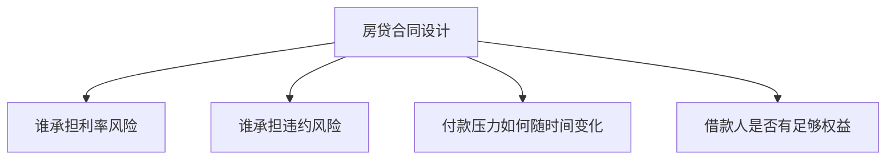

# 23.2 固定利率房贷、可调利率房贷与其他房贷类型

来源：

- 主线：Mishkin/Eakins Ch.14
- 补充：Mishkin《货币金融学》Ch.12 中 2007-2009 危机、CDO、CDS 案例
- 延伸：Bodie/Kane/Marcus《Investments》Ch.14, Ch.20

## 房贷类型为什么会不同

抵押贷款的基本功能相同：借款人现在获得资金购买房地产，未来用收入逐步偿还。但不同借款人的收入路径、风险承受能力和购房目的不同，贷款人面对的利率风险、信用风险和提前还款风险也不同。于是，市场发展出多种房贷合同。

房贷类型的差异，核心在于风险如何分配。

如果利率固定，借款人知道未来月供，预算稳定；贷款人承担市场利率上升导致旧贷款价值下降的风险。如果利率可调整，贷款人把一部分利率风险转给借款人；借款人初期利率可能较低，但未来月供可能上升。其他创新型房贷则在初期付款、还款速度、首付要求和住房权益使用上做不同安排。

理解各种房贷，不是记名称，而是看它改变了哪一种风险。

## 固定利率房贷

固定利率房贷是最直观的抵押贷款。借款人在贷款期限内支付固定利率，月供通常也保持不变。常见期限是 15 年和 30 年。

固定利率房贷对借款人有明显好处。借款人知道未来每月需要支付多少，家庭预算更稳定。如果市场利率上升，借款人的旧贷款利率不变，不会因为外部利率变化而增加月供。

但这种稳定性意味着贷款人承担利率风险。贷款人发放一笔 30 年固定利率贷款后，如果市场利率上升，旧贷款支付的利息低于新贷款，旧贷款的市场价值下降。长期固定利率资产对利率变化非常敏感，前面债券章节中的利率风险在房贷中同样存在。

固定利率房贷还给借款人一个隐含优势：如果市场利率下降，借款人可以再融资，用新低利率贷款偿还旧贷款。这样，利率上升时借款人受保护，利率下降时借款人有机会受益。对贷款人和抵押贷款证券投资者来说，这意味着提前还款风险。

## 固定利率房贷的期限选择

15 年和 30 年固定利率房贷的主要差异在月供、总利息和利率风险。

30 年房贷期限长，月供较低，因此更多家庭能够负担。但本金偿还速度慢，总利息支出高。15 年房贷月供较高，但本金偿还快，总利息支出少，贷款人承担的期限风险较低，因此利率通常低于 30 年房贷。

| 类型 | 月供 | 总利息 | 利率通常 | 适合情形 |
| --- | --- | --- | --- | --- |
| 30 年固定利率 | 较低 | 较高 | 较高 | 希望降低月供、提高购房能力 |
| 15 年固定利率 | 较高 | 较低 | 较低 | 收入较高、希望快速还清贷款 |

这也是家庭跨期选择问题。选择 30 年房贷，等于把还款负担分散到更长未来，释放当前现金流；选择 15 年房贷，则牺牲当前现金流，换取更少利息和更快积累住房权益。

## 可调利率房贷

可调利率房贷，即 ARM，把贷款利率与某个市场利率挂钩，并定期调整。合同通常会规定参考利率、加点幅度、调整频率和利率上限。比如，某 ARM 可以规定利率等于国库券平均利率加 2%，并设置每年最多上调 2%、整个贷款期间最多上调 6% 的上限。

ARM 对贷款人更有吸引力，因为它降低利率风险。市场利率上升时，贷款利率随之调整，贷款人的资产收益提高，旧贷款价值不会像固定利率贷款那样大幅下降。

借款人通常更喜欢固定利率，因为固定月供带来安全感。为了吸引借款人选择 ARM，贷款人常提供较低初始利率。借款人因此在初期支付更低月供，但承担未来利率上升的风险。

| 风险/收益 | 固定利率房贷 | 可调利率房贷 |
| --- | --- | --- |
| 借款人月供 | 稳定 | 随利率变化 |
| 借款人利率风险 | 较低 | 较高 |
| 贷款人利率风险 | 较高 | 较低 |
| 初始利率 | 通常较高 | 通常较低 |

ARM 的核心问题不是它本身危险，而是借款人是否真正理解未来付款可能上升。如果借款人只看初始低利率，而没有能力承受调整后的月供，就会埋下违约风险。

## Teaser 利率和 2/28 ARM

次贷扩张时期，一种常见产品是 2/28 ARM。它在前 2 年提供较低固定利率，之后 28 年利率变为可调整，常常显著上升。前两年的低利率也叫 teaser rate，像“诱导利率”一样降低最初月供，让借款人看起来能够负担。

在房价持续上涨时，这种结构似乎可行。借款人可以在利率重置前出售房屋或再融资；贷款人和经纪人也相信房价上涨能保护抵押品价值。但如果房价停止上涨甚至下跌，借款人无法轻易卖房或再融资，利率重置后月供上升，违约风险急剧增加。

这说明，房贷合同的风险不能只看第一年月供，而要看整个生命周期中的付款路径。

## 受保房贷和传统房贷

房贷也可以分为受保房贷和传统房贷。

受保房贷由银行或其他贷款机构发放，但由政府机构担保，例如 FHA 或 VA。符合条件的借款人可以用较低首付甚至零首付获得贷款。政府担保降低贷款人损失风险，因此扩大了部分家庭获得住房融资的机会。

传统房贷没有政府担保。贷款人要自行承担借款人违约风险，或要求借款人购买私人抵押贷款保险。若贷款价值比较高，贷款人通常会要求 PMI。

受保房贷的政策目标是扩大住房可得性，尤其是服务低收入家庭、首次购房者或退伍军人。但低首付也意味着借款人自有权益较少，如果房价下跌，违约激励可能增强。因此，即使有担保，也仍需要合理承保标准。

## 渐进支付房贷

渐进支付房贷，即 GPM，适合预期未来收入会上升的借款人。它在前几年提供较低月供，之后月供逐步上升。年轻专业人士或收入成长性较高的家庭，可能希望用这种贷款提前购买合适住房。

GPM 的优点是初期付款压力小，借款人可以获得更大贷款或更早买房。缺点是付款上升不一定和收入上升同步。如果借款人收入没有按预期增长，后期月供会变成负担。

有些 GPM 初期付款甚至不足以覆盖当期利息，未支付利息会加入本金，导致贷款余额上升。这被称为负摊还。负摊还使借款人初期压力更小，但未来债务负担更重。

GPM 的风险来自对未来收入的乐观预期。只要收入增长实现，它可以平滑住房消费；如果收入增长落空，它会把风险推迟到未来。

## 增长权益房贷

增长权益房贷，即 GEM，也有逐步增加的月供，但目的和 GPM 不同。GPM 的目的通常是降低早期付款、帮助借款人通过资格审核；GEM 的目的则是更快还清贷款。

GEM 初始付款可能和传统房贷类似，之后付款逐步增加，增加的部分更多用于偿还本金。这样，贷款寿命缩短，借款人更快积累住房权益，总利息支出减少。

如果借款人收入预计上升，并且希望快速还债，GEM 可能合适。它的风险是未来付款增加具有强制性。如果收入没有增长，借款人仍要按合同支付更高金额。

| 类型 | 初期付款 | 后期付款 | 主要目的 |
| --- | --- | --- | --- |
| GPM | 较低 | 上升 | 帮助借款人初期负担更低 |
| GEM | 正常或较低 | 上升 | 更快偿还本金、缩短贷款期限 |

## 第二抵押贷款和 Piggyback 贷款

第二抵押贷款是以同一房产作为担保的第二笔贷款。它排在第一抵押贷款之后。如果借款人违约并出售房产，第一抵押贷款先受偿，剩余价值才支付第二抵押贷款。因此，第二抵押贷款风险更高，利率通常也更高。

第二抵押贷款有合理用途。房主已经还贷多年，房屋价值高于贷款余额，积累了住房权益。此时，他可以用第二抵押贷款把部分住房权益转化为现金，用于装修、教育或其他支出。相比整体再融资，第二抵押贷款有时成本更低。

但第二抵押贷款也被用于绕开首付要求。次贷扩张时期，一些借款人用第一抵押贷款覆盖房价 80%，再用第二抵押贷款覆盖剩余 20%，实现零首付。这种 piggyback 结构避免了 PMI，也让借款人几乎没有自有权益。房价下跌时，借款人更容易陷入负权益并违约。

这里的关键不是第二抵押贷款本身，而是它是否建立在真实住房权益基础上。已有权益支持的第二抵押贷款，与零首付购房时叠加出来的第二抵押贷款，风险完全不同。

## 反向年金抵押贷款

反向年金抵押贷款，即 RAM，适合一些退休家庭。普通房贷是借款人每月向贷款人付款；RAM 则相反，贷款人按月向房主支付资金，贷款余额逐步增加，并以房屋作为担保。借款人通常不在生前偿还，房屋出售或借款人去世后，用房产价值偿还贷款。

RAM 的作用是把住房权益转化为退休现金流。许多退休者拥有住房但现金收入有限，不愿出售房屋搬离。RAM 允许他们继续居住，同时用房屋权益补充生活开支。

RAM 的风险在于费用、利率、房价变化和剩余权益不确定。它适合某些现金流紧张但拥有住房权益的退休者，但需要谨慎理解合同条款。

## 房贷创新的边界

房贷创新可以改善融资可得性。固定利率房贷提供稳定性，ARM 降低初始利率，GPM 帮助收入预期上升者提前购房，GEM 帮助借款人更快还清贷款，RAM 帮助退休者释放住房权益。

但创新也可能掩盖风险。降低初期付款、减少首付、弱化收入核实、依赖未来再融资或房价上涨，都可能让借款人在合同早期看似负担得起，却在未来暴露巨大违约风险。

判断一种房贷是否稳健，要看三个问题：

第一，借款人是否能承受整个贷款周期的付款，而不是只承受初期付款。

第二，借款人是否有真实权益投入，房价下跌时是否仍有还款激励。

第三，贷款人或投资者是否真正承担风险，还是通过出售贷款把风险转移给不了解底层质量的人。

这些问题会在证券化和次贷危机中变得更加重要。

房贷类型也可以用内含期权理解。固定利率房贷通常允许借款人提前还款，相当于借款人持有一个在利率下降时再融资的期权；贷款人和 MBS 投资者则卖出了这个期权。ARM 把利率风险更多转给借款人，使贷款资产久期较短，但增加借款人的付款冲击风险。GPM、GEM、第二抵押贷款和 RAM 则分别改变现金流时间、权益积累和住房资产变现方式。合同创新的核心，是期权价值和风险在借款人、贷款人和投资者之间重新分配。

## 小结

固定利率房贷让借款人获得稳定月供，但贷款人承担较大利率风险；可调利率房贷把部分利率风险转给借款人，因此通常提供较低初始利率。ARM 本身不是问题，问题在于借款人是否理解并能承受未来利率调整。

受保房贷通过政府担保扩大住房融资可得性，传统房贷则更多依赖借款人首付、信用和 PMI。GPM、GEM、第二抵押贷款和 RAM 都是为不同收入路径和资金需求设计的房贷形式，但如果被用于绕开风险控制，就可能放大违约。

房贷类型的本质，是在借款人、贷款人、保险方和投资者之间重新分配利率风险、信用风险、付款压力和住房权益风险。

## 自测问题

- 固定利率房贷和可调利率房贷分别把利率风险分配给谁？
- 为什么 30 年固定利率房贷通常利率高于 15 年房贷？
- 2/28 ARM 为什么在房价下跌时特别危险？
- 受保房贷和传统房贷的区别是什么？
- GPM 和 GEM 都有递增付款，它们的目的有什么不同？
- 第二抵押贷款在什么情况下是合理使用？在什么情况下会放大风险？
- 判断一种房贷创新是否稳健，应关注哪些问题？
- 为什么固定利率房贷的提前还款权可以被看作借款人持有的期权？
