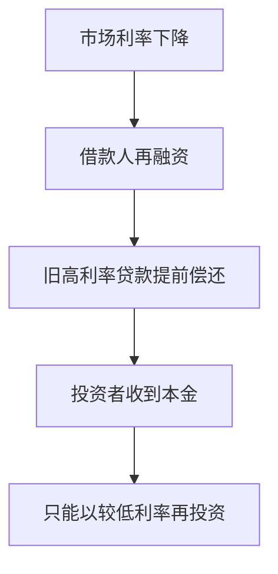

# 23.3 房贷摊还、房贷利率与贷款机构

来源：

- 主线：Mishkin/Eakins Ch.14
- 补充：Mishkin《货币金融学》Ch.12 中 2007-2009 危机、CDO、CDS 案例

## 月供为什么不等于“平均还本金”

很多借款人以为，每个月支付固定月供，本金也会按相对平均的速度下降。实际并非如此。摊还式房贷的月供虽然可以固定，但每个月月供中用于支付利息和偿还本金的比例会变化。

贷款初期，未偿本金很高，所以当月利息也高。固定月供中大部分用于支付利息，只有很小一部分用于减少本金。随着本金逐步下降，每月利息减少，月供中用于偿还本金的部分才逐渐增加。

这就是为什么许多借款人还了几年房贷，却发现贷款余额下降不多。问题不在于月供“没有用”，而在于贷款初期资金成本主要体现为利息。

理解摊还结构，有助于理解 15 年和 30 年房贷、提前还款、再融资和住房权益积累。

## 什么是完全摊还

完全摊还是指借款人的定期付款会在贷款到期时正好还清全部本金和利息。现代固定支付房贷通常是完全摊还贷款。

假设一笔 30 年房贷，每月付款固定。每次付款先覆盖当期利息，剩余部分减少本金。下一期利息按新的未偿本金计算。只要借款人按计划支付，到第 360 次付款后贷款余额为零。

可以用一笔 30 年、13 万美元、年利率 8.5% 的贷款理解。每月付款约 999.59 美元。第一期付款中，约 920.83 美元用于支付利息，只有约 78.75 美元用于偿还本金。到第 60 期，也就是 5 年后，贷款余额仍然约为 124,137 美元。前五年支付了大量月供，但本金下降有限。

| 时间 | 月供结构的典型变化 |
| --- | --- |
| 初期 | 利息占比高，本金下降慢 |
| 中期 | 利息占比下降，本金偿还加快 |
| 后期 | 大部分月供用于本金 |

这说明，房贷期限越长，早期本金下降越慢。借款人如果在持有几年后卖房，积累的住房权益可能主要来自房价上涨和首付，而不一定来自本金偿还。

## 期限对总利息的影响

同样贷款金额，15 年房贷的月供高于 30 年房贷，但总利息大幅低于 30 年房贷。原因很直接：本金更快偿还，未偿本金余额下降更快，未来计息基础更小。

以教材中的例子为直觉，如果一笔贷款从 30 年改为 15 年，月供会明显增加，但整个贷款生命周期可以节省大量利息。许多借款人选择 30 年房贷，是因为当前月供约束更重要；选择 15 年房贷，则是愿意承担更高月供以减少长期利息支出。

这是典型的跨期权衡。30 年房贷提高当前住房可负担性，但未来支付更多利息；15 年房贷牺牲当前现金流，但更快积累净资产。

| 选择 | 当前现金流压力 | 本金偿还速度 | 总利息 |
| --- | --- | --- | --- |
| 30 年贷款 | 较低 | 较慢 | 较高 |
| 15 年贷款 | 较高 | 较快 | 较低 |

借款人的最佳选择取决于收入稳定性、其他投资机会、风险承受能力和持有房屋时间。

## 提前还款和再融资

许多抵押贷款允许提前还款。借款人可以额外支付本金，缩短贷款期限并减少总利息。增长权益房贷可以看成合同规定的提前加速还本；普通 30 年房贷如果没有提前还款罚金，借款人也可以自愿多还本金。

再融资是另一种提前还款。借款人用一笔新贷款偿还旧贷款，通常发生在市场利率下降时。假设借款人原来有 7% 固定利率房贷，后来市场利率降到 5%，他可能通过再融资降低月供或缩短期限。

对借款人来说，提前还款和再融资是灵活性；对贷款人和抵押贷款证券投资者来说，这是提前还款风险。利率下降时，贷款人最希望继续收取高利息，但借款人偏偏会提前还掉高利率贷款；利率上升时，借款人不愿提前还款，贷款人只能继续持有低利率资产。

这种不对称性是抵押贷款投资和 MBS 定价的重要难点。

## 房贷利率和长期利率

抵押贷款利率通常与长期国债收益率同向变化，但高于国债收益率。国债被视为违约风险极低且流动性很高的长期基准；抵押贷款有借款人违约风险、提前还款风险、服务成本和较低流动性，因此需要更高收益率补偿。

抵押贷款利率还受贷款期限影响。长期固定利率贷款给贷款人带来更大利率风险，所以通常利率更高。可调利率贷款把部分利率风险转给借款人，初始利率通常较低。

折扣点也会影响借款人实际成本。借款人支付前期点数换取较低名义利率，如果持有贷款时间长，可能划算；如果很快卖房或再融资，前期成本摊销时间短，实际年化成本可能更高。

因此，比较房贷不能只看合同利率，还要看点数、费用、期限、提前还款可能和预期持有时间。

## 贷款机构为什么会变化

早期住房金融主要依赖储蓄贷款协会等 thrift institutions。这些机构吸收短期存款，再发放长期固定利率房贷。这个模式在利率稳定时可以运行良好：存款成本稳定，房贷收益稳定，利差足够覆盖成本。

问题出现在 20 世纪 70 年代。通胀和市场利率大幅上升，储蓄机构需要支付更高利率吸引存款，但它们资产端持有大量过去发放的低利率长期固定房贷。负债成本上升，资产收益固定，房贷资产市场价值下降，储蓄机构遭受严重利率风险。

这和银行资产负债管理完全一致：用短期负债支持长期固定利率资产，会暴露在利率上升风险中。抵押贷款市场的发展，部分就是为了让贷款发起机构不必长期持有所有房贷。

## 地域集中风险

传统抵押贷款机构还面临地域集中风险。过去，许多储蓄机构受法律限制，不能跨地区广泛经营，只能在本地附近发放贷款。表面上它们拥有许多房贷，似乎分散化；实际上，这些贷款集中在同一地区。

如果当地经济遭受冲击，例如某个依赖石油行业的地区因油价下跌陷入衰退，失业上升、房价下降，本地大量借款人可能同时违约。本地贷款机构即使持有上千笔贷款，也会因为风险高度相关而遭受集中损失。

真正的分散化不只是贷款数量多，还要风险来源不同。跨地区、跨行业、跨借款人类型的组合，比单一区域大量贷款更稳健。

## 贷款发起、持有和服务

现代抵押贷款通常可以拆成三个功能：发起、持有和服务。

贷款发起是寻找借款人、审核资格、安排贷款文件并完成放款。发起机构可以是银行、抵押贷款公司或线上贷款平台。发起机构通常收取贷款发起费。

贷款持有是承担贷款现金流和风险。持有者可以是银行、政府支持机构、保险公司、养老金、抵押贷款池或 MBS 投资者。持有者真正承担利息收入、提前还款和违约风险。

贷款服务是收取每月付款、记录本金和利息、管理税费和保险准备账户、处理拖欠和客户服务。服务机构可以是原贷款机构，也可以是专门服务商。服务商通常按贷款余额收取服务费。

| 功能 | 做什么 | 收益来源 | 承担的主要风险 |
| --- | --- | --- | --- |
| 发起 | 审核并放款 | 发起费 | 审核质量、声誉风险 |
| 持有 | 拥有贷款现金流 | 利息收入 | 信用、利率、提前还款风险 |
| 服务 | 收款和管理账户 | 服务费 | 操作和合规风险 |

这三个功能可以由同一家机构完成，也可以由不同机构完成。功能分离提高专业化和资金周转效率，但也可能带来代理问题。

## Originate-to-distribute 模式

发起并分销模式是现代房贷市场的重要变化。发起机构发放贷款后，很快把贷款出售给其他投资者或打包进入证券化产品。这样，发起机构不用长期持有贷款，可以回收资金继续发放新贷款，并通过发起费赚钱。

这个模式的好处是提高信贷供给。资金不再被单家银行长期锁定在本地房贷中，投资者可以通过二级市场为全国房贷提供资金。发起机构也能服务更多借款人。

但问题也很明显。如果发起机构很快把贷款卖掉，它对贷款长期表现的关心可能下降。只要贷款能通过初始审核并出售，发起机构就获得费用；未来违约损失由投资者承担。这样，发起机构可能放松借款人资格审核，甚至鼓励借款人夸大收入或选择不适合的贷款。

这就是典型委托代理问题。投资者是最终资金提供者，贷款经纪人或发起人是代理人。代理人如果按贷款数量收费，而不承担贷款质量后果，就有动力追求数量而不是质量。

## 线上贷款和比较购物

互联网改变了抵押贷款发起方式。借款人可以通过线上平台比较不同贷款机构的利率、点数和条款。抵押贷款适合线上比较，因为它本质上是信息产品，不需要运输实物；借款人关心资金是否按时到位、利率和费用是否合理，而不一定关心资金来自本地银行还是远程机构。

线上平台增加竞争，可能降低利率和费用，也让借款人更容易获得多个报价。但它也带来信息负担。不同贷款方案可能在利率、点数、费用、期限、可调条款和提前还款限制上不同，只比较利率可能误导。

线上贷款还带来欺诈风险。借款人提交大量个人和财务信息，虚假网站和钓鱼邮件可能窃取身份信息或诱导错误转账。数字化降低交易成本，也要求更强的信息安全和消费者识别能力。

## 小结

房贷摊还是逐步偿还本金和利息的过程。固定月供并不意味着本金平均下降；贷款初期大部分月供用于支付利息，本金下降较慢，后期本金偿还加快。贷款期限越长，当前月供越低，但总利息通常越高。

房贷利率受长期市场利率、期限和折扣点影响。抵押贷款利率通常高于长期国债收益率，因为它包含违约、提前还款、服务成本和流动性补偿。提前还款和再融资给借款人提供灵活性，却给贷款持有人带来提前还款风险。

现代抵押贷款把发起、持有和服务拆分开来，提高了专业化和信贷供给，但也产生代理问题。发起并分销模式如果缺乏有效质量控制，会鼓励发起机构重数量轻质量，成为次贷危机的重要机制之一。

## 自测问题

- 为什么固定月供房贷初期本金下降很慢？
- 15 年房贷和 30 年房贷在月供、总利息和本金积累上有什么差异？
- 借款人再融资为什么会给 MBS 投资者带来提前还款风险？
- 抵押贷款利率为什么通常高于长期国债收益率？
- 传统储蓄机构为什么在利率上升时容易受损？
- 贷款发起、持有和服务分别是什么意思？
- 发起并分销模式为什么会带来代理问题？
