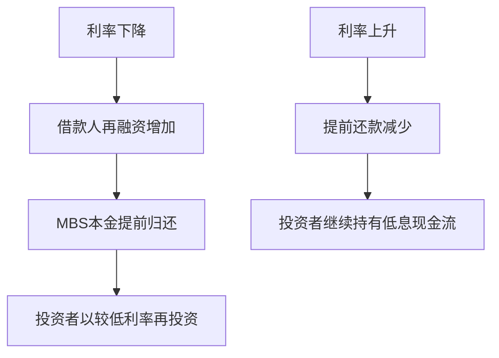
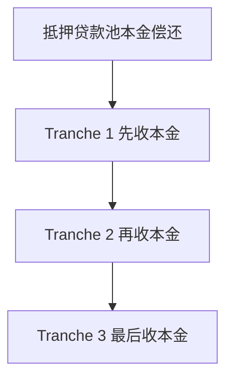

# 23.5 MBS、房贷证券化与风险转移

来源：

- 主线：Mishkin/Eakins Ch.14
- 补充：Mishkin《货币金融学》Ch.12 中 2007-2009 危机、CDO、CDS 案例

## 证券化要解决什么问题

单笔抵押贷款不适合直接卖给大型投资者。它金额相对小，条款不完全标准，服务复杂，违约风险需要逐笔分析。证券化的基本思路，是把许多抵押贷款放入一个贷款池，再用这个贷款池的现金流支持新证券。

抵押贷款支持证券，即 MBS，是由一组抵押贷款作为担保的证券。投资者购买 MBS，不是购买某一户家庭的贷款，而是购买由许多家庭贷款现金流支持的证券。贷款池收到借款人的月供，再把本金和利息按规则分配给 MBS 投资者。

证券化把“许多小而复杂的贷款”转化为“较大规模、可交易、较标准化的证券”。它让保险公司、养老金、共同基金、银行和海外投资者都能间接投资住房贷款。

从金融体系角度看，证券化提高了资金流动性；从风险角度看，它改变了谁持有风险、谁监督贷款质量。

## Mortgage Pass-Through

最基本的 MBS 是抵押贷款转手证券，即 mortgage pass-through。借款人的每月还款先进入托管人或受托机构，再“转手”支付给投资者。投资者收到的现金流来自贷款池中许多借款人的本金和利息。

如果借款人按时还款，投资者获得预期现金流。如果借款人提前还款，投资者会提前收到更多本金。如果借款人违约，投资者或担保方可能承担损失，具体取决于证券结构和担保安排。

MBS 的好处是显而易见的。投资者不用购买和管理成千上万笔单独房贷，只需要购买一个由贷款池支持的证券。贷款发起机构也不必长期持有贷款，可以把资金回收后继续放贷。

但 MBS 也把抵押贷款特有风险传递给投资者，尤其是提前还款风险。

## 提前还款风险

抵押贷款借款人常常可以提前还款。提前还款可能因为卖房，也可能因为利率下降后再融资。对借款人来说，提前还款是灵活性；对 MBS 投资者来说，它使现金流时间不确定。

假设投资者购买了平均利率为 6% 的 MBS。如果市场利率下降，许多借款人会用低利率新贷款偿还旧贷款。MBS 投资者提前收到本金，但此时市场利率已经下降，只能把本金再投资到收益更低的资产中。投资者失去了继续收取 6% 现金流的机会。

相反，如果市场利率上升，借款人不愿提前还款，因为旧贷款利率比新贷款低。MBS 投资者继续持有低收益资产，无法较快把资金转投高利率资产。

这种风险和普通债券不同。普通公司债通常没有大量家庭借款人的自主提前还款行为，而 MBS 的现金流会随利率和房屋交易行为变化。

## 政府机构 MBS

美国 MBS 市场中，Ginnie Mae、Fannie Mae 和 Freddie Mac 等机构发挥重要作用。

Ginnie Mae 从 1968 年开始担保转手证券。商业银行和抵押贷款公司等机构发起符合条件的贷款，贷款被汇入贷款池，Ginnie Mae 担保投资者按时收到本金和利息。Ginnie Mae 的担保增强了投资者信心。

Freddie Mac 购买抵押贷款，也发行类似转手证券。Freddie Mac 的参与凭证通常由传统房贷支持，贷款池规模较大，合同结构与 Ginnie Mae 证券有所不同。

机构 MBS 的核心作用是提高贷款池信用质量和市场接受度。担保降低投资者对个别借款人违约的担忧，使 MBS 更容易销售，也让房贷资金来源扩大。

但担保也会引入政府支持预期。如果市场相信机构证券最终有政府支持，投资者可能要求较低风险补偿，住房信贷扩张更容易。

## CMO：按现金流时间分层

传统 pass-through 把贷款池现金流按比例转给投资者，但所有投资者共同面对提前还款风险。为更好满足不同投资者需求，市场发展出抵押贷款担保债务凭证，即 CMO。

CMO 把同一贷款池的本金偿还按不同层级分配。这些层级叫 tranche。第一层先收到本金，之后第二层、第三层依次收到。投资者可以选择更适合自己期限需求的层级。

如果投资者几年后需要现金，可以买较早偿还的 tranche；如果投资者希望长期持有，可以买较后偿还的 tranche。不同 tranche 面对的提前还款和违约风险不同，因此收益率也不同。

CMO 的目的之一，是把贷款池现金流重新切分，让不同投资者承担不同期限和风险。它不是消除风险，而是重新分配风险。

## REMIC 和税收结构

REMIC 是一种由税法授权的房地产抵押贷款投资管道。它允许发起人把抵押贷款现金流传递给投资者，同时避免某些层面的重复征税。REMIC 和 CMO 在经济功能上相似，主要差别在法律和税收处理。

这说明证券化不仅是金融工程，也是法律、税收和会计结构的组合。要让贷款池现金流顺利传递给投资者，需要明确谁拥有资产、谁收款、谁纳税、谁承担损失以及投资者权利如何排序。

金融市场很多创新看似只是“打包资产”，实际上依赖完整制度环境。没有合同执行、产权登记、税收规则、受托安排和披露制度，证券化难以运行。

## 私人 MBS 和 jumbo 贷款

除了政府机构相关 MBS，私人机构也可以发行 MBS。私人 MBS 常用于不符合政府机构标准的贷款，例如贷款金额超过政府规定上限的 jumbo mortgage。私人机构把这些贷款打包成贷款池，发行 pass-through 或其他结构证券。

私人 MBS 没有同样程度的政府担保，因此投资者更依赖底层贷款质量、信用增级、评级和结构设计。收益率通常需要补偿更高信用风险和流动性风险。

私人证券化扩大了市场范围，使更多类型的房贷可以获得资本市场资金。但它也更依赖市场纪律。如果承保标准下降、评级失真或投资者忽视底层风险，私人 MBS 会成为风险积累渠道。

## 证券化的好处

证券化有几个重要好处。

第一，它提高流动性。原本不易交易的房贷变成可交易证券，吸引更多投资者。

第二，它扩大资金来源。全国和全球资本可以进入住房贷款市场，而不仅依赖本地存款。

第三，它分散风险。贷款池可以包含不同地区、不同借款人的贷款，降低单一借款人或单一地区风险。

第四，它提高发起机构资金周转。贷款机构卖出贷款后，释放资本继续放贷。

第五，它满足不同投资者需求。通过 pass-through、CMO 和不同 tranche，投资者可以选择不同期限、风险和现金流结构。

这些好处解释了为什么 MBS 市场快速发展，并成为现代住房金融的重要组成部分。

## 证券化的风险

证券化的风险同样明显。

第一，风险可能被转移给不了解底层资产的投资者。投资者购买的是证券，可能没有能力逐笔检查贷款质量。

第二，发起机构可能降低承保标准。如果贷款很快出售，发起机构不承担长期违约损失，就有动力追求贷款数量。

第三，结构复杂可能降低透明度。CMO、CDO 和更复杂产品把现金流切分成多个层级，投资者可能难以理解极端情形下的损失分布。

第四，系统性风险可能上升。单个贷款机构通过出售贷款降低自身风险，但整个金融体系可能持有大量相似住房风险。如果全国房价下跌，风险会同时显现。

这就是证券化的双面性：它能提高市场效率，也能在激励扭曲时放大风险。

## 证券化和货币政策传导

MBS 市场还会影响货币政策传导。抵押贷款利率取决于长期利率和 MBS 投资者要求的收益率。MBS 市场流动性好、风险补偿低时，住房贷款利率更低，住房需求更强；MBS 市场恐慌、流动性下降时，房贷利率可能相对国债上升，政策降息传导受阻。

2007-2009 年危机后，中央银行购买大量 MBS，目的之一是支撑 MBS 市场、压低住房抵押贷款利率，帮助住房市场和总需求恢复。这说明，MBS 不只是私人投资工具，也是宏观政策传导中的重要资产类别。

## 小结

MBS 是由抵押贷款池支持的证券。证券化把许多小额、非标准化、服务复杂的房贷转化为可交易证券，使机构投资者能够间接投资住房贷款。最基本的 MBS 是 mortgage pass-through，借款人月供通过受托机构转给投资者。

MBS 投资者面临提前还款风险。利率下降时，借款人再融资，投资者提前收到本金并以较低利率再投资；利率上升时，提前还款减少，投资者继续持有低利率资产。CMO 通过 tranche 把现金流按偿还顺序分层，满足不同期限需求，但只是重新分配风险，不是消除风险。

证券化提高流动性、扩大资金来源、分散单笔风险并支持住房信贷，但也可能造成代理问题、透明度下降和系统性风险。理解 MBS，关键是同时看到效率收益和激励扭曲。

## 自测问题

- MBS 为什么能解决单笔房贷难以交易的问题？
- Mortgage pass-through 的现金流如何传递给投资者？
- 提前还款风险为什么在利率下降时对投资者不利？
- CMO 的 tranche 是按什么逻辑分层的？
- 政府机构 MBS 和私人 MBS 的风险差异在哪里？
- 证券化如何提高效率？又如何可能放大系统性风险？
