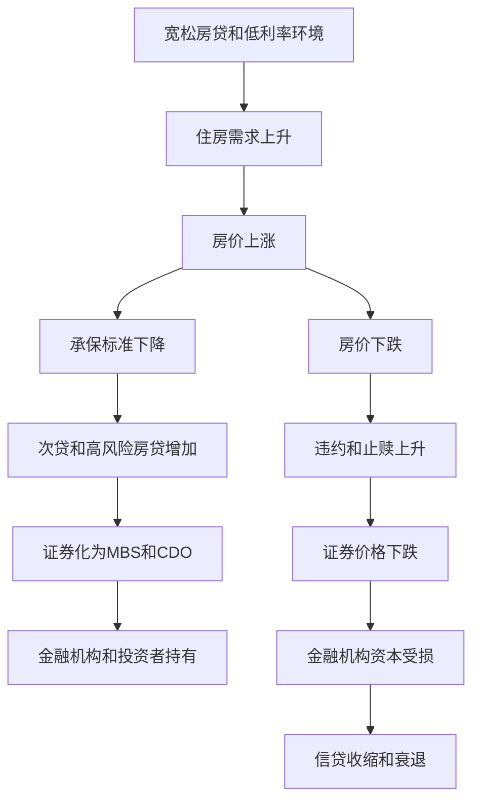
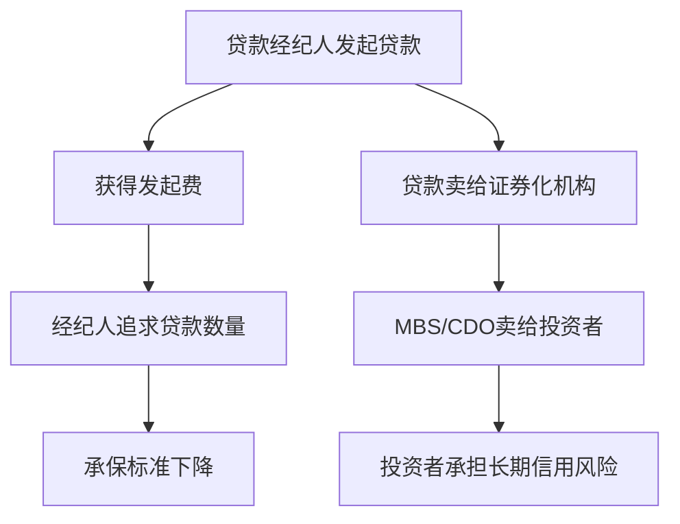
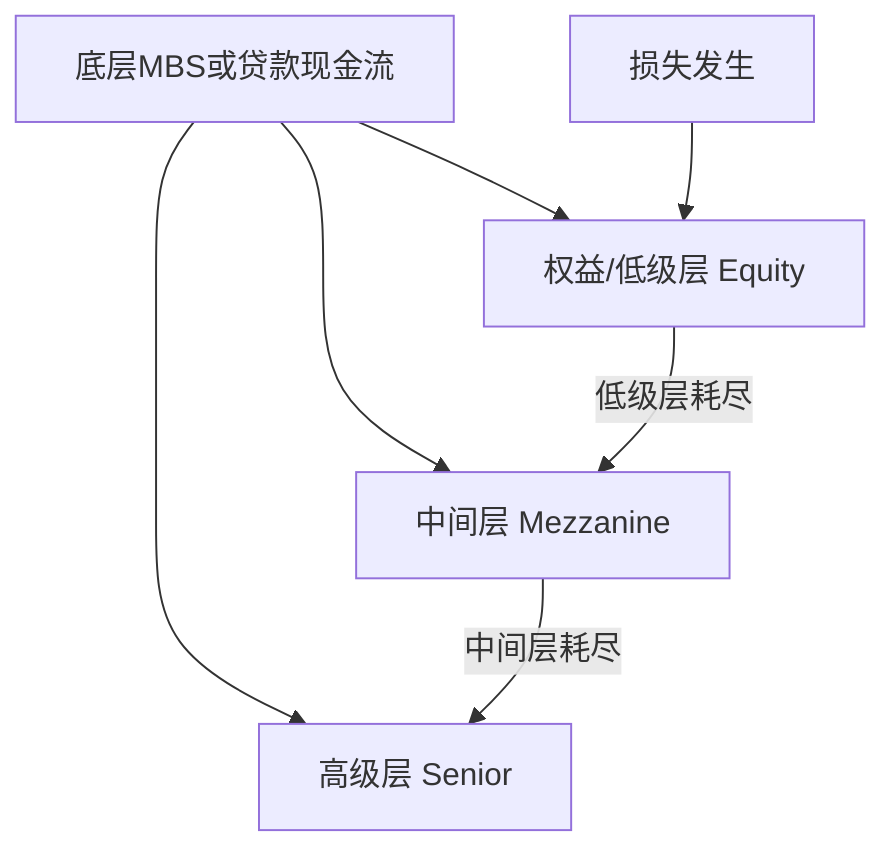
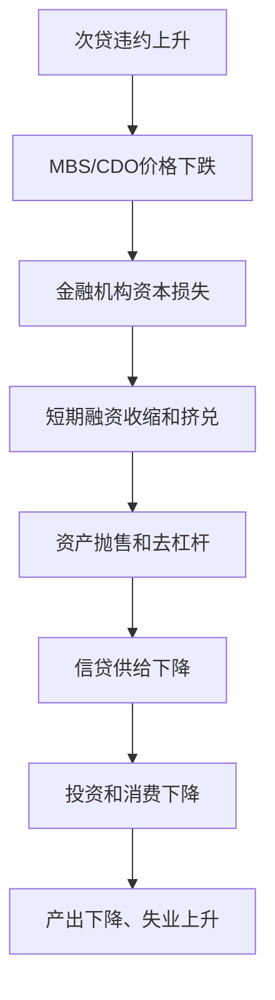

# 23.6 次贷、CDO 与房地产金融危机机制

来源：

- 主线：Mishkin/Eakins Ch.14
- 补充：Mishkin《货币金融学》Ch.12 中 2007-2009 危机、CDO、CDS 案例

## 次贷危机为什么从房贷开始

2007-2009 年金融危机不是简单的“房价下跌”。房价下跌只是触发点之一。真正的问题是，住房信贷、证券化、金融机构杠杆、评级、短期融资和宏观预期已经紧密连接。大量低质量房贷被发放、打包、评级、出售，并被金融机构和投资者持有。房价一旦停止上涨，这套结构中的弱点同时暴露。

次贷危机的逻辑可以概括为一条链：

宽松信贷扩大住房需求，推高房价；房价上涨让更多人相信房价不会跌，于是承保标准下降；低质量贷款被证券化并卖给投资者；复杂证券和高评级掩盖了真实风险；房价下跌后，借款人违约上升，MBS 和 CDO 价格暴跌；金融机构资产负债表恶化，短期融资市场挤兑，信贷收缩，实体经济衰退。

这节的目标，是把这条链拆开。

## 什么是次级抵押贷款

次级贷款是发放给不符合优质贷款条件的借款人的贷款。借款人可能信用记录差、收入不足、债务负担高，或贷款金额超过收入所能支持的水平。次级贷款不只存在于房贷，也可以存在于汽车贷款或信用卡中；但次级抵押贷款因为规模大、证券化程度高、与房价直接相连，在金融危机中影响最大。

次级抵押贷款本身不是必然错误。金融市场可以为风险较高借款人提供贷款，只要风险被准确识别、定价，并由能承受风险的人持有。问题出现在风险被系统性低估时。

2000 年左右，次贷占房贷比例很低；到 2006 年，次贷比例显著上升。推动因素包括证券化融资渠道、房价上涨、竞争加剧、贷款经纪人激励和创新型贷款产品。平均而言，次贷借款人的 FICO 分数明显低于优质贷款借款人，说明信用风险确实更高。

## 宽松承保和危险贷款设计

次贷扩张时期，许多贷款设计降低了初期付款压力，却提高了未来违约风险。

2/28 ARM 在前两年提供较低 teaser 利率，之后利率重置并可能大幅上升。借款人在初期看似能够负担，但两年后月供可能跳升。

Piggyback 贷款用第二抵押贷款补足首付，使借款人接近零首付购房。没有真实权益投入，房价下跌时借款人更容易放弃房屋。

No Doc 或 NINJA 贷款弱化收入、工作和资产核实。贷款发放建立在抵押品价值继续上涨的假设上，而不是建立在借款人真实还款能力上。

渐进支付或其他低初期付款设计，也可能让借款人承担超出长期承受能力的债务。

这些产品共同问题是：它们把风险推迟到未来，并依赖房价上涨来解决未来问题。如果房价上涨，借款人可以再融资或出售房屋；如果房价下跌，这条退路消失。

## 房价上涨如何强化风险

房价上涨会改变所有人的行为。

借款人看到房价上涨，会认为购房是低风险甚至快速致富机会。即使当前月供压力大，也相信未来可以卖房获利或再融资。

贷款人看到房价上涨，会认为抵押品足够安全。即使借款人信用较差，房屋价值上升也似乎能覆盖贷款。

投资者看到房价上涨，会认为由房贷支持的证券现金流安全，因为违约后也可以处置房产。

开发商和投机者看到价格上涨，会增加建设和购买，进一步推高需求。

这形成正反馈。信贷扩张推高房价，房价上涨又让更多信贷看似合理。直到房价停止上涨，这个循环才会暴露脆弱性。

这和宏观经济中的资产价格泡沫一致：价格上涨本身改变预期和信贷条件，从而推动价格进一步上涨。

## Originate-to-distribute 的代理问题

发起并分销模式在次贷危机中非常关键。贷款经纪人和发起机构发放房贷后，很快把贷款卖给证券化机构或投资者。它们的收入主要来自贷款发起费，而不是贷款长期表现。

如果发起人长期持有贷款，它会关心借款人能否还款。贷款违约会直接造成损失。如果发起人很快把贷款卖出，它更关心贷款能否通过初始标准、能否卖出、能否产生费用。未来违约损失由证券投资者承担。

这种激励错位会降低承保质量。贷款经纪人可能鼓励借款人选择更大贷款，弱化收入核实，甚至帮助美化申请材料。投资银行通过承销 MBS 和 CDO 获得费用，也有动力扩大证券化产品供给。评级机构从发行方获得评级费用，可能面临利益冲突。

这不是某个单点错误，而是一整条激励链的问题。

## CDO 如何重新分层风险

CDO 是抵押贷款危机中非常重要的结构化产品。它可以由 MBS、公司债、贷款或其他资产支持。与 CMO 主要按提前还款和期限分层不同，CDO 通常按风险优先级分层。

贷款池或证券池产生现金流后，最优先的 tranche 先收款，因此被认为风险最低；中间层之后收款；最低层最先吸收损失，因此风险最高、收益率也最高。

在正常时期，这种结构看起来合理。底层贷款即使有少量违约，损失先由低层吸收，高层仍然安全。于是，很多高层 CDO tranche 可以获得高评级。

问题在于，如果底层资产高度相关，损失不是零星发生，而是同时大规模发生，低层不足以吸收损失，高层也会受损。住房市场全国性下跌时，许多地区和借款人的违约同时上升，原本被认为分散的风险变得高度相关。

CDO 的危险不在于分层本身，而在于分层让风险看起来比实际更小，尤其当模型低估房价共同下跌和违约相关性时。

## 评级问题和复杂性

评级机构在结构化产品中扮演重要角色。许多投资者依赖评级判断证券风险。一些机构投资者只能购买高评级证券，因此评级决定了结构化产品能卖给谁、以什么价格卖出。

危机前，许多由次贷相关资产支持的证券获得很高评级。问题包括：评级模型依赖历史数据，而历史数据未能充分反映全国房价大幅下跌情形；复杂结构让真实风险难以判断；评级机构由发行方付费，存在利益冲突；投资者过度依赖评级而没有深入理解底层资产。

当房价下跌、次贷违约上升时，许多高评级证券被连续降级。降级迫使一些机构出售资产，也让市场突然意识到这些证券风险远高于预期。价格暴跌，持有者资产负债表受损。

这和前面信用评级章节一致：评级降低信息成本，但评级不是担保。如果评级错误被广泛用于杠杆投资，错误会被放大成系统性风险。

## 房价下跌和负权益

房价下跌是危机爆发的关键。只要房价上涨，许多问题可以被掩盖：借款人还不起可以卖房，贷款人可以依靠抵押品，投资者相信 MBS 安全。房价下跌后，这些假设同时失效。

当房屋价值低于贷款余额时，借款人处于负权益状态，也就是 underwater mortgage。此时，即使借款人继续付款，也是在偿还一笔高于房屋价值的债务。如果借款人收入下降或贷款利率重置，违约激励显著增强。

违约和止赎增加会进一步压低房价。止赎房屋进入市场，增加供给，压低周边房价。房价下降又让更多借款人进入负权益，形成下行循环。

这就是房地产下跌和信贷违约互相强化的机制。

## 从房贷损失到金融危机

如果次贷损失只停留在少数贷款机构，危机影响可能有限。但证券化把这些风险分散到银行、投资银行、保险公司、货币市场工具、对冲基金和全球投资者手中。许多机构还使用短期融资购买长期或复杂证券。

当 MBS 和 CDO 价格下跌，持有这些资产的金融机构资本受损。市场不知道哪些机构损失最大，于是交易对手互不信任。短期融资提供者要求更多抵押品、更高折扣，甚至拒绝续借。影子银行体系出现类似银行挤兑的压力。

资产价格下跌迫使机构出售资产，出售又进一步压低价格。金融机构去杠杆，减少贷款，信用供给收缩。企业和家庭更难获得融资，投资和消费下降，失业上升，GDP 下滑。

这就是从抵押贷款违约到宏观衰退的传导：

这与金融危机章节的信息问题、资产负债表恶化、银行危机和债务通缩机制完全一致。

## 为什么个体风险下降，系统风险反而上升

证券化最初被认为可以降低贷款机构风险。贷款机构把房贷卖出，不再集中持有本地贷款；投资者通过贷款池分散单一借款人风险。这些都是真的。

但系统风险可能同时上升。原因在于：更多机构持有相似住房风险；发起机构降低贷款标准；投资者依赖评级而忽视底层质量；复杂证券提高不透明度；短期融资支持长期资产；房价全国性下跌使分散化失效。

单个机构看似减少了风险，整个系统却积累了更大风险。这是金融系统常见悖论。风险转移可以改善配置，也可能让风险从透明位置转移到不透明位置。

## 宏观政策的角色

危机后，政策应对包括降息、流动性支持、资产购买、资本注入、担保和监管改革。中央银行购买 MBS，是为了稳定 MBS 市场、降低抵押贷款利率、支持住房市场。政府救助或接管部分机构，是为了防止住房金融体系崩溃。

监管改革则试图修复激励问题，包括加强承保标准、提高资本要求、改善证券化披露、约束评级机构利益冲突、监管衍生品和影子银行活动。

宏观经济学在这里和金融学完全汇合。住房信贷过度扩张会推高总需求和资产价格；泡沫破裂会压低财富、投资、消费和银行资本；货币政策和金融监管都必须考虑金融市场结构。

## 小结

次贷危机来自住房信贷、证券化和宏观金融条件的共同作用。低初始利率、零首付、弱化收入核实和次贷扩张提高了借款人违约风险；房价上涨暂时掩盖这些风险，并鼓励进一步放松信贷。

发起并分销模式造成代理问题，贷款经纪人和发起机构追求贷款数量，长期风险转移给 MBS 和 CDO 投资者。CDO 按风险分层，使部分证券看起来非常安全，但当房价全国性下跌、违约高度相关时，高级层也会受损。评级错误和复杂结构进一步放大信息问题。

房价下跌导致负权益和违约上升，MBS 与 CDO 价格暴跌，金融机构资本受损，短期融资市场挤兑，信贷收缩，最终传导为投资、消费、产出和就业下降。证券化可以分散个体风险，但如果激励扭曲和透明度不足，也会放大系统性风险。

## 自测问题

- 次级抵押贷款本身为什么不必然错误？问题出在哪里？
- 房价上涨为什么会鼓励承保标准下降？
- 发起并分销模式中的代理问题是什么？
- CDO 的风险分层为什么在全国房价下跌时失效？
- 评级机构在危机中为什么会放大信息问题？
- 负权益如何提高借款人违约激励？
- 次贷违约如何传导为宏观经济衰退？
