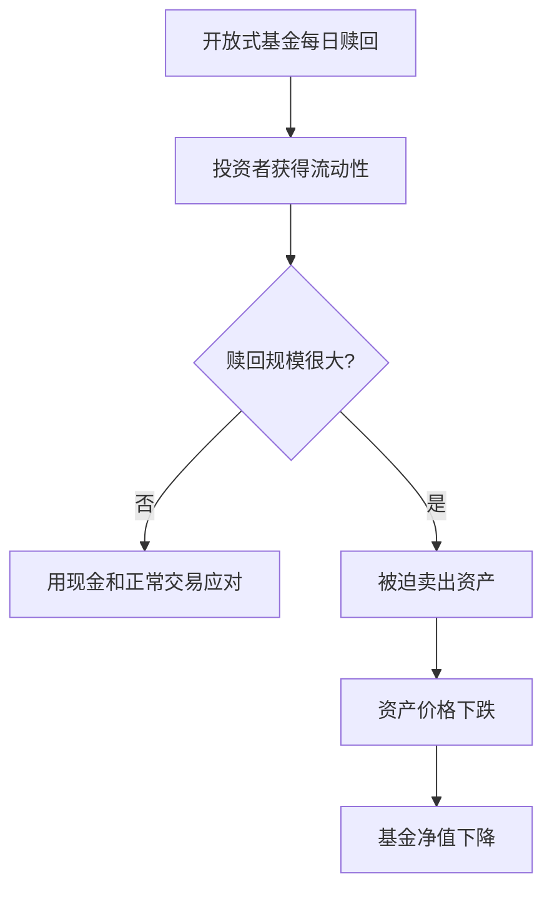
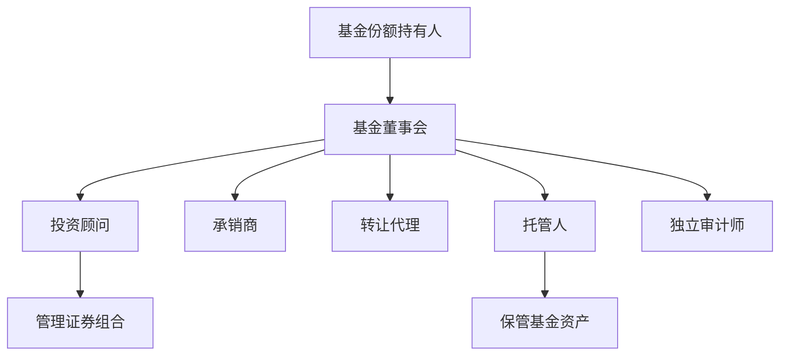

# 24.2 开放式基金与封闭式基金

来源：

- 主线：Mishkin/Eakins Ch.20
- 补充：Mankiw Ch.27；Mishkin《货币金融学》Ch.2 中投资中介

## 基金结构为什么重要

共同基金并不只有一种组织形式。最基本的区分是开放式基金和封闭式基金。两者都把投资者资金集中起来购买证券，但投资者进出基金的方式不同，基金份额数量变化方式不同，份额价格形成方式也不同。

这些差异会影响流动性、基金规模、基金经理行为和投资者风险。如果一个基金必须随时应对赎回，它的资产组合和流动性管理就会不同；如果基金份额不能赎回，只能在市场上转让，价格就可能偏离基金持有资产的价值。

理解开放式和封闭式基金，是理解基金行业结构的起点。

## 封闭式基金

早期共同基金多是封闭式基金。封闭式基金在初始发行时出售固定数量的份额，募集资金后用这些资金购买证券。发行结束后，基金本身通常不再接受新的投资者资金，也不承诺赎回份额。

投资者如果想退出，不能把份额卖回基金，而是在二级市场把份额卖给其他投资者。封闭式基金份额像股票一样交易，市场价格由买卖供求决定。

由于市场价格由交易决定，封闭式基金价格可能高于或低于基金资产净值。如果投资者相信基金经理能力强，愿意支付溢价；如果投资者对基金前景不看好，份额可能折价交易。基金持有的资产价值和基金份额市场价格之间，可能出现持续差异。

封闭式基金对基金经理有一个优势：投资者不能随时赎回，基金经理不必为了应对赎回而被迫卖出资产。这有利于持有流动性较差或长期投资资产。但它也使基金规模不容易自然增长，管理人若想管理更多资金，通常需要发行新基金或进行新的融资安排。

## 开放式基金

现代共同基金主要是开放式基金。开放式基金允许投资者随时按规则投入新资金，也允许投资者赎回份额。新资金进入时，基金发行更多份额；投资者赎回时，基金取消相应份额并支付现金。

开放式基金每天计算净资产价值，即 NAV。当天申购和赎回通常按当天计算出的 NAV 进行。投资者不是在二级市场和其他投资者竞价交易，而是直接与基金发生申购和赎回关系。

开放式基金的优势非常明显。第一，投资者流动性好，可以较方便地进出。第二，基金规模可以随投资者需求扩张，不受初始份额数量限制。第三，按 NAV 申购赎回，使投资者交易价格与底层资产价值直接挂钩。

这些优势解释了为什么绝大多数共同基金资产集中在开放式基金中。

| 特征 | 封闭式基金 | 开放式基金 |
| --- | --- | --- |
| 份额数量 | 初始固定 | 随申购赎回变化 |
| 投资者退出 | 二级市场卖出 | 向基金赎回 |
| 交易价格 | 市场价格，可能偏离 NAV | 通常按 NAV |
| 基金经理赎回压力 | 较低 | 较高 |
| 规模增长 | 较受限制 | 可随资金流入扩张 |

## 开放式结构的流动性压力

开放式基金给投资者提供流动性，但流动性不是凭空产生的。基金必须持有现金或可卖出的证券，以满足赎回请求。如果赎回规模不大，基金可以用现金或正常卖出证券应对；如果市场恐慌、投资者集中赎回，基金可能被迫出售资产。

这会产生一个重要问题：基金持有的资产可能没有基金份额本身那么流动。股票基金持有的大盘股票通常较容易卖出；但高收益债基金、部分新兴市场基金或某些信用基金持有的资产流动性较差。投资者每天都能赎回基金份额，但基金底层资产不一定每天都能以合理价格卖出。

当大量投资者赎回时，基金卖出资产可能压低价格，剩余投资者也受损。这说明开放式基金提供流动性中介，同时也会在极端时期面临流动性错配。

这和银行流动性管理有相似之处，但基金没有像银行存款那样承诺固定面值，投资者承担净值变化。

## 基金复合体和基金家族

许多基金公司不是只管理一个基金，而是管理一组基金。这些由共同管理机构管理的基金组合，被称为基金复合体或基金家族。一个基金家族可能同时提供股票基金、债券基金、货币市场基金、指数基金、目标日期基金和国际基金。

基金家族对投资者有便利性。投资者可以在同一平台内查看账户信息，也可以在不同基金之间转换，例如从股票基金转到债券基金，或从货币市场基金转到指数基金。

对基金公司来说，基金家族可以覆盖不同投资者需求。年轻投资者可能偏好股票或目标日期基金，退休投资者可能偏好债券和货币市场基金。基金公司提供多种产品，可以留住客户资产。

但基金家族也可能带来利益冲突。例如，基金公司可能有动力推广费用更高的基金，而不是最适合投资者的基金。因此，费用披露、投资目标披露和销售监管非常重要。

## 基金的组织结构

共同基金通常有一套专门组织结构。基金投资者是基金份额持有人，类似公司的股东，享有基金净收益扣除费用后的剩余收益。

基金董事会监督基金活动，批准与投资顾问和其他服务机构的合同。监管要求一定比例董事独立，以代表基金份额持有人监督管理人。

投资顾问负责按照基金招募说明书中的投资目标和政策管理组合。它决定买入、卖出和持有什么证券。基金还会聘请主承销商销售基金份额，转让代理处理投资者账户和交易记录，托管人保管基金资产，独立审计师审计财务报表。

这个结构的目的，是把资产管理、资产保管、销售、记录和审计分开，降低挪用资产、信息不透明和管理人自利行为。

## 小结

封闭式基金在初始发行后份额数量固定，投资者通过二级市场买卖份额，份额价格可能高于或低于基金资产净值。它的优势是基金经理不必随时应对赎回，适合某些长期或流动性较低资产。

开放式基金允许投资者按 NAV 申购和赎回，份额数量随资金流入流出变化。它提供了很强流动性，也使基金规模可以持续增长，因此成为共同基金主流结构。但开放式结构也会产生流动性压力，尤其当底层资产不够流动而投资者集中赎回时。

基金家族和基金组织结构让资产管理专业化。董事会、投资顾问、托管人、转让代理和审计师各自承担不同职责，目的是保护基金份额持有人利益并降低代理问题。

## 自测问题

- 封闭式基金和开放式基金最根本的区别是什么？
- 为什么封闭式基金价格可能偏离净资产价值？
- 开放式基金为什么更受投资者欢迎？
- 开放式基金的每日赎回机制会带来什么流动性风险？
- 基金董事会、投资顾问和托管人分别起什么作用？
