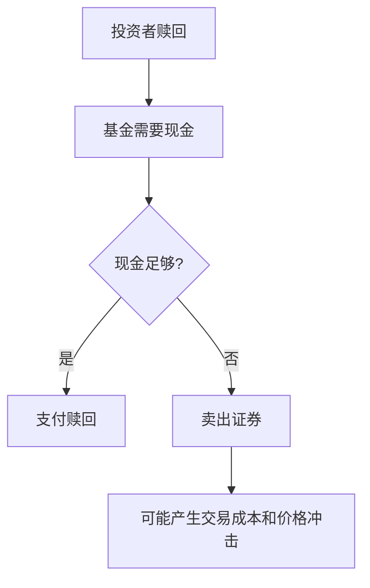

# 24.3 净资产价值 NAV、申购赎回与费用结构

来源：

- 主线：Mishkin/Eakins Ch.20
- 补充：Mankiw Ch.27；Mishkin《货币金融学》Ch.2 中投资中介

## 为什么基金需要 NAV

开放式基金每天都有投资者申购和赎回。新投资者应该以什么价格买入？老投资者赎回时应该拿到多少钱？答案不能由基金经理随意决定，也不能让先来者占后来的便宜。于是，基金需要一个统一价格：净资产价值，即 NAV。

NAV 是基金资产净值除以基金份额数。基金资产包括股票、债券、现金和其他投资；负债包括应付费用、管理费和其他应付项目。公式是：

```text
NAV = (基金资产总值 - 基金负债) / 基金份额数
```

开放式基金当天的申购和赎回通常都按同一个 NAV 进行。这保证投资者交易价格反映底层资产价值，而不是由基金公司任意设定。

## NAV 如何计算

假设一个共同基金持有当前市值 2000 万美元股票、1000 万美元债券和 50 万美元现金，总资产为 3050 万美元。基金有 30 万美元负债，净资产为 3020 万美元。如果基金共有 1000 万份，NAV 为：

```text
NAV = 30,200,000 / 10,000,000 = 3.02 美元
```

如果一年后股票组合上涨到 2200 万美元，债券组合下降到 980 万美元，现金和负债不变，净资产变成 3200 万美元。份额数仍为 1000 万份，则新 NAV 为：

```text
NAV = 32,000,000 / 10,000,000 = 3.20 美元
```

投资者收益率可按 NAV 变化计算：

```text
收益率 = (3.20 - 3.02) / 3.02 = 5.96%
```

这个例子说明，基金投资者的收益来自底层资产价值变化、收到的利息和股利，以及扣除费用后的净结果。

## 申购和赎回如何影响基金

投资者申购开放式基金时，基金收到现金并发行新份额。投资者赎回时，基金支付现金并取消份额。只要按 NAV 交易，申购和赎回本身不会让原投资者无端获利或受损。

但大量申购和赎回会影响基金管理。资金大量流入时，基金经理需要把现金投资到符合基金目标的资产中；资金大量流出时，基金可能需要卖出资产以支付赎回。如果卖出资产发生在市场压力时期，交易成本和价格冲击会影响基金净值。

开放式基金的流动性管理因此很重要。基金可能持有一定现金，或持有更容易卖出的证券，以应对赎回。但现金比例过高又可能降低收益，因为现金通常收益较低。这是收益和流动性之间的权衡。



## 费用为什么重要

共同基金为投资者提供管理、交易、记录和服务，这些服务需要收费。费用看似每年只有几个百分点甚至更低，但长期复利下会显著影响最终财富。

基金费用通常从基金资产或投资者交易中扣除。由于许多费用不是投资者手动支付，而是直接从基金收益中扣除，投资者容易忽视。但费用越高，留给投资者的净回报越低。

有效市场理论还提醒我们，高费用不一定带来高回报。大量研究发现，很多主动管理基金扣除费用后难以持续跑赢市场。因此，投资者选择基金时，费用结构是核心因素之一。

## Load 和 No-load

早期许多基金通过经纪人销售，经纪人获得销售佣金。带销售佣金的基金称为 load fund。

如果投资者买入时支付费用，称为前端销售费用。投资者投入 10000 美元，若前端费用为 5%，实际进入基金投资的只有 9500 美元。前端费用越高，投资者越需要更长时间才能弥补最初扣除。

如果费用在赎回时收取，称为后端或递延销售费用。它通常随持有时间延长而下降，目的之一是补偿销售人员，也可能鼓励投资者长期持有。

不收取销售佣金的基金称为 no-load fund。许多 no-load 基金可以由投资者直接购买，不需要销售中介。随着投资者对费用敏感度提高和基金竞争加剧，低费用、无销售佣金产品越来越普遍。

| 费用类型 | 收取时间 | 主要作用 |
| --- | --- | --- |
| 前端销售费用 | 买入时 | 支付销售佣金 |
| 递延销售费用 | 赎回时，常随时间下降 | 补偿销售并 discourages 短期退出 |
| 无销售佣金 | 不收销售 load | 降低投资者进入成本 |

## 其他常见费用

即使基金没有销售佣金，也仍可能有其他费用。

管理费支付给投资顾问，用于组合管理。12b-1 费用用于营销、分销或补偿销售人员，通常从基金资产中扣除。赎回费可能在短期赎回时收取，用于减少频繁交易对长期投资者的影响。转换费可能在同一基金家族内从一个基金转到另一个基金时收取。账户维护费可能针对低余额账户收取。

这些费用共同决定基金的总成本。投资者不能只看基金名称或历史收益，还要阅读费用披露，理解每年有多少收益被费用消耗。

费用对长期投资影响可以用直觉理解。假设两个基金投资组合表现相同，一个每年费用 0.2%，另一个每年费用 1.2%。二者每年相差 1 个百分点。30 年后，这 1 个百分点在复利下会造成显著财富差距。

## 费用披露和竞争

监管要求基金清楚披露费用和成本。基金招募说明书通常会用标准化示例展示，投资者投入 10000 美元并持有 1 年、3 年、5 年、10 年时，需要承担多少费用。这样，投资者更容易在不同基金之间比较。

费用披露增强竞争。投资者能够清楚看到成本，就更可能选择低费用基金。基金公司为了吸引资金，也会降低费用。过去几十年，行业竞争和被动投资发展推动许多基金成本下降。

费用披露的经济意义，是降低信息不对称。基金经理和销售人员比普通投资者更了解费用结构，如果费用复杂且不透明，投资者可能支付过高成本。标准化披露使市场纪律更容易发挥作用。

## 税收和分配

基金投资者还要关注税收。共同基金收到股利、利息和实现资本利得后，通常会向投资者分配。投资者需要按税法对这些分配纳税。若基金持有免税市政债，相关免税收入通常也可以传递给投资者。

这说明基金不是一个让税收消失的容器。投资者间接持有底层证券，也间接承担相关税收后果。频繁交易的基金可能产生更多已实现资本利得分配，给应税账户投资者带来税负；低换手率指数基金通常更税收有效。

## 小结

NAV 是开放式基金申购和赎回的核心价格，等于基金净资产除以基金份额数。它把基金份额价格与底层资产价值连接起来，保证投资者按统一、可计算的价值进出基金。

开放式基金的申购和赎回提供流动性，但大量赎回可能迫使基金卖出资产，产生交易成本和价格冲击。基金需要在收益和流动性之间平衡。

费用结构直接影响投资者净回报。销售费用、管理费、12b-1 费用、赎回费和账户维护费都会减少投资者收益。监管要求标准化费用披露，有助于投资者比较基金并推动行业竞争。

## 自测问题

- NAV 的计算公式是什么？
- 为什么开放式基金申购和赎回通常按 NAV 进行？
- 大量赎回会给基金带来什么管理压力？
- 前端销售费用和递延销售费用有什么区别？
- 为什么基金费用对长期投资结果影响很大？
- 费用披露如何降低信息不对称？
