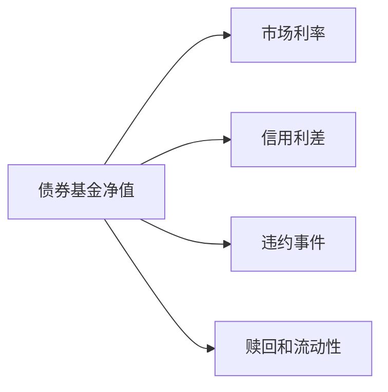

# 24.4 货币基金、债券基金、股票基金、混合基金、指数基金

来源：

- 主线：Mishkin/Eakins Ch.20
- 补充：Mankiw Ch.27；Mishkin《货币金融学》Ch.2 中投资中介

## 基金类型由投资目标决定

共同基金不是一种单一投资。基金的风险、收益和流动性取决于它持有什么资产。股票基金、债券基金、混合基金、货币市场基金和指数基金，分别对应不同投资目标。

选择基金，首先要问：基金要解决什么问题？是保留短期现金、获得债券收入、参与股票增长、在股票和债券之间平衡，还是低成本跟踪市场指数？

不同基金类型正好把前面学过的金融市场连接起来。货币市场基金投资短期债务工具，债券基金投资长期债务证券，股票基金投资普通股，混合基金同时持有股票和债券，指数基金用规则化方式复制某个市场组合。

## 股票基金

股票基金主要投资股票，也称权益基金。它们让投资者间接持有一篮子公司所有权。股票基金风险较高，因为股票是剩余索取权，价格受利润预期、增长率、利率和风险偏好影响。但长期看，股票基金也可能提供较高回报。

股票基金可以进一步分成多种目标。资本增值基金追求股价上涨，通常关注成长型公司，对股利不太重视。这类基金风险较高，因为它依赖公司未来快速增长。总回报基金同时关注当前收入和资本增值，可能持有成熟分红公司和成长公司，风险通常低于纯成长导向基金。全球或世界股票基金投资外国公司股票，帮助投资者获得国际分散化。

股票基金与宏观经济关系密切。经济增长预期改善、企业利润上升、利率下降时，股票基金净值可能上升；衰退、利率上升或风险偏好下降时，股票基金净值可能下跌。

## 债券基金

债券基金投资债券。它们可以持有政府债券、投资级公司债、高收益债、市政债或国际债券。债券基金通常风险低于股票基金，但并不等于安全资产。

政府债券基金违约风险低，但仍有利率风险。市场利率上升时，债券价格下跌，债券基金净值下降。投资级公司债基金承担信用风险和利率风险。高收益债基金收益率较高，但违约风险和经济周期敏感性更强。市政债基金可能提供税收优势，但仍需关注地方财政和流动性风险。

债券基金和直接持有债券有重要区别。单只债券如果持有到期且不违约，投资者可以收到本金；开放式债券基金通常没有固定到期日，基金净值随组合中债券价格变化。投资者赎回时按当时 NAV 退出，可能出现损失。

债券基金是普通投资者进入债券市场的重要渠道，但投资者必须理解利率风险和信用风险。

## 混合基金

混合基金同时投资股票和债券。它的目标是让投资者通过一个基金获得跨资产类别的分散化。股票提供增长潜力，债券提供收入和相对稳定性。

混合基金的吸引力在于简单。投资者不必自己分别购买股票基金和债券基金，也不必频繁调整比例。基金经理按照基金目标维持某种股票债券组合。

但混合基金仍然需要看资产配置比例。一个股票占 80% 的混合基金，风险接近股票基金；一个债券占 70% 的混合基金，风险更接近债券基金。基金名称不能替代对组合结构的理解。

混合基金也常用于退休投资。目标日期基金本质上是一类随退休日期临近逐步调整资产配置的混合基金：年轻时股票比例较高，退休临近时债券和现金比例提高。这体现了生命周期投资逻辑。

## 货币市场基金

货币市场基金投资短期、高质量货币市场工具，例如国库券、政府机构证券、回购协议和高质量商业票据。它们通常是开放式基金，目标是提供较高流动性和接近现金的稳定性。

货币市场基金在 20 世纪 70 年代以后快速发展，与当时银行存款利率管制有关。当市场利率很高而银行受 Regulation Q 限制不能支付足够高存款利率时，投资者把资金转向货币市场基金，以获得更高收益。

货币市场基金对投资者很有吸引力，因为它们提供较好流动性，有些还提供类似支票书写的便利。对小投资者来说，它们提供了参与货币市场工具的渠道；这些工具单独购买通常需要大额资金。

但货币市场基金不是银行存款。它们通常不享有存款保险。2008 年 Lehman Brothers 破产后，Reserve Primary Fund 因持有相关资产出现损失，无法按 1 美元 NAV 赎回，被称为“跌破 1 美元”。这引发货币市场基金挤兑，投资者快速赎回，威胁短期融资市场。政府随后提供担保和流动性支持，才恢复信心。

这个案例说明，即使投资短期高质量资产，货币市场基金仍可能在市场恐慌中面临流动性风险。

## 指数基金

指数基金不试图选择“赢家”证券，而是复制某个指数。比如 S&P 500 指数基金持有该指数中的股票，并按一定比例配置，使基金表现尽量接近指数。

指数基金的理论背景是有效市场假说。如果市场价格已经快速反映公开信息，主动基金经理很难持续选出被低估证券并战胜市场。既然如此，投资者没有必要支付高费用购买主动选股服务，可以低成本买入整个指数。

指数基金的优点包括费用低、透明、换手率低和分散化好。缺点是它不会主动避开指数中的高估证券，也无法在市场整体下跌时自动防御。它给投资者的是市场回报，而不是超越市场的承诺。

指数基金的兴起改变了资产管理行业。越来越多资金从主动管理流向被动管理，基金费用下降，市场指数成为资产配置核心工具。

## 主动管理与被动管理

主动基金依靠基金经理选择证券、判断市场时机或调整行业配置。被动基金则按规则复制指数。二者背后的投资哲学不同。

主动管理认为，市场存在错误定价，专业经理可以通过研究获得超额收益。被动管理认为，持续战胜市场很难，低费用和广泛分散化更可靠。

投资者选择时不能只看历史收益。主动基金过去表现好，不保证未来继续好；高费用会侵蚀回报。被动基金不能避免市场整体下跌，但成本较低，结果更接近基准指数。

| 类型 | 核心逻辑 | 主要优势 | 主要限制 |
| --- | --- | --- | --- |
| 主动基金 | 经理选股或择时 | 可能获得超额收益 | 费用高，持续胜出困难 |
| 指数基金 | 复制市场指数 | 成本低、透明、分散 | 不能主动避险或超越指数 |

## 小结

基金类型由投资目标和底层资产决定。股票基金提供股权增长暴露，债券基金提供债务证券暴露，混合基金跨股票和债券配置，货币市场基金提供短期流动性工具暴露，指数基金低成本复制市场指数。

不同基金承担不同风险。股票基金承担市场和盈利风险，债券基金承担利率和信用风险，货币市场基金虽相对安全但仍有流动性和信用风险，混合基金风险取决于资产配置比例。

指数基金体现了有效市场思想：如果主动管理难以持续战胜市场，低成本、分散化地持有指数就是有吸引力的选择。

## 自测问题

- 股票基金和债券基金的主要风险分别是什么？
- 债券基金为什么不同于直接持有单只债券到期？
- 货币市场基金为什么不是银行存款？
- 混合基金的风险取决于什么？
- 指数基金为什么通常费用较低？
- 主动管理和被动管理的核心差异是什么？
