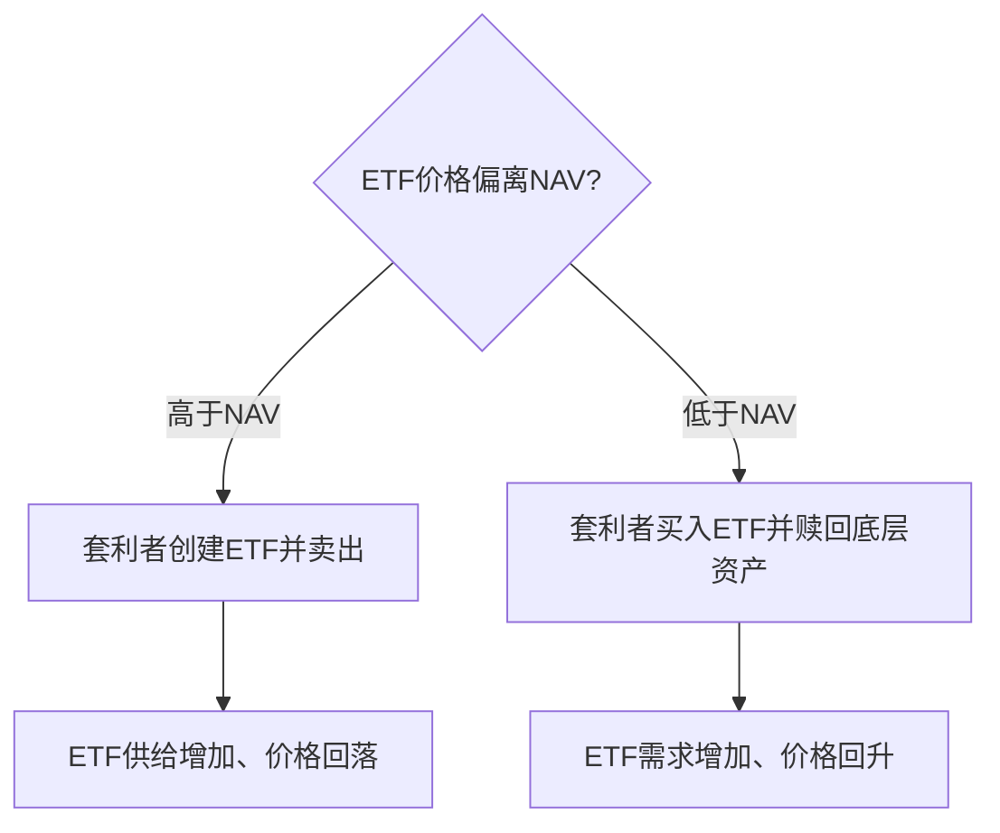

# 24.5 ETF 与被动投资

来源：

- 主线：Mishkin/Eakins Ch.20；Mishkin/Eakins Ch.13 ETF 部分
- 补充：Mankiw Ch.27；Mishkin《货币金融学》Ch.2 中投资中介

## ETF 为什么会出现

ETF，即交易所交易基金，是共同基金和股票交易机制结合后的产物。传统指数共同基金可以让投资者低成本跟踪指数，但通常按每日 NAV 申购和赎回。股票可以在交易日内随时买卖，但买单只股票缺乏分散化。ETF 把这两种特征结合起来：它持有一篮子资产，同时像股票一样在交易所交易。

最简单的 ETF 是指数 ETF。基金持有某个指数对应的一篮子股票，投资者买卖 ETF 份额，就相当于买卖这篮子股票的组合。教材中的例子包括跟踪 Dow Jones Industrial Average、S&P 500 和 NASDAQ 的 ETF。

ETF 的出现降低了投资组合构建成本。普通投资者可以用一笔交易获得整个市场、某个行业、某类债券或某个国家市场的暴露。


## ETF 和共同基金的相同点

ETF 和传统共同基金都把投资者资金集中起来，持有证券组合。二者都可以实现分散化，也都可以跟踪指数。投资者购买 ETF 或指数基金，目的通常不是押注单家公司，而是获得某个市场组合的收益。

ETF 的净值也来自底层资产价值。如果 ETF 持有的股票上涨，ETF 理论价值上升；底层资产下跌，ETF 理论价值下降。ETF 并不是脱离底层资产的独立收益工具。

ETF 和共同基金也都收取费用。被动 ETF 费用通常较低，但仍有管理费、交易成本和买卖价差。投资者不能只看 ETF 价格，还要看费用率、流动性、跟踪误差和底层资产。

## ETF 和开放式基金的不同点

ETF 与传统开放式共同基金最大的不同，是交易方式。开放式基金通常一天按 NAV 交易一次；ETF 在交易所交易，价格在交易日内不断变化，投资者可以像买卖股票一样下单。

ETF 支持限价单、止损单、卖空和保证金交易。对机构投资者和活跃交易者来说，这提供了更大灵活性。ETF 也通常没有传统共同基金那样的最低投资额要求，投资门槛低。

但 ETF 交易也有成本。投资者买卖 ETF 可能支付经纪佣金，虽然很多平台已降低或取消佣金；还要承担买卖价差。对于频繁小额投资者，交易成本可能抵消低管理费优势。

| 特征 | 开放式共同基金 | ETF |
| --- | --- | --- |
| 交易价格 | 通常按每日 NAV | 交易所实时价格 |
| 交易频率 | 通常每日一次 | 交易日内连续交易 |
| 交易方式 | 向基金申购赎回 | 在交易所买卖 |
| 可用订单 | 通常简单申购赎回 | 限价、卖空、保证金等 |
| 成本 | 管理费、可能有销售费用 | 管理费、买卖价差、交易费用 |

## ETF 价格为什么接近净值

ETF 在交易所交易，市场价格可能偏离底层资产净值。但这种偏离通常受到套利机制约束。

如果 ETF 市场价格高于底层资产价值，套利者可以买入底层证券、创建 ETF 份额并卖出 ETF，从中获利。这个过程增加 ETF 供给，压低 ETF 价格。反过来，如果 ETF 价格低于底层资产价值，套利者可以买入 ETF、赎回底层证券并卖出底层资产，推动价格回归。

这种创建和赎回机制使 ETF 价格通常接近其资产净值。它不是绝对保证，尤其在市场压力、底层资产不流动或交易暂停时，ETF 价格仍可能偏离净值。但在流动性良好的市场中，套利机制很强。



## ETF 和被动投资的扩张

ETF 的普及推动了被动投资扩张。过去，投资者要获得市场组合，可能需要购买传统指数基金；现在可以通过 ETF 以较低成本、较高交易便利性获得相似暴露。

ETF 的范围也不断扩大。从宽基股票指数，到行业、风格、国家、债券、商品和其他策略，ETF 使资产配置更加模块化。投资者可以用多个 ETF 组合出股票、债券、国际资产和现金工具的配置。

这种便利也带来风险。ETF 易买易卖，可能鼓励频繁交易。投资者原本买 ETF 是为了长期分散化，却可能因为盘中价格波动而追涨杀跌。低成本工具如果被高频率使用，仍可能造成不良投资结果。

被动投资还改变市场结构。大量资金跟踪指数，使指数成分股获得稳定需求；基金投票权集中于大型资产管理公司；市场价格发现越来越依赖仍然主动交易和研究的投资者。

## 被动投资为什么难以被长期战胜

被动投资的吸引力不只是费用低，还来自资产定价和有效市场的逻辑。市场指数已经提供广泛分散化，投资者可以用 ETF 低成本获得市场风险溢价。主动基金若想证明价值，不能只在牛市中取得正收益，而要在扣除费用后相对于合适基准获得风险调整后的超额收益。

评价主动基金时，常见指标包括：

```text
Sharpe 比率 = (基金收益 - 无风险利率) / 基金标准差
信息比率 = 主动收益 / 跟踪误差
```

Sharpe 比率评价每单位总风险的补偿，信息比率评价每单位主动风险的超额收益。一个基金如果只是比指数承担更高 beta 或更多小盘、价值、信用等因子暴露，就不应把这部分收益全部称为经理能力。ETF 和因子基金的普及，使投资者更容易区分廉价可获得的风险暴露和真正需要高费用购买的 alpha。

## ETF 的宏观意义

ETF 把家庭储蓄、机构资产配置和资本市场更紧密地连接。货币政策、利率、通胀和风险偏好变化，会迅速反映到 ETF 价格和资金流中。股票 ETF 资金流反映投资者对风险资产的偏好；债券 ETF 资金流反映对利率和信用风险的判断。

市场压力时期，ETF 也可能成为流动性观察窗口。底层债券市场不流动时，债券 ETF 仍在交易所交易，ETF 价格可能比单个债券报价更快反映市场压力。这既提供价格发现，也可能引发关于价格偏离净值的担忧。

ETF 不是简单的“基金产品”，而是现代资产管理和市场交易基础设施的一部分。

## 小结

ETF 是在交易所交易的一篮子证券份额。它像共同基金一样提供分散化，又像股票一样可以盘中交易。ETF 通常用于被动跟踪指数，费用较低、透明度较高，投资门槛也低。

ETF 与开放式共同基金的核心差异在交易方式。ETF 市场价格由交易所供求决定，但创建和赎回套利机制通常使其价格接近底层资产净值。

ETF 推动被动投资和资产配置工具化，但低成本和高流动性不等于低风险。投资者仍然承担底层资产风险、市场风险、流动性风险和交易行为风险。主动基金要相对于 ETF 创造价值，需要在风险、费用和基准调整后仍有稳定 alpha。

## 自测问题

- ETF 为什么可以被理解为共同基金和股票交易机制的结合？
- ETF 和传统开放式基金在交易方式上有什么不同？
- ETF 价格为什么通常接近净资产价值？
- ETF 如何降低分散投资成本？
- 为什么低成本 ETF 仍可能导致不良投资结果？
- ETF 扩张对市场结构有什么影响？
