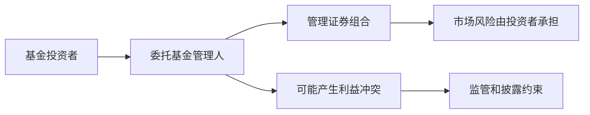
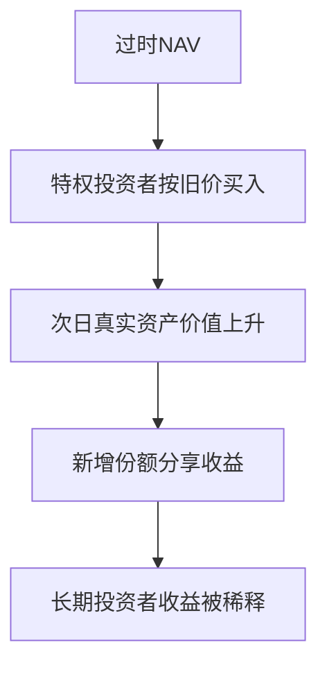

# 24.6 对冲基金、利益冲突与基金行业监管

来源：

- 主线：Mishkin/Eakins Ch.20
- 补充：Mankiw Ch.27；Mishkin《货币金融学》Ch.2 中投资中介
- 延伸：Bodie/Kane/Marcus《Investments》Ch.24, Ch.26

## 为什么基金行业需要监管

共同基金管理的是他人的钱。投资者把资金交给基金，希望基金经理按照招募说明书中的目标投资，并公平对待所有份额持有人。这里天然存在代理问题：投资者是委托人，基金经理、投资顾问和销售机构是代理人。代理人可能追求管理费、销售收入或自身交易利益，而不完全以投资者利益为中心。

基金监管的核心不是保证投资者赚钱，而是保证信息披露、资产隔离、公平交易和利益冲突控制。基金可以亏损，因为市场风险由投资者承担；但基金不能隐瞒费用、偏袒特定客户、滥用资产或违反投资政策。

基金行业越大，监管越重要。共同基金已经深度参与退休储蓄和资本市场，信任一旦受损，会影响家庭财富积累和市场稳定。

## 基金监管框架

美国共同基金受到多项联邦法律监管。证券法要求基金披露重要信息；证券交易法设定反欺诈规则；投资公司法要求基金注册并遵守运营标准；投资顾问法监管基金顾问。

基金必须向投资者免费提供招募说明书和股东报告。招募说明书说明基金目标、费用、投资策略和风险，以及如何买卖基金份额。年度和半年度报告披露基金表现、财务报表和持仓等信息，使投资者判断基金是否按既定目标运作。

监管还强调基金董事会独立性。独立董事代表基金份额持有人监督投资顾问、费用合同和基金运作。基金还需披露董事背景、持有基金份额和相关关系，以便投资者评估其独立性。

这些规则的共同目标，是减少信息不对称和代理问题。

## 利益冲突从哪里来

基金行业的利益冲突有多种来源。

第一，管理费通常按资产规模收取。基金公司收入随管理资产增加而增加，因此可能更重视吸引资金，而不是提高风险调整后收益。

第二，销售机构可能推广费用更高的基金，因为佣金更高，而不是推荐最适合投资者的基金。

第三，基金经理可能偏袒大客户，给他们更好的交易条件或信息。

第四，开放式基金每日按 NAV 交易，若估值时间和市场信息更新不同步，部分交易者可能利用滞后价格套利，损害长期投资者。

这些问题说明，基金行业不是只要“专业管理”就自然保护投资者。制度设计必须约束代理人行为。

## Late Trading

共同基金通常在市场收盘后计算当天 NAV。所有在规定截止时间前提交的申购和赎回，按当天 NAV 交易；截止后提交的交易，应按下一交易日 NAV 执行。

Late trading 是指允许截止时间后的交易仍按当天旧 NAV 成交。这样，交易者可以利用收盘后出现的新信息，在旧价格上买入或卖出基金份额。

例如，某科技基金下午 4 点 NAV 为 20 美元。晚上 6 点，几家大型科技公司公布好于预期的盈利，市场预期明天科技股上涨。如果某特权投资者能在晚上用 20 美元价格买入基金，他几乎可以确定次日 NAV 上升后获利。这个利润来自其他长期投资者，因为基金以过时价格给了特权交易者。

Late trading 的问题不是投资者聪明，而是交易规则不公平。它相当于在比赛结束后下注。

## Market Timing

Market timing 在共同基金丑闻中指利用基金估值滞后进行短期套利，尤其涉及国际基金。不同国家市场收盘时间不同。美国基金下午计算 NAV 时，可能使用早已收盘的外国股票价格。如果之后出现影响外国市场价值的消息，但 NAV 尚未反映，交易者可以利用过时价格申购或赎回。

Market timing 本身在广义上不一定违法，但许多基金政策明确禁止频繁短线进出，因为它会增加交易成本、干扰基金管理，并稀释长期投资者利益。如果基金公司为大客户豁免规则，就形成不公平待遇。

可以用一个简单例子理解稀释。基金原本有 10 份，每份 NAV 为 35 美元。市场收盘后出现好消息，底层资产真实价值明天会使 NAV 升到 40 美元。如果特权投资者能在旧 NAV 35 美元买入 1 份，次日基金总价值增加后，新增投资者分享了原投资者本应获得的收益，老投资者每份价值被稀释。

## 对冲基金是什么

对冲基金是一类特殊投资基金。它们通常面向富裕个人和机构投资者，最低投资额高，监管较传统共同基金弱，投资策略更灵活，常使用杠杆、卖空和复杂交易。

“对冲基金”这个名称容易误导。对冲是降低某种风险的交易策略，但对冲基金并不一定风险低。许多对冲基金追求市场中相对价格错配，通过买入被低估资产、卖空被高估资产获利。策略可能在正常时期看似市场中性，但在极端市场中仍会遭受巨大损失。

典型策略是相对价值交易。假设两种期限几乎相同的国债价格短期偏离历史关系，基金可以买入便宜的一种，卖空昂贵的一种，等待价格重新收敛。如果判断正确，就能获利；如果市场继续偏离，基金可能亏损。

## 杠杆如何放大收益和风险

对冲基金常用杠杆。杠杆意味着用借来的资金扩大投资规模。杠杆能放大收益，也能放大损失。

假设基金用 1200 万美元自有资金进行交易，最终赚到 2500 万美元，收益率很高。如果其中一半资金是借来的，自有资本只有 600 万美元，同样利润对应的股本收益率更高。但如果交易方向错误，损失也会更快耗尽自有资本。

Long Term Capital Management 是经典案例。它由许多高度专业人士管理，使用复杂模型和高杠杆进行相对价值交易。1998 年市场出现“flight to quality”，投资者涌向安全国债，抛售风险资产，导致许多价差朝 LTCM 预期相反方向扩大。高杠杆使损失迅速放大，最终需要由纽约联储组织私人机构救助，以避免强制抛售造成更大系统性冲击。

这个案例说明，模型精密和市场中性都不能消除流动性风险、相关性变化和杠杆风险。

## 对冲基金和系统性风险

对冲基金投资者通常被认为更有能力承担风险，因此监管较少。但当对冲基金规模大、杠杆高、交易集中、与多家金融机构有融资关系时，它的失败可能影响整个市场。

问题不只是基金投资者亏钱。如果基金被迫平仓，会大量卖出不流动资产，压低市场价格；作为交易对手的银行和券商可能遭受损失；其他机构也可能因价格下跌被迫追加保证金或去杠杆。

这就是系统性风险。一个机构的风险外溢到其他机构和市场，最终影响信用供给和实体经济。

## 监管回应

共同基金丑闻后，监管回应集中在几个方向。

第一，强化董事独立性。更多独立董事、更独立的董事会程序，有助于监督基金管理人。

第二，严格执行交易截止时间。防止截止后交易按旧 NAV 成交。

第三，使用赎回费或短期交易限制，减少 market timing 对长期投资者的伤害。

第四，提高透明度。要求披露费用、补偿安排、基金与销售机构关系、董事利益关系等，让市场纪律发挥作用。

对冲基金方面，监管关注点包括顾问注册、反欺诈、杠杆、交易对手风险和系统重要性。监管难点在于既要限制系统性风险，又不完全扼杀风险投资和市场流动性提供功能。

投资学评价基金行业监管时，关键是把市场风险和代理风险分开。市场风险应由投资者承担，但费用隐藏、滞后交易、估值操纵、侧袋安排、杠杆不透明和交易对手集中，会让投资者承担自己没有理解或没有同意的风险。对冲基金若使用杠杆和流动性错配，即使策略在正常时期低波动，也可能在保证金上升和融资撤回时被迫平仓，冲击其他市场。监管的目标是让风险被看见、被定价，并由有能力承担的人持有。

## 小结

基金行业需要监管，是因为基金经理和投资者之间存在代理问题。监管重点是信息披露、费用透明、资产隔离、公平交易、董事独立和反欺诈，而不是保证投资收益。

共同基金丑闻集中体现为 late trading 和 market timing。前者让截止时间后的交易按旧 NAV 成交，后者利用估值滞后和特殊待遇进行套利，都会损害长期投资者。

对冲基金策略灵活、监管较弱、常使用杠杆和卖空。它们可以提高市场效率，也可能因高杠杆、流动性冲击和交易集中造成系统性风险。LTCM 案例说明，市场中性策略在极端环境下仍可能失败，并影响更广泛金融体系。

## 自测问题

- 基金行业的代理问题来自哪里？
- 基金监管为什么强调披露和董事独立性？
- Late trading 为什么损害长期基金投资者？
- Market timing 如何利用 NAV 滞后？
- 对冲基金为什么不等于低风险基金？
- 杠杆如何同时放大收益和损失？
- LTCM 案例说明了什么系统性风险？
- 为什么基金监管应区分投资者自愿承担的市场风险和管理人造成的代理风险？
