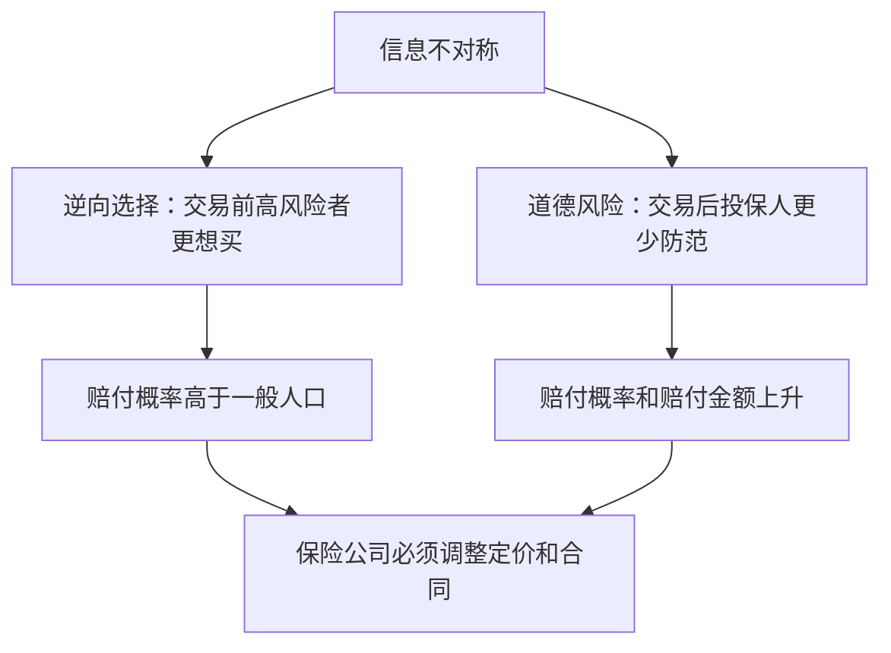

# 25.2 逆向选择、道德风险与保险定价

来源：

- 主线：Mishkin/Eakins Ch.21
- 补充：Mishkin《货币金融学》Ch.2 中契约型储蓄机构
- 延伸：Bodie/Kane/Marcus《Investments》Ch.2, Ch.26

## 保险市场为什么特别容易出现信息问题

保险公司卖的是对未来损失的承诺。问题是，投保人往往比保险公司更了解自己的风险。一个人是否经常生病、是否开车鲁莽、是否住在洪水高发区域、是否会小心保管财物，保险公司不一定完全知道。

这种信息不对称会产生两个经典问题：逆向选择和道德风险。

逆向选择发生在交易前。最想买保险的人，往往是最可能发生损失的人。慢性病患者更想买健康保险，住在洪水区的人更想买洪水保险，开车风险高的人更想买车险。

道德风险发生在交易后。买了保险后，投保人可能减少防范，因为损失由保险公司承担。例如，有全额盗窃保险的人可能不那么注意锁车；有低自付医疗保险的人可能更频繁使用医疗服务。

保险管理的大部分工具，都是为处理这两个问题。

## 逆向选择如何破坏保险

假设保险公司按总体平均风险定价。低风险人群觉得保费太贵，会退出市场；高风险人群觉得保费划算，会留下来。留下来的投保人平均风险上升，保险公司赔付增加，只能提高保费。保费提高后，更多低风险人群退出，风险池进一步恶化。

这个过程会导致保险市场萎缩，甚至失灵。保险公司不能简单地按全体人口平均风险定价，而必须区分风险类型。

汽车保险中，年轻男性平均事故率较高，因此保费可能高于年龄较大的安全驾驶者。表面看这不公平，但如果保险公司不按风险定价，低风险人群会转向其他公司，高风险人群留下，保险公司亏损。

风险定价不是歧视性的任意收费，而是保险市场维持运行的条件。没有风险分类，保险公司无法吸引低风险客户，也无法覆盖高风险客户的预期赔付。

## 筛选和风险分类

保险公司通过筛选降低逆向选择。购买车险时，保险公司会询问驾驶记录、车辆类型、年龄、婚姻状况和居住地区。购买寿险时，保险公司会询问健康状况、吸烟、饮酒、危险爱好，并可能要求体检、血液和尿液检测。

这些信息用于把投保人分配到风险类别。风险低的人支付较低保费，风险高的人支付较高保费，风险过高的人可能被拒保。

筛选的经济逻辑和银行贷款审核相似。银行要区分好借款人和坏借款人，保险公司要区分低风险投保人和高风险投保人。信息收集越有效，定价越准确，市场越能覆盖更多人。

但筛选也有社会争议。健康保险如果完全按个人风险定价，高风险人群可能买不起保险。因此，现实制度常在风险定价、社会公平和强制参保之间做权衡。

## 道德风险如何出现

保险降低投保人损失，也可能降低投保人的谨慎程度。如果车被盗可以全额赔付，车主可能少装防盗设备；如果企业火灾保险全额覆盖，企业可能少维护消防系统；如果医疗费用几乎全部报销，患者和服务提供者可能使用更多医疗服务。

道德风险不一定是故意欺诈，也可能只是行为激励改变。人们在不用承担全部成本时，会选择更多风险或更多服务。

保险公司必须让投保人保留一部分损失，使其仍有防范动机。免赔额、共保、赔付上限、限制性条款和取消保险，都是为了让投保人与保险公司利益更一致。

## 免赔额、共保和赔付上限

免赔额是投保人必须自己承担的损失部分。例如，车险有 250 美元免赔额，发生 1000 美元损失时，保险公司只赔 750 美元。投保人仍承担一部分损失，因此有动力小心驾驶和保护车辆。

共保是投保人与保险公司按比例分担损失。例如，医疗保险报销 80%，投保人支付 20%。投保人不再面对零价格医疗服务，因此会更谨慎使用服务。

赔付上限限制保险公司最多赔多少。如果保险金额超过财产真实价值，投保人可能从损失中获利，甚至产生故意损失激励。保险公司必须避免过度保险。

| 工具 | 主要作用 |
| --- | --- |
| 免赔额 | 让投保人承担小额损失，降低道德风险和管理成本 |
| 共保 | 让投保人按比例承担损失，减少过度使用 |
| 赔付上限 | 防止投保人从损失中获利 |
| 限制性条款 | 要求投保人采取安全措施 |
| 取消保险 | 惩罚持续高风险行为 |

## 限制性条款和防欺诈

保险合同常有特殊条款，限制投保人行为。寿险可能规定自杀不赔或等待期；企业火灾保险可能要求安装和维护喷淋系统；租赁摩托车业务如果要获得责任险，可能必须提供头盔。

这些条款类似债务契约中的限制性条款。债权人通过契约限制借款人冒险，保险公司通过条款限制投保人增加赔付概率的行为。

保险公司还必须防止欺诈。投保人可能虚构事故、夸大损失、隐瞒违反合同的行为，或者提交不真实索赔。调查和核赔是保险公司控制道德风险的重要环节。

## 保险代理人与承保人

保险销售也存在代理问题。保险代理人负责销售产品，通常按佣金获得收入。代理人希望卖出更多保单，但不一定承担未来赔付损失。保险公司因此需要承保人审核代理人提交的保单。

承保人有权拒绝风险过高的投保申请，要求更多信息，或调整保费。教材中的案例显示，代理人可能为了拿到业务而美化风险信息，例如拍摄看似有消防设施的照片。承保制度正是为了防止销售激励把过高风险带入保险公司。

这和房贷发起并分销模式类似：如果前端销售人员按数量收费，而后端机构承担风险，就必须有独立风险审核。

保险定价也体现激励相容。免赔额、共保和赔付上限让投保人保留一部分边际成本，从而减少过度索赔和过度冒险；筛选和风险分类让低风险客户不至于被高风险客户挤出风险池。若监管为了公平限制风险定价，通常需要强制参保、补贴或风险调整机制配合，否则逆向选择会重新出现。保险合同设计本质上是在保障、效率和公平之间取舍。

## 小结

保险市场高度依赖信息。逆向选择发生在交易前，高风险者更愿意购买保险；道德风险发生在交易后，保险覆盖可能降低投保人防范激励。

保险公司通过筛选、风险定价、限制性条款、免赔额、共保、赔付上限、防欺诈和取消保险来控制信息问题。这些工具不是附加细节，而是保险市场能否运行的核心。

保险定价必须同时考虑统计风险和行为激励。只按平均风险定价会吸引高风险客户、赶走低风险客户；全额赔付又会鼓励投保人减少防范。有效保险合同必须在保障和激励之间平衡。

## 自测问题

- 保险市场中的逆向选择和道德风险分别发生在什么时候？
- 为什么保险公司不能只按全体人口平均风险收费？
- 筛选和风险分类如何降低逆向选择？
- 免赔额和共保为什么能降低道德风险？
- 保险代理人和承保人之间为什么需要分工？
- 为什么限制风险定价时，常需要强制参保或补贴来避免逆向选择？
