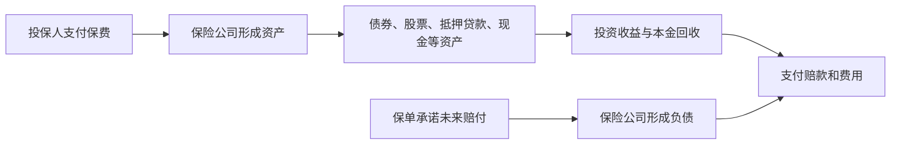
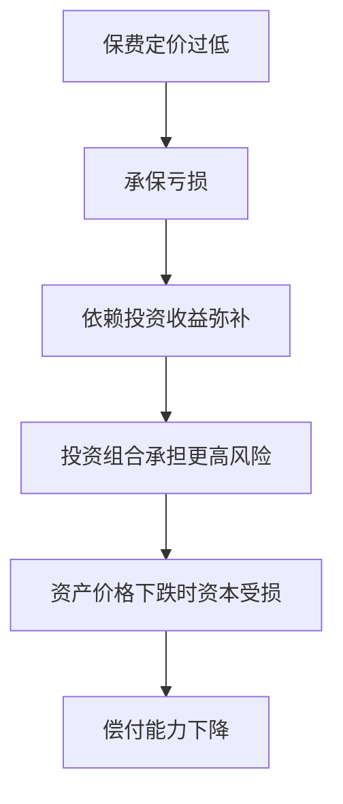

# 25.4 保险公司资产配置与风险管理

来源：

- 主线：Mishkin/Eakins Ch.21
- 补充：Mishkin《货币金融学》Ch.2 中契约型储蓄机构
- 延伸：Bodie/Kane/Marcus《Investments》Ch.16, Ch.26

## 保险公司为什么必须同时管理资产和负债

保险公司的业务看起来是卖保单，但真正的经营核心是把未来赔付承诺和现在持有的资产匹配起来。保单形成负债，保费形成资产。保险公司今天收取保费，未来可能要支付赔款。如果资产价值不足，或资产在需要赔付时无法及时变现，保险公司就会失去偿付能力。

普通企业也有资产和负债，但保险公司的负债有两个特点。第一，赔付时间不完全确定。车祸、火灾、疾病和死亡不会按照固定日历发生。第二，赔付金额也不完全确定。单个事故可能很小，也可能非常大；一次自然灾害可能同时触发大量保单。

因此，保险公司不能只问“投资什么收益最高”，还必须问“这些资产能否在赔付需要出现时提供现金”。这就是资产负债管理的基本逻辑。

这个循环把保险公司放进宏观金融体系。保险公司购买债券、股票和抵押贷款，成为资本市场的重要需求方；资本市场价格和利率变化，又反过来影响保险公司的偿付能力。

## 寿险公司的资产配置：长期、可预测和利率敏感

寿险公司的负债通常较长期。死亡率在个人层面不确定，但在大规模人群层面较可预测。终身寿险、年金和其他长期保单，使寿险公司知道自己未来很多年都要支付某些现金流。

负债长期且相对稳定，意味着寿险公司可以持有较多长期资产。长期公司债、政府债、抵押贷款、股票和房地产投资，都可能出现在寿险公司的资产组合中。长期资产通常收益高于短期流动资产，可以帮助寿险公司覆盖未来赔付和保单储蓄部分的承诺。

但长期资产也让寿险公司暴露在利率风险中。债券价格与利率反向变动。市场利率上升时，旧债券价格下降，寿险公司的资产市值可能缩水；市场利率下降时，新投资收益率下降，保险公司未来更难获得足够收益来支持保单承诺。

这和前面利率章节的逻辑相连：长期债券久期更高，对利率变化更敏感。寿险公司如果持有大量长期固定收益资产，就必须关注资产久期和负债久期是否匹配。资产久期太长，利率上升会带来较大市值损失；资产久期太短，未来再投资收益可能无法覆盖长期负债。

| 寿险公司经营特征 | 对资产配置的含义 |
| --- | --- |
| 负债期限长 | 可以持有长期债券、抵押贷款和部分股票 |
| 死亡率较可预测 | 现金流规划相对稳定 |
| 年金和储蓄型保单较多 | 对长期利率和投资收益敏感 |
| 客户信赖偿付能力 | 需要资本和准备金支持 |

寿险公司不是简单地追求高收益，而是在长期收益、利率风险、信用风险和偿付能力之间做平衡。

## 财产与意外险公司的资产配置：短期、不确定和流动性

财产与意外险公司的负债通常更短期、更不稳定。车祸、火灾、盗窃、飓风、责任诉讼，都可能在短时间内产生赔付。某些责任险还存在“长尾”问题：事故可能已经发生，但诉讼和赔付多年后才确定。

这种不确定性要求财产与意外险公司持有更多流动资产。流动资产是指能较快变现且价格不容易大幅折价的资产，例如现金、短期政府证券和高质量短期债券。它们收益可能较低，但能在大额赔付来临时提供资金。

财产险公司的风险还更容易集中。一个地区的地震、飓风或洪水，可能同时影响成千上万份保单。如果保险公司在同一地区承保过多，又没有足够再保险，灾害发生时资本会承受巨大压力。

因此，财产与意外险公司的风险管理重点包括承保分散、再保险安排、准备金估计、流动性管理和资本充足。它们要避免在同一风险上过度集中，也要避免投资资产在灾害发生时无法变现。

## 承保风险和投资风险

保险公司主要面对两大类风险：承保风险和投资风险。

承保风险是保单定价和赔付预测出错的风险。保险公司可能低估事故概率、低估平均赔付金额，或者没有充分考虑风险相关性。如果保费收得太低，赔付长期高于预期，保险业务本身就会亏损。

投资风险来自保费投资后的资产波动。债券可能违约，股票可能下跌，房地产价格可能下降，长期债券可能因利率上升而贬值。保险公司如果为了弥补承保亏损而追求高收益投资，风险会进一步放大。

这两类风险不能分开看。承保亏损会迫使保险公司依赖投资收益；投资亏损又会削弱赔付能力。稳健的保险经营要求承保纪律和投资纪律同时存在。

这个机制也解释了为什么保险监管重视资本要求和资产质量。保险公司承担的是公众风险保障功能，不能像普通投资基金那样完全由投资者自行承担亏损。

## 保险监管和偿付能力

保险监管通常关注三个问题：保险公司是否有足够资本，资产是否安全和分散，是否按规定提取准备金。

资本是保险公司吸收意外损失的缓冲。即使正常年份保费足以覆盖赔款，灾害年份或金融市场下跌年份仍可能产生巨大损失。资本越充足，保险公司越有能力履行赔付承诺。

准备金是为未来赔付预留的负债估计。已经发生但尚未完全赔付的事故，需要列入准备金；未来可能发生的保单责任，也要根据精算模型估计。准备金不足会使公司账面看起来盈利，实际却隐藏亏损。

资产监管则限制保险公司把投保人的保费用于过度冒险投资。监管者可能要求资产多元化、限制高风险资产比例、审查资本充足率，并对代理人和保险产品销售进行许可管理。

保险监管与银行监管有相似之处。银行接受存款并承诺按需支付，保险公司收取保费并承诺未来赔付。二者都涉及公众信任，都可能因资产质量恶化而无法履约。

## 信用违约互换和保险边界

保险教材在讨论保险公司风险时，会引入信用违约互换和单线保险公司的案例，因为它们说明“类似保险的承诺”一旦扩张到金融市场，可能产生系统性影响。

信用违约互换是一种对债务违约提供保护的合约。购买保护的一方支付费用，如果某个债券或贷款违约，卖出保护的一方承担赔付。它看起来像保险，但一个关键差别是：购买者不一定真的持有被保护的债券。没有可保险利益约束，合约就可能被用于投机。

这种差别很重要。传统保险要求投保人因事故遭受真实损失，赔付只是补偿损失；信用违约互换如果没有这种限制，就可能让市场参与者对他人违约下注。保护卖方如果低估相关性和极端风险，在危机中会面对大量同时赔付。

单线保险公司原本为债券本息支付提供担保。地方政府债券得到担保后，投资者认为违约风险较低，地方政府融资成本下降。但当担保业务扩展到与次级抵押贷款相关的证券时，房地产危机使这些公司遭受损失。评级下调又影响它们担保的市政债券，进而推高地方政府融资成本。

这一链条把保险风险、证券化、信用评级和宏观财政联系在一起。金融体系中某个环节的担保能力下降，可能传导到公共基础设施、学校和医院等地方政府支出。

## AIG 案例的含义

金融危机中的 AIG 说明，大型保险集团如果通过金融衍生品承担大量信用风险，就可能从普通保险公司变成系统性金融机构。AIG 的问题并不只是传统寿险或财产险赔付，而是其金融产品业务卖出了大量信用保护。当抵押贷款相关证券价格下跌、信用风险上升时，AIG 需要提供抵押品并承担潜在赔付，资本压力迅速扩大。

这个案例的教训是，保险公司风险管理不能只看单份保单。它必须看全集团的资产负债表、衍生品敞口、抵押品要求、评级变化和市场流动性。一个看似分散的金融合约组合，在危机中可能同时恶化。

宏观经济层面，保险公司承担风险转移功能，本来可以提高家庭和企业稳定性。但如果保险公司本身过度承担集中风险，它就会从稳定器变成冲击源。金融稳定监管因此越来越关注大型保险机构和非银行金融机构。

保险公司的资产负债管理可以用久期、凸性和压力测试来理解。寿险负债对长期利率非常敏感，利率下降会抬高负债现值，也会压低未来再投资收益；利率上升会压低长期债券市值。财险公司则更需要灾害情景下的流动性压力测试，例如在资产市场下跌同时出现大额赔付。稳健管理不是单独优化资产收益率，而是让资产现金流、资本缓冲和再保险安排覆盖负债情景。

## 小结

保险公司的核心经营，是把保单形成的未来赔付负债与保费投资形成的资产匹配起来。寿险负债长期且较可预测，适合持有长期债券、抵押贷款和部分股票；财产与意外险负债更短期、更不确定，需要更高流动性和更强再保险安排。

保险公司同时面对承保风险和投资风险。保费定价错误、准备金不足、资产价格下跌、利率变化和灾害相关性，都可能削弱偿付能力。监管资本、准备金和资产质量，是为了保护投保人在最需要保险时能够获得赔付。

保险风险还可能扩展到金融市场。信用违约互换、单线保险公司和 AIG 案例说明，一旦保险式承诺与证券化、杠杆和信用评级相连，局部风险可能传导为系统性风险。

## 自测问题

- 为什么保险公司不能只追求投资收益最高？
- 寿险公司和财产险公司的资产配置为什么不同？
- 承保风险和投资风险分别指什么？
- 准备金和资本在保险公司偿付能力中各起什么作用？
- 信用违约互换为什么既像保险又不同于传统保险？
- AIG 案例说明保险公司风险管理中最容易被忽视的是什么？
- 为什么保险公司的投资组合要按负债情景做久期匹配和压力测试？
