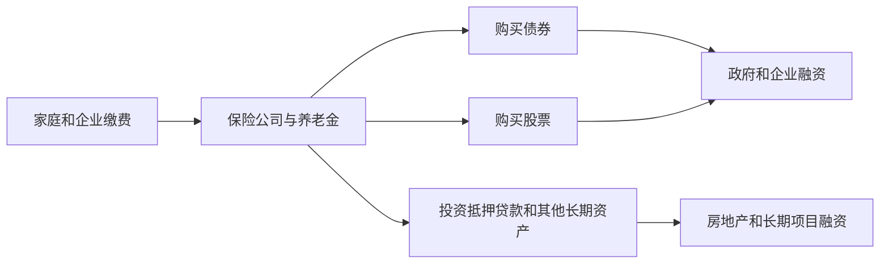
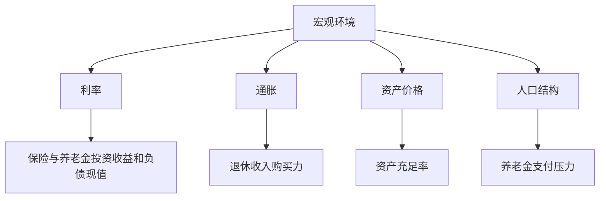

# 25.6 保险与养老金作为长期机构投资者

来源：

- 主线：Mishkin/Eakins Ch.21
- 补充：Mishkin《货币金融学》Ch.2 中契约型储蓄机构
- 延伸：Bodie/Kane/Marcus《Investments》Ch.16, Ch.24

## 为什么保险和养老金会成为长期投资者

保险公司和养老金都收取现在的资金，承诺未来支付。保险公司收取保费，未来在事故、疾病、死亡或退休年金支付时赔付；养老金收取雇主和员工缴费，未来向退休者支付收入。这种合同结构使它们天然积累大量长期资金。

银行主要依靠存款融资，许多存款可以随时提取，因此银行必须特别关注流动性。保险公司和养老金的资金来源更稳定，尤其是寿险和养老金，负债期限很长。这使它们能够购买长期债券、股票、抵押贷款和其他期限较长的资产。

它们的长期投资者角色，把家庭储蓄和企业资本需求连接起来。家庭通过保费和养老金缴费积累长期资产；企业和政府通过发行债券、股票获得资金；金融市场把二者连接起来。

这就是它们在宏观经济中的位置：把分散的长期储蓄集中起来，转化为资本市场的长期资金供给。

## 对债券市场的影响

保险公司和养老金通常是债券市场的重要投资者。债券提供固定现金流，适合匹配未来支付义务。寿险公司和 DB 养老金尤其重视长期债券，因为它们未来要支付长期且相对可预测的现金流。

长期债券需求会影响长期利率。当前面宏观章节讨论储蓄和投资时，可贷资金市场中的储蓄供给会影响实际利率；在金融市场中，保险和养老金就是重要的储蓄供给者。它们购买长期债券，相当于把家庭长期储蓄提供给政府和企业。

但这种投资也有风险。长期债券价格对利率变化敏感。利率上升时，债券价格下降，保险和养老金资产价值可能下跌；利率下降时，已有债券价格上升，但未来新投资收益率下降，长期负债支持难度可能增加。

这解释了为什么机构投资者经常关心久期匹配。资产现金流到期时间如果与负债支付时间接近，利率变化对净资产的冲击较小。资产太短，未来要再投资，面临再投资风险；资产太长，利率上升时市值波动更大。

## 对股票市场和公司治理的影响

养老金尤其是大型私人养老金和公共养老金，是股票市场中的重要机构投资者。它们代表许多退休储蓄者持有企业股份，因此在公司治理中拥有潜在影响力。

公司治理是指谁监督公司管理层、如何约束管理层为股东利益行动。分散的个人股东通常没有动力研究每家公司，也很难协调行动。大型机构投资者持股规模大，投票权集中，更有能力监督管理层、参与董事会选举、推动信息披露和薪酬治理。

这种作用与前面讨论的委托代理问题相连。企业管理者是代理人，股东是委托人。管理者可能追求个人利益、规模扩张或短期业绩，而不完全追求股东长期价值。机构投资者如果积极监督，可以降低代理问题。

但机构投资者本身也有代理问题。养老金管理者管理的是他人的退休资金，保险公司管理的是投保人的保费。它们可能过度关注短期排名，或在政治、商业关系和受益人利益之间产生冲突。因此，机构投资者不是天然完美监督者，也需要治理和监管。

## 保险、养老金和金融稳定

长期机构投资者可以稳定金融体系，也可能放大风险。

稳定作用来自长期负债。保险和养老金不像银行存款那样容易发生大规模即时提款。它们通常不需要在市场下跌时立刻抛售所有资产，因此可以成为长期买方，帮助资本市场吸收波动。

风险来自两个方向。第一，如果机构投资者承诺的负债较刚性，而资产价格大幅下跌，它们的资金缺口会扩大。DB 养老金和寿险公司都可能面临这种压力。第二，如果它们为了追求收益购买复杂证券、承担杠杆或卖出信用保护，风险会变得更像影子银行。

金融危机中的保险集团案例说明，非银行机构也可能具有系统重要性。它们不是传统存款银行，但如果规模巨大、与金融市场和衍生品合约深度相连，问题同样可能传导到整个金融体系。

因此，金融稳定不能只盯住商业银行。保险公司、养老金、共同基金、对冲基金和其他非银行金融机构，都可能影响信用供给、资产价格和市场流动性。

## 长期资金和宏观经济

从宏观经济看，保险和养老金影响储蓄、投资、利率和风险分担。

第一，它们提高长期储蓄的制度化程度。家庭可能缺乏自我控制、金融知识或投资规模，无法稳定积累长期资产。养老金缴费和保险合同把储蓄变成规则性行为，降低临时消费冲动对长期资产积累的影响。

第二，它们支持长期投资。基础设施、住房、企业设备和长期研发都需要长期资金。保险和养老金购买长期债券和股票，使这些投资更容易融资。

第三，它们改变风险分配。保险把灾害、死亡、疾病和责任风险在大量人群中分散；养老金把长寿和退休收入风险通过制度安排管理。风险分散提高家庭消费稳定性，减少个体遭遇冲击时对宏观总需求的负面影响。

第四，它们也会受到宏观环境反向影响。低利率会压低固定收益投资回报，使寿险和养老金更难履行长期承诺；通胀会侵蚀固定退休收入购买力；资产价格下跌会降低养老金资产；人口老龄化会提高养老金支付压力。

这说明保险和养老金不是资本市场的外围机构，而是宏观经济与金融市场之间的重要连接点。

## 长期机构投资者的约束

长期机构投资者并不意味着可以无限承担风险。它们的资金来自投保人和退休者，目标是未来支付，而不是短期投机。它们必须受到合同、监管、受托责任和风险管理约束。

受托责任意味着管理者必须以受益人利益为先。养老金管理者应为退休参与者管理资产，保险公司应保证投保人赔付能力。投资政策、资产配置、风险限额、信息披露和监管资本，都是为了把长期资金用于与长期负债相匹配的资产。

如果长期机构投资者过度追求短期收益，可能损害其基本功能。例如，DB 养老金资金不足时，如果通过高风险投资试图“赌回来”，失败后缺口更大；保险公司如果卖出大量信用保护以赚取费用，危机中可能无法履约。

长期资金的优势在于稳定、耐心和规模，而不是天然免疫风险。真正稳健的长期投资，需要清楚知道负债是什么、支付时间在哪里、风险由谁承担。

在资本市场中，保险和养老金也是重要的边际定价者。它们对长期国债、投资级信用债、基础设施资产和股权指数的需求，会影响期限溢价、信用利差和公司治理。由于负债期限长，它们有条件承受短期价格波动并获得流动性溢价；但受托责任要求它们不能把受益人的退休收入和赔付保障变成高杠杆押注。长期机构投资者的价值在于把耐心资本配置到与长期负债匹配的资产上。

## 小结

保险公司和养老金是契约型储蓄机构。它们现在收取保费或缴费，未来按合同赔付或支付退休收入，因此形成大量长期资金。它们投资债券、股票、抵押贷款和其他长期资产，把家庭储蓄转化为企业、政府和住房市场融资。

它们对宏观经济有多重影响：增加长期储蓄供给，支持长期投资，影响长期利率，参与公司治理，并通过风险分散稳定家庭消费。但它们也受到利率、通胀、资产价格和人口结构影响。

保险和养老金的稳定性来自长期负债和风险分散，但如果资产负债错配、资金不足、过度追求收益或深度参与复杂金融合约，也可能成为系统性风险来源。

## 自测问题

- 为什么保险公司和养老金比银行更容易成为长期投资者？
- 它们购买长期债券如何连接到宏观经济中的储蓄和投资？
- 大型养老金为什么可能影响公司治理？
- 长期机构投资者为什么既可能稳定市场，也可能放大风险？
- 低利率和人口老龄化分别如何影响保险与养老金？
- 受托责任对养老金和保险资金管理有什么意义？
- 为什么保险和养老金的长期资金需求会影响期限溢价和信用利差？
