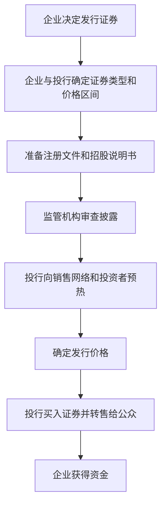

# 26.2 承销：IPO、增发与债券发行

来源：

- 主线：Mishkin/Eakins Ch.22
- 补充：Mishkin《货币金融学》Ch.2 中金融中介类型

## 承销是什么意思

承销是投资银行帮助企业发行证券时最核心的安排。在典型承销中，投资银行按事先约定价格从发行企业买下整批证券，再把这些证券卖给公众投资者。投资银行的收益来自买入价和卖出价之间的差额；风险在于，如果证券卖不出去，或只能降价出售，投资银行会亏损。

承销不是简单代销。代销只是帮客户找买家，卖不掉主要由发行人承担结果；承销则意味着投行自己先承担库存和价格风险。


这种安排让企业更确定自己能筹到多少钱，也让投资银行有动力认真定价和销售。

## 证券发行的基本流程

证券公开发行通常从企业决定融资开始。企业和投资银行先讨论发行股票还是债券、发行规模、目标价格、市场时机和资金用途。随后准备注册文件和招股说明书，提交监管审查。

监管审查期间，投资银行会联系销售网络和潜在投资者，了解需求。招股说明书会被分发给可能投资者。对于债券发行，还需要信用评级、债券律师和受托人；对于股票发行，可能需要安排交易所上市。

监管等待期结束后，最终招股说明书分发，证券由投资银行买入并转售给公众。这个过程可以概括为：



这个流程显示，投资银行同时处理金融、法律、信息披露、销售和市场时机问题。

## IPO 为什么特别难定价

IPO 是首次公开发行。公司第一次向公众出售股票，没有现成市场价格可参考。投资银行必须估计公司价值，并判断投资者愿意支付多少。

如果价格定得太低，股票上市后可能大涨，投资者获利，但发行公司会觉得自己少筹了钱。假设公司发行 500,000 股，发行价 20 美元。如果市场其实愿意支付 25 美元，公司少筹：

```text
(25 - 20) × 500,000 = 2,500,000 美元
```

如果价格定得太高，投资银行承销后可能卖不出去，或被迫降价销售。发行人也会因上市后股价下跌而损害形象。投资银行在发行人想要高价和投资者要求合理回报之间平衡。

已经上市公司再次发行股票或债券，定价相对容易，因为市场已有交易价格和历史信息。IPO 更依赖投行判断、投资者沟通和市场情绪。

## 认购不足、充分认购和超额认购

承销发行时，投资银行希望发行被充分认购。充分认购意味着所有证券在发行日前已有投资者表示愿意购买。

认购不足意味着投资者需求不够，投行可能需要降价才能卖完证券。如果投行已经按较高价格从发行人买入证券，降价会直接造成损失。

超额认购意味着投资者需求超过可发行证券数量。表面看这很好，但也可能说明发行价格太低。发行人会认为投行没有为自己争取足够高价格，因为更多投资者愿意买，说明可以提高发行价。

| 状态 | 含义 | 主要问题 |
| --- | --- | --- |
| 认购不足 | 需求少于发行量 | 投行可能降价亏损 |
| 充分认购 | 需求大致覆盖发行量 | 最接近理想状态 |
| 超额认购 | 需求超过发行量 | 发行人可能认为定价过低 |

承销定价的难点就在这里：不是卖得越快越好，也不是价格越高越好，而是要在发行人筹资、投资者接受和投行风险之间找到平衡。

## 承销团为什么存在

大型证券发行金额巨大，单一家投行承担全部风险可能过高。投行通常组成承销团。承销团是多家投资银行共同购买并销售证券，每家承担一部分份额。

承销团有两个作用。第一，分散风险。如果发行失败，损失不由一家机构独自承担。第二，扩大销售网络。不同投行拥有不同客户群、地区覆盖和机构投资者关系，联合销售更容易触达足够买家。

传统金融报纸上的墓碑广告会列出参与承销团的投行名单。这个名称来自广告形状类似墓碑。它既是发行公告，也显示哪些投行为该证券发行提供支持。

承销团说明金融中介本身也需要风险分担。它们帮助企业分散融资风险，同时也在同业之间分散承销风险。

## 最佳努力和私募发行

并非所有发行都采用正式承销。最佳努力协议下，投资银行只按佣金帮助销售证券，不保证发行人最终能筹到多少钱，也不承担买下整批证券的风险。如果证券卖不出去，发行可以取消。

最佳努力对投行更安全，但对发行人确定性较低。它适合某些风险较高或规模较小、难以准确估值的发行。

私募发行是把证券卖给少数合格投资者，而不是公开卖给所有公众投资者。私募发行在满足限制条件时不需要完整 SEC 注册，成本较低，速度较快。常见买方包括保险公司、商业银行、养老金和共同基金，因为它们资金量大，有能力一次购买大额证券并自行分析风险。

私募发行尤其常见于债券市场。投资银行在私募中仍可能发挥作用：建议发行条款、寻找潜在买方、安排谈判。

## 债券发行中的额外环节

债券发行和股票发行都需要定价和销售，但债券还特别依赖信用分析。投资者关心发行人能否按时付息还本，所以信用评级非常重要。评级越高，投资者要求的利率通常越低；评级越低，债券必须提供更高收益率。

债券还需要契约条款。契约规定发行人义务、违约事件、限制性条款、抵押品安排和受托人职责。受托人代表债券持有人监督发行人履约。

这与前面债券市场章节相连。债券价格和收益率反映无风险利率、违约风险、流动性和税收因素。投资银行发行债券时，必须把这些因素转化为发行利率和销售条件。

## 小结

承销是投资银行从发行人买入证券并转售给公众的过程。它让发行人获得较确定的融资结果，也让投资银行承担定价和销售风险。

IPO 定价最困难，因为没有现成市场价格。发行可能认购不足、充分认购或超额认购，每种结果都反映定价和需求匹配问题。承销团通过分散风险和扩大销售网络，使大型发行更可行。

除正式承销外，还有最佳努力和私募发行。债券发行还需要信用评级、契约设计和受托人安排。承销把企业融资需求、投资者资金和资本市场价格机制连接起来。

## 自测问题

- 承销和代销有什么区别？
- 为什么 IPO 比已上市公司再融资更难定价？
- 认购不足和超额认购分别说明什么问题？
- 承销团为什么能降低单家投资银行风险？
- 最佳努力协议和正式承销的风险分担有什么不同？
- 债券发行为什么特别需要信用评级和契约条款？
