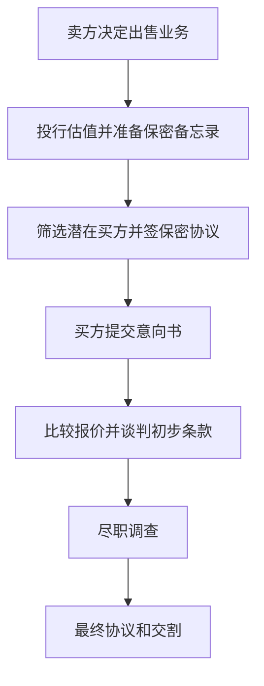

# 26.3 并购顾问、重组与企业融资服务

来源：

- 主线：Mishkin/Eakins Ch.22
- 补充：Mishkin《货币金融学》Ch.2 中金融中介类型
- 延伸：Bodie/Kane/Marcus《Investments》Ch.18, Ch.26

## 企业不只在发行证券时需要投资银行

上一节讲的是企业如何通过投资银行发行股票和债券。证券发行解决的是“企业怎样从资本市场筹资”。但企业经营中还会遇到另一类问题：业务要不要出售，子公司值多少钱，是否该并购另一家公司，如何抵御不想要的收购，陷入财务困难时怎样重组。

这些问题和证券发行一样，都有一个共同特点：交易金额大、信息不对称强、价格很难直接观察。普通商品有货架价格，公司控制权和业务部门没有统一标价。一个业务对不同买方的价值可能完全不同：对只想购买实物资产的买方，价值接近资产价值；对能与自身业务产生协同效应的买方，价值可能高得多。

因此，投资银行不仅是证券发行中介，也是公司交易顾问。它把复杂的公司出售、并购和重组过程，拆成估值、寻找买方、信息披露、谈判、融资和交割等步骤。

## 股权出售：先判断一个业务值多少钱

公司或业务部门出售是理解交易顾问业务的起点。一个企业可能因为某个子公司亏损、战略不匹配、债务压力过大或需要集中主业，决定出售业务。Mattel 的案例说明了这一点。1984 年，Mattel 因电子子公司亏损，银行贷款面临压力，于是聘请 Drexel Burnham Lambert 帮助出售非玩具业务，作为重组的第一步。后来 Mattel 又因收购软件公司遇到问题，再次使用投资银行出售相关业务。

出售业务的第一步，是判断该业务值多少钱。这里不能像给洗衣粉或糖果标价那样简单。一个正在经营的企业有客户、员工、品牌、合同、技术、资产和未来现金流。它的价值取决于买方准备怎样使用它。

如果买方只看重厂房、设备和库存，估值可能较低。如果买方能把该业务接入自己的销售渠道、技术平台或成本体系，产生协同效应，就可能愿意支付更高价格。协同效应指合并后的整体价值超过两家公司单独经营价值之和。

投资银行会比较类似公司和类似交易，分析未来现金流，并用估值模型给卖方一个价值区间。这个区间不是绝对真理，而是谈判起点。

## 保密备忘录和买方筛选

企业出售时，卖方不能把全部敏感资料公开给市场。财务数据、客户名单、成本结构和战略计划如果落到竞争对手手里，可能损害公司。因此，投资银行会准备保密备忘录，向合格潜在买方提供详细信息。

潜在买方通常要签署保密协议，承诺不把资料用于竞争，也不向第三方泄露。投资银行还会筛选买方：它们是否有资金实力，是否有真实收购意愿，是否只是想打探情报，是否可能通过监管审查。

这一步仍然是在解决信息问题。买方需要信息才能报价，卖方又不能把信息随便给所有人。投资银行通过保密协议、买方筛选和有序披露，在信息提供和信息保护之间建立制度。

## 意向书、尽职调查和最终协议

潜在买方若有兴趣，会提交意向书。意向书表达继续推进交易的意愿，并列出初步价格和条件。它通常不是最终合同，但会决定谈判方向。

卖方和投资银行会比较多个意向书。最高价格不一定最好，还要看付款方式、融资确定性、监管风险、交割条件、买方信誉和交易完成概率。投资银行会帮助卖方分析和排序报价，并代表卖方谈判条款。

一旦卖方接受某个意向书，买方进入尽职调查阶段。尽职调查通常持续数周，用于核实保密备忘录中的信息。买方会检查财务报表、合同、法律风险、资产状况、客户关系和管理层陈述。调查结果会影响最终协议：若发现问题，买方可能降价、要求赔偿条款，甚至退出交易。

这个流程说明，公司出售不是简单“找人买”。它需要金融分析、法律文件、会计审查、行业知识和谈判能力。投资银行通常会组织多学科团队，包括金融分析师、律师、会计师和行业专家。

## 并购：合并、收购和敌意收购

业务出售之后，就进入更广义的并购市场。合并是两家公司结合成一个新公司，双方管理层通常支持交易，股东把原公司股票换成新公司股票。收购是一家公司购买另一家公司所有权，通常通过购买股票实现。

收购可以是友好的，也可以是敌意的。友好收购中，双方相信合并资源能带来成本节约、规模经济、市场扩张或技术互补。财务困难公司有时甚至主动寻找买方，希望被更强公司收购。

敌意收购中，目标公司管理层反对交易，收购方绕过管理层，试图直接向股东购买足够股份，从而控制董事会。董事会一旦被控制，就能推动目标公司与收购方合并。

投资银行可以服务收购方，也可以服务目标公司。收购方需要帮助寻找目标、评估价值、筹集资金、设计要约收购；目标公司可能聘请投资银行帮助抵御不想要的收购。

## 要约收购和控制权市场

要约收购是收购方直接向目标公司股东提出买入股票的报价。只要足够多股东接受，收购方就能取得控制权。这个机制让公司控制权不完全掌握在现任管理层手里。

控制权市场有公司治理功能。如果管理层经营差、公司资产被低效使用，外部收购方可能认为自己接管后能提高公司价值。敌意收购威胁会约束管理层，让他们不能完全忽视股东利益。

但敌意收购也会引发防御。目标公司管理层可能认为收购价格低估公司，或认为收购方会损害长期价值。此时，投资银行会帮助目标公司评估报价是否公平，设计防御策略，并寻找替代买方。

## 毒丸：让目标公司获得谈判筹码

毒丸是敌意收购防御中的常见工具。它通常允许现有股东在某个外部收购方持股超过一定比例时，以折扣价购买更多股份，从而稀释收购方持股比例，提高收购成本。

Twitter 与 Elon Musk 的交易展示了投资银行在控制权争夺中的作用。Musk 先取得 Twitter 超过 9% 股份，随后提出收购意向。Twitter 董事会设置股东权利计划，即毒丸，以防止未经董事会同意的控制权快速转移。Twitter 聘请 JPMorgan 和 Goldman Sachs，Musk 则由 Morgan Stanley 协助。最终交易在 2022 年 10 月 28 日完成，价格为 440 亿美元。

这个案例的重点不是判断交易好坏，而是看到投资银行在控制权争夺中的位置：目标公司需要评估报价、设计回应、增强谈判能力；收购方需要融资、结构设计和执行支持。

## 垃圾债券和 20 世纪 80 年代并购浪潮

并购需要大量资金。20 世纪 80 年代，美国并购活动与高收益债券市场密切相关。高收益债券也称垃圾债券，违约风险高、收益率高。Michael Milken 和 Drexel Burnham Lambert 推动了垃圾债券市场的发展，使较小公司也能筹集大量资金，尝试收购更大公司。

这改变了公司控制权市场。过去，大公司收购小公司更常见；高收益债券让较小公司也可能通过举债筹资，挑战更大目标公司。杠杆收购和敌意收购活动因此增加。

但高收益债券融资也让并购更依赖信用环境。收购方如果大量举债，未来必须依靠目标公司现金流还本付息。经济放缓、利率上升、现金流不足或违约率上升，都会使这种结构变脆弱。Drexel Burnham Lambert 后来因垃圾债券组合违约率上升、经济放缓和监管变化陷入困境并破产，并购活动也在 1990 年代初放缓。

这里可以和前面债券市场、信用利差、金融危机联系起来。并购市场繁荣不只是企业战略问题，也依赖资本市场愿意为高风险债务提供资金。信用宽松时，并购更容易扩张；信用收缩时，交易减少。

## 投资银行自身也会暴露在危机中

并购业务之后，还必须看到 2008-2009 年抵押贷款和信用危机中投资公司的困难。许多知名投资公司持有次级抵押贷款证券化产品。当市场发现这些证券质量不足以支持价格时，机构难以出售资产，资产价值下跌。

第二个问题是流动性。信用市场冻结后，一些投资公司有到期证券需要融资，却找不到新资金来源。投资银行不像传统商业银行那样拥有稳定存款基础，更依赖市场融资。市场信心一旦下降，融资压力会迅速放大。

Bear Stearns 被 J.P. Morgan 收购并获得政府支持，Merrill Lynch 被 Bank of America 收购，Lehman Brothers 破产，说明证券公司和投行虽然不是普通存款银行，也会因杠杆、流动性错配和资产价格下跌引发系统性问题。

这与金融危机章节的机制一致：资产价格下跌、信息不确定性上升、流动性枯竭、金融机构资产负债表恶化，会互相强化。

并购估值把公司金融和投资学直接连起来。收购方支付的溢价必须由协同效应、成本节约、税盾、资产重组或治理改善来支持；如果溢价只是来自乐观情绪和便宜债务，股东价值可能被毁。杠杆收购还会把企业经营风险转化为信用风险：现金流预测、利率、信用利差和退出估值一旦恶化，交易回报会迅速变差。

## 小结

投资银行在公司出售、并购、重组和控制权市场中提供估值、买方筛选、保密信息管理、谈判、融资安排和交易执行服务。公司交易没有简单市场价格，价值取决于现金流、资产、协同效应和买方用途。

并购可以是友好合并，也可以是敌意收购。投资银行既可能帮助收购方筹资和发起要约，也可能帮助目标公司防御。毒丸、要约收购和高收益债券融资，都是控制权市场的重要机制。

并购活动与宏观信用环境密切相关。经济扩张和信用宽松会推动交易，衰退和信用收缩会抑制交易。投资银行本身也可能因持有风险资产和依赖短期融资而在危机中变得脆弱。

## 自测问题

- 为什么公司出售比普通商品买卖更需要估值顾问？
- 保密备忘录和尽职调查分别解决什么问题？
- 合并、友好收购和敌意收购有什么区别？
- 毒丸为什么能提高目标公司的谈判筹码？
- 垃圾债券如何推动 20 世纪 80 年代的并购浪潮？
- 为什么并购活动会随经济周期和信用环境变化？
- 2008 年危机中投资银行暴露了哪些资产负债表风险？
- 为什么收购溢价必须由协同效应或治理改善支持，不能只依赖乐观估值？
