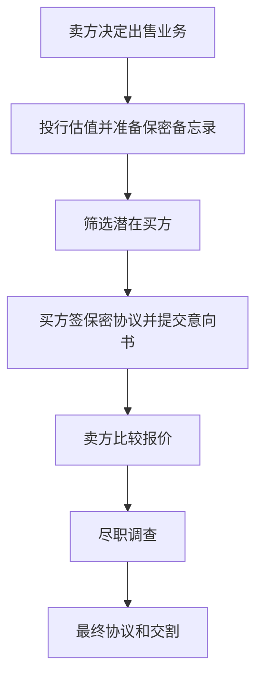

# 26.3 并购顾问、重组与企业融资服务

来源：

- 主线：Mishkin/Eakins Ch.22
- 补充：Mishkin《货币金融学》Ch.2 中金融中介类型

## 企业不只需要发行证券

企业融资并不只有发行股票和债券。企业还可能出售某个业务部门，收购另一家公司，与竞争对手合并，抵御敌意收购，或在财务困难时重组资产和债务。投资银行在这些交易中提供估值、谈判、融资和信息筛选服务。

这些服务的共同点，是交易对象复杂、金额巨大、信息不对称严重。买方不知道目标公司真实价值，卖方不知道潜在买方愿意出什么价格，双方还要处理税务、法律、融资、员工和监管问题。普通商品有明确市场价格，公司控制权没有简单标价。

投资银行的角色，是把复杂公司交易转化为可谈判、可融资、可执行的交易结构。

## 出售业务和公司估值

当企业决定出售子公司或业务部门时，第一步是估值。一个正在经营的企业不像一盒洗衣粉或一台电脑，有统一标价。它的价值取决于买方如何使用它。

如果买方只看中厂房、设备和库存，价值可能接近资产清算价值。如果买方能把该业务与自身销售渠道、技术或成本结构结合，产生协同效应，那么它愿意支付更高价格。协同效应是指两家公司合在一起后，整体价值超过单独经营价值之和。

投资银行会比较类似公司交易、预测现金流、分析行业和竞争格局，为卖方提供价值区间。它还会准备保密备忘录，向潜在买方介绍公司财务、业务、客户和风险。潜在买方通常需要签署保密协议，承诺不把信息用于竞争或泄露给第三方。

## 买方筛选和尽职调查

公司出售不是把信息发给所有人。潜在买方必须有支付能力、战略兴趣和交易诚意。投资银行会筛选买方，避免把敏感信息交给不合格或只是想刺探商业机密的企业。

有兴趣的买方会提交意向书。意向书不是最终合同，而是表达购买兴趣和初步条款。卖方和投资银行会比较不同报价，不只看价格，也看付款方式、融资确定性、监管风险和交易完成概率。

一旦卖方接受意向书，买方进入尽职调查阶段。尽职调查通常用于核实保密备忘录中的信息：财务数据是否真实，客户合同是否稳定，法律风险是否存在，资产是否有瑕疵，管理层陈述是否准确。

尽职调查结果会影响最终协议。如果发现问题，买方可能压低价格、要求赔偿条款，甚至退出交易。投资银行要协调财务顾问、律师、会计师和行业专家，让交易继续推进。

## 并购：合并、收购和敌意收购

合并是两家公司结合成一个新公司，双方管理层通常都支持交易，股东把原公司股票换成新公司股票。收购是一家公司购买另一家公司所有权，通常通过购买股票实现。收购可以是友好的，也可以是敌意的。

友好收购中，双方认为合并资源可以产生规模经济、成本节约、市场扩张或技术互补。财务困难公司有时也主动寻找买方，希望被更强公司收购。

敌意收购中，目标公司管理层反对交易，收购方绕过管理层，试图直接向股东购买足够股份，以控制董事会。投资银行可以服务收购方，也可以服务目标公司。收购方需要寻找目标、筹集资金、设计收购报价和发起要约收购；目标公司可能聘请投行帮助防御。

要约收购是收购方直接向目标公司股东提出购买股份的报价。如果足够多股东接受，收购方可以获得控制权。

## 毒丸和控制权争夺

敌意收购防御中，毒丸是一种常见工具。它通常允许现有股东在某个外部收购方持股超过一定比例时，以折扣价购买更多股份，从而稀释收购方持股比例，提高收购成本。

Twitter 与 Elon Musk 的交易可以说明控制权争夺中投资银行的作用。收购方需要投行帮助融资和谈判；目标公司也需要投行评估报价、设计回应方案、判断是否接受交易。毒丸并不一定是永久阻止收购，而是让董事会获得谈判筹码。

控制权市场与公司治理有关。如果管理层表现差，收购方可能认为更换管理层能提高公司价值。敌意收购威胁可以约束管理层，但也可能使管理层过度关注短期股价或采取防御措施保护自身职位。

## 杠杆收购和垃圾债券

并购需要大量资金。20 世纪 80 年代，美国并购活动与高收益债券市场密切相关。高收益债券也常被称为垃圾债券，风险高、利率高。它们使规模较小的公司也能筹集巨额资金，尝试收购更大公司。

这种融资方式扩大了控制权市场，但也提高了财务脆弱性。收购方如果大量举债收购目标公司，未来必须依靠目标公司现金流还本付息。经济放缓、利率上升或现金流低于预期，都可能导致违约。

Drexel Burnham Lambert 和 Michael Milken 的案例说明，金融创新能推动并购和企业重组，也可能在信用风险上升和监管压力下崩溃。垃圾债券市场衰退后，并购活动一度放缓。

这与宏观周期有关。经济扩张、股价较高、信用宽松时，并购更活跃；衰退和信用收缩时，并购活动下降。企业控制权市场不是孤立领域，而受利率、信用利差、风险偏好和经济增长影响。

## 投资银行危机中的脆弱性

2008-2009 年金融危机显示，投资银行本身也可能成为风险中心。部分大型投资银行持有大量与次级抵押贷款相关的证券。当市场意识到这些证券质量不足以支持价格时，机构难以出售资产，资产价格下跌损害资本。

同时，信用市场冻结使一些投资银行无法为到期融资续借资金。投资银行不像传统商业银行那样拥有稳定存款基础，往往依赖短期市场融资。一旦市场信任下降，流动性压力会迅速放大。

Bear Stearns 被收购，Lehman Brothers 破产，Merrill Lynch 被 Bank of America 收购，说明证券公司和投行虽然不是普通存款银行，但也会因杠杆、流动性错配和资产价格下跌而出现系统性问题。

这和前面金融危机章节的逻辑一致：资产价格下跌、信息不确定性上升、流动性枯竭和金融机构资产负债表恶化，会互相强化。

## 小结

投资银行在公司出售、并购、重组和控制权市场中提供估值、买方筛选、保密信息管理、谈判、融资安排和交易执行服务。公司交易没有简单市场价格，价值取决于现金流、资产、协同效应和买方用途。

并购可以是友好合并，也可以是敌意收购。投资银行既可能帮助收购方筹资和发起要约，也可能帮助目标公司防御。毒丸、要约收购和杠杆融资，都是控制权市场的重要机制。

并购活动与宏观信用环境密切相关。经济扩张和信用宽松会推动交易，衰退和信用收缩会抑制交易。投资银行本身也可能因持有风险资产和依赖短期融资而在危机中变得脆弱。

## 自测问题

- 为什么公司出售比普通商品买卖更需要估值顾问？
- 保密备忘录和尽职调查分别解决什么问题？
- 合并、友好收购和敌意收购有什么区别？
- 毒丸为什么能提高目标公司的谈判筹码？
- 垃圾债券如何推动杠杆收购？
- 2008 年危机中投资银行暴露了哪些资产负债表风险？
