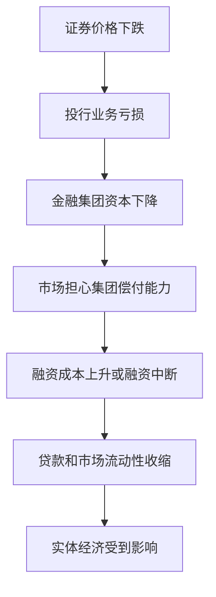

# 26.5 商业银行与投行业务边界

来源：

- 主线：Mishkin/Eakins Ch.22
- 补充：Mishkin《货币金融学》Ch.2 中金融中介类型

## 为什么从证券监管讲到银行边界

原书在讲完经纪商和交易商之后，没有立刻跳到私募股权，而是先讨论证券公司监管，再讨论证券公司和商业银行的关系。这个顺序很重要。

经纪商、交易商和投资银行都在证券市场中工作。它们帮助企业发行证券，帮助投资者买卖证券，也可能持有证券库存。证券市场能否吸引资金，取决于投资者是否相信市场基本公平、信息披露可信、交易不会被操纵。

一旦投资者认为市场被内部人、操纵者或大机构系统性占便宜，他们就会退出市场。资金退出会降低市场流动性，提高企业融资成本，最终影响经济增长。因此，证券监管和商业银行边界问题，不只是机构分类问题，而是金融体系怎样维持信任的问题。

## 证券公司为什么需要监管

证券市场天然存在信息不对称。公司内部人比外部投资者更了解企业真实状况。证券经纪商、交易商和投行人员也可能掌握普通投资者不知道的信息。

如果投资者无法区分好证券和坏证券，只能按平均质量出价，那么好公司会觉得价格太低而退出，留下质量较差、定价过高的证券。随着市场平均质量下降，投资者愿意支付的价格进一步下降，更多好证券退出。这个过程就是证券市场中的柠檬问题。

解决办法之一，是强制披露。发行人必须提交注册文件，公开重要财务和经营信息，上市公司还要持续提交定期报告。披露不是保证投资者不亏钱，而是让投资者有基本信息可以判断风险。

监管还禁止虚假陈述、市场操纵和内幕交易。原因很直接：如果小投资者认为市场价格被操纵，或者内部人总能在坏消息公布前提前卖出，他们就不会愿意把储蓄投入证券市场。

## 1933 年和 1934 年证券法的逻辑

美国 1933 年和 1934 年证券法构成现代证券监管基础。这些法律在大萧条后通过，当时许多人认为证券市场滥用行为与经济困难有关。

这些法律的主要内容包括：设立证券交易委员会；要求新证券发行注册并向潜在投资者披露相关信息；要求公众公司提交年度和半年度报告；要求发生重大事件时及时披露；要求内部人买卖股票时提交报告；禁止市场操纵。

这些规则背后的经济逻辑，是把证券市场从“关系和传闻驱动”推向“公开披露和法律责任驱动”。投资者仍然要承担商业风险和市场风险，但不应在基本信息上被系统性欺骗。

| 监管要求 | 解决的问题 |
| --- | --- |
| 新证券注册和披露 | 降低发行人与投资者之间的信息不对称 |
| 上市公司定期报告 | 让投资者持续了解公司状况 |
| 重大事件披露 | 防止重要信息长期只掌握在内部人手中 |
| 内部人交易报告 | 监控管理层和大股东交易 |
| 禁止市场操纵 | 保护价格形成和市场信心 |

## 投资池操纵的例子

原书用 1932 年投资池操纵说明为什么监管必要。所谓投资池，是一群投资者联合起来操纵某只股票价格。他们先散布关于某家公司健康状况的负面谣言，压低股价；然后在低价买入；等持有足够股票后，再发布好消息或制造乐观情绪，让价格上涨；最后卖出获利。

这个过程中，普通小投资者被虚假信息误导，在低价时卖出或高价时买入，承担损失。操纵者获利不是因为发现了真实价值，而是因为制造了错误价格。

这类行为破坏证券市场最基础的功能：把分散信息反映到价格中。如果价格可以被谣言和团体操纵，投资者就无法把价格当作可靠信号，企业也无法通过证券市场有效融资。

1933 年和 1934 年证券法禁止这类操纵行为，目的就是保护市场诚信。

## 并非所有证券发行都受同等监管

不是所有证券发行都必须完整注册。私募发行、小规模发行、短期证券、美国政府和多数市政证券等，可以在一定条件下豁免完整 SEC 注册。

这种安排反映了监管成本和投资者保护之间的权衡。面向公众的大规模发行，投资者分散、信息能力差异大，需要强披露。面向少数大型机构投资者的私募，买方通常有专业分析能力和谈判能力，监管可以相对宽松。

短期证券和政府证券也有不同风险特征。短期证券期限短，公开注册成本相对不划算；美国政府证券依靠政府信用，信息问题与普通公司证券不同。

这说明监管不是越多越好，而是要根据交易对象、投资者类型、期限和信息不对称程度设计。

## 商业银行和投资银行为什么曾被分开

商业银行和投资银行边界问题，源于两类机构风险性质不同。商业银行吸收存款、经营支付系统，并受到存款保险和中央银行流动性支持等安全网影响。投资银行从事证券承销、经纪、交易和并购顾问，资产价格波动更直接。

大萧条后，美国通过 Glass-Steagall Act 把商业银行和投资银行分开。监管者担心商业银行如果同时承销证券，可能把劣质证券卖给客户，或用受保护的存款资金支持证券投机。银行失败不仅损害股东，也可能冲击存款人、支付体系和信用供给。

分业之后，许多新的证券公司发展起来，既提供投资银行服务，也提供经纪服务。也就是说，证券发行和证券交易在证券公司体系内结合，而商业银行主要保留存款和贷款业务。

## 边界为什么逐渐模糊

从 20 世纪 80 年代开始，商业银行和投资银行之间的法律壁垒逐渐削弱。大型商业银行开始收购投资银行或证券公司，建立承销、并购和资本市场业务。金融危机期间，Bank of America 收购 Merrill Lynch，J.P. Morgan 收购 Bear Stearns，Barclays 收购 Lehman Brothers 部分资产，进一步改变了行业结构。

边界模糊有经济原因。企业客户希望同一家金融机构既能提供贷款，又能安排债券发行、股票发行、外汇、并购和风险管理。大型金融集团可以共享客户关系和信息，提供一站式服务。

这就是范围经济：同一家机构联合提供多种金融服务，可能比多家机构分别提供更方便、更便宜。银行已经了解企业财务状况，就可能更有效地为其安排债券发行或并购融资。

## 证券公司为什么也进入银行业务

银行要求放松限制，还有一个原因：证券公司也在进入传统银行领域。

Merrill Lynch 的现金管理账户提供支票功能、较高收益的货币市场基金、贷款、信用卡和统一账户记录。证券公司还可以提供 ATM、借记卡、证券买卖和某些保险产品。对客户来说，这些服务越来越像银行账户。

商业银行因此认为竞争环境不公平。证券公司可以提供许多银行式服务，却不受同样限制；银行却被禁止或限制进入证券承销和经纪业务。银行要求“公平竞争环境”，希望获得进入证券业务的权利。

证券公司则可能担心相反问题：商业银行有存款基础和政府安全网，若进入证券业务，可能获得融资成本优势，并把受保护业务的安全感带到高风险证券活动中。

## 混业经营的利益冲突

边界放松提高效率，也带来利益冲突。综合金融机构同时做贷款、承销、研究和经纪，可能在不同客户之间产生冲突。

例如，投行部门希望获得某公司的证券承销业务，研究部门可能受到压力，发布更积极的研究报告以维持发行人关系。经纪部门向投资者销售证券，可能推荐本公司投行业务正在承销的发行。银行贷款部门也可能通过证券发行把问题企业风险转移给市场投资者。

这些冲突与信息不对称相连。普通投资者依赖金融机构提供研究和建议，但金融机构可能同时从发行人那里获得费用。监管要求信息披露、职能隔离、内部防火墙和合规审查，就是为了减少这种冲突。

## 危机后的边界反思

2008 年危机后，大型综合金融机构的风险再次受到关注。金融集团同时经营商业银行、投行、交易、资产管理和衍生品业务，内部风险复杂，外部监管也更困难。

商业银行的危险在于短期负债和长期资产错配；投资银行的危险在于市场融资依赖、杠杆和证券价格波动。合在一起后，既可能提高多元化能力，也可能让风险更难识别。一个部门的损失可能影响整个集团声誉和融资能力。

宏观金融稳定的关键，不是简单地说分业一定好或混业一定好，而是理解不同业务如何通过资产负债表、融资渠道、担保关系和市场信心相互传染。

## 小结

证券监管的基础，是维护市场诚信和降低信息不对称。1933 年和 1934 年证券法通过注册披露、持续报告、内部人交易报告和禁止操纵，帮助投资者相信证券市场基本公平。

商业银行和投资银行边界问题，来自效率、竞争和风险控制之间的冲突。分业可以降低受保护存款业务与证券风险之间的传染，但也限制范围经济和竞争。混业可以提供一站式服务，却可能带来利益冲突和系统性风险。

理解这条边界，不能只看机构名称。关键是看资金来源是否稳定、政府安全网是否存在、业务风险能否相互传染，以及投资者是否能获得真实充分的信息。

## 自测问题

- 为什么证券市场特别依赖投资者信心？
- 证券市场中的柠檬问题如何出现？
- 1933 年和 1934 年证券法主要解决哪些问题？
- 投资池操纵为什么会破坏证券市场功能？
- 为什么商业银行和投资银行曾被分开监管？
- 现金管理账户为什么让证券公司与银行竞争？
- 综合金融机构可能产生哪些利益冲突？
