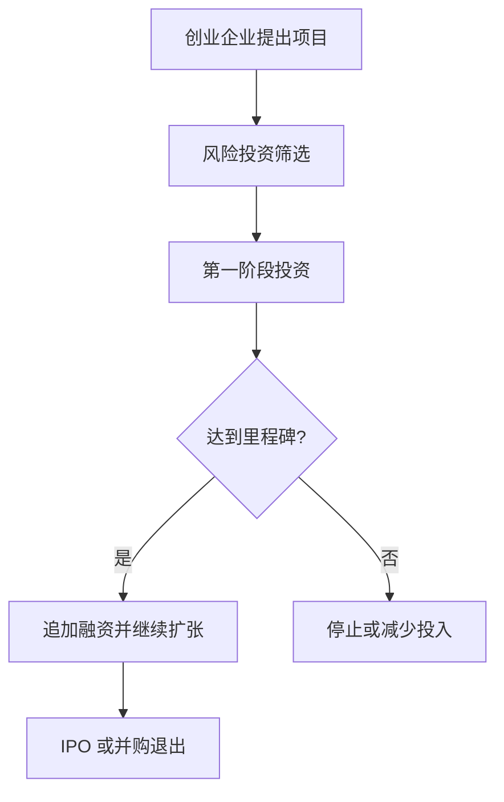

# 26.6 风险投资、私募股权与创业融资

来源：

- 主线：Mishkin/Eakins Ch.22
- 补充：Mishkin《货币金融学》Ch.2 中金融中介类型

## 为什么创业企业很难融资

创业企业通常有想法、技术或产品原型，但缺少稳定现金流、抵押品和经营历史。商业银行不愿贷款，因为贷款需要按期付息还本，而创业企业早期可能多年没有收入。公开发行股票也很难，因为公司太新，公众投资者缺乏信息，投资银行也难以为其定价并销售给大众。

如果没有特殊融资渠道，许多高风险但有潜力的创新项目无法启动。风险投资就是填补这个缺口的金融中介。

风险投资通常向年轻、未上市、成长潜力高的企业提供股权资金。投资者不是期待固定利息，而是希望少数成功企业未来价值大幅上升，弥补多数失败项目的损失。

这与前面信息不对称章节相连。创业企业最严重的问题不是单纯“缺钱”，而是外部投资者很难判断创始人能力、技术可行性、市场规模和管理行为。风险投资机构通过专业筛选、分阶段投资和积极治理来解决这个问题。

## 风险投资如何降低信息问题

风险投资与银行贷款不同。银行贷款人主要依靠利息、抵押品和借款人现金流；风险投资人持有股权，收益来自企业价值增长。由于创业企业没有稳定现金流，股权比债务更适合承担早期风险。

风险投资机构通常不是被动投资者。它们可能进入董事会，参与重大决策，帮助企业招聘管理层，介绍客户、供应商和后续投资者，并监督资金使用。

最重要的控制工具之一，是分阶段投资。风险投资不会一次性把全部资金交给创业公司，而是根据产品开发、客户验证、收入增长或监管审批等里程碑逐步投入。若项目停滞或市场变化，后续资金可以停止，以限制损失。

这种安排同时处理逆向选择和道德风险。筛选减少投到差项目的概率；董事会监督和分阶段拨款减少创始人浪费资金或偏离投资者利益的可能。

## 风险投资基金的组织

风险投资资金通常通过有限合伙制筹集。有限合伙人提供资金，可能包括养老金、企业、富裕个人和其他机构投资者；普通合伙人负责寻找项目、投资、监督和退出。

有限合伙人承诺出资后，资金不会一次性全部进入基金。风险投资基金根据投资需要发出资本调用，要求有限合伙人按承诺缴款。这种方式适合长期、分阶段投资。

风险投资基金期限通常很长，资金可能被锁定 7 到 10 年。原因是创业企业从概念到产品、收入、盈利和上市或被收购，需要多年时间。普通投资者希望每年看到股息或价格变化，风险投资则要忍受长期缺乏流动性。

这种长期性说明，风险投资不是短期交易，而是把长期耐心资本投入高不确定性创新。养老金进入风险投资市场，也把前一章长期机构投资者与创业融资连接起来。

## 种子期、早期和后期投资

风险投资可以按企业发展阶段分类。

种子投资发生在企业还没有明确产品或组织结构时，资金用于验证想法、开发原型和建立团队。风险最高，但如果成功，回报也可能最高。

早期投资用于企业已经形成初步产品或商业计划，需要资金开发市场、完善产品、建立运营体系。

后期投资用于企业已经有一定收入和业务规模，需要资金扩张到足够规模，以便吸引公开市场融资或被战略买方收购。

| 阶段 | 企业状态 | 资金用途 | 主要风险 |
| --- | --- | --- | --- |
| 种子期 | 想法或原型 | 技术验证、团队搭建 | 技术和市场都不确定 |
| 早期 | 初步产品和组织 | 产品完善、市场进入 | 商业模式未充分证明 |
| 后期 | 已有收入和增长 | 扩张规模、准备退出 | 增长能否持续 |

风险投资机构会在一个基金中投资多家公司。大多数创业项目失败，少数成功项目提供高回报。组合分散是风险投资商业模式的一部分。

## 退出：IPO 和并购

风险投资最终需要退出。退出不是简单“卖掉股票”，因为创业企业通常没有公开交易市场。常见退出方式是 IPO 和并购。

IPO 使公司股票在公开市场交易，风险投资机构作为早期股东获得可交易股票。但它通常受到锁定期和内部人出售限制，不能立即全部卖出。公开上市后，股票逐步流通，风险投资基金可以向有限合伙人分配股票或现金。

并购是另一种常见退出。大公司可能购买创业企业，以获得技术、团队、客户或市场位置。风险投资基金获得现金或收购方股票，并分配给有限合伙人。

退出决定了风险投资能否把账面价值转化为实际收益。宏观市场环境很重要。股市高涨、风险偏好强、IPO 市场活跃时，退出更容易；经济衰退、股价下跌、信用收缩时，退出困难，基金回报下降。

## 私募股权收购

私募股权不只包括风险投资，还包括收购基金。风险投资通常投资年轻私营公司；私募股权收购则常常购买已经上市或成熟的公司，把它们私有化，重组后再出售或重新上市。

典型私募股权收购中，有限合伙制基金从投资者那里筹集资金，寻找经营不佳但有改善潜力的公司，购买公开流通股票，使公司退市。新的董事会和管理层进入公司，削减成本、出售非核心资产、调整战略或改善激励。

私有化的一个优势，是公司不再面对季度盈利压力和公开披露负担，管理层可以更专注长期重组。另一个优势，是管理层常常获得较大股权激励，使其利益与私募基金更一致。

但私募股权收购也可能使用大量债务融资。债务提高股东回报潜力，也提高违约风险。如果公司改善失败或经济下行，债务负担会压垮企业。

## 私募股权的宏观位置

私募股权和风险投资把资本配置到公开市场难以覆盖的领域。风险投资支持创新和创业，可能推动技术进步、就业和生产率增长；收购基金试图改善成熟企业经营效率，把低效资产重新配置。

但它们也带来风险。高回报来自高风险和低流动性。投资者资金通常被锁定多年，估值不如公开市场透明。杠杆收购在信用宽松时期容易扩张，一旦利率上升或经济衰退，债务压力可能放大破产风险。

从宏观经济看，风险投资连接技术创新和长期增长；私募股权收购连接公司治理、信用市场和资本重新配置。它们不是普通散户投资工具，而是面向有能力承受长期锁定和高风险的机构与高净值投资者。

## 小结

风险投资为年轻、高风险、信息不透明的创业企业提供股权资金。它通过专业筛选、董事会参与、分阶段投资和投资组合分散，缓解信息不对称和道德风险。退出通常依赖 IPO 或并购。

私募股权收购则常常购买成熟或上市公司，将其私有化并重组。私有化可能减少公开市场短期压力，改善管理激励，但如果使用大量债务，也会提高财务脆弱性。

二者共同说明，金融市场不只服务成熟上市公司，也为创新、企业控制权重组和资本重新配置提供渠道。它们与宏观增长、信用周期和资本市场风险偏好密切相关。

## 自测问题

- 为什么创业企业很难从银行贷款或公开股票市场融资？
- 风险投资为什么通常采用股权而不是债务？
- 分阶段投资如何缓解道德风险？
- 风险投资基金为什么需要长期锁定资金？
- IPO 和并购作为退出方式有什么区别？
- 私募股权收购为什么既可能改善企业效率，也可能提高财务风险？
