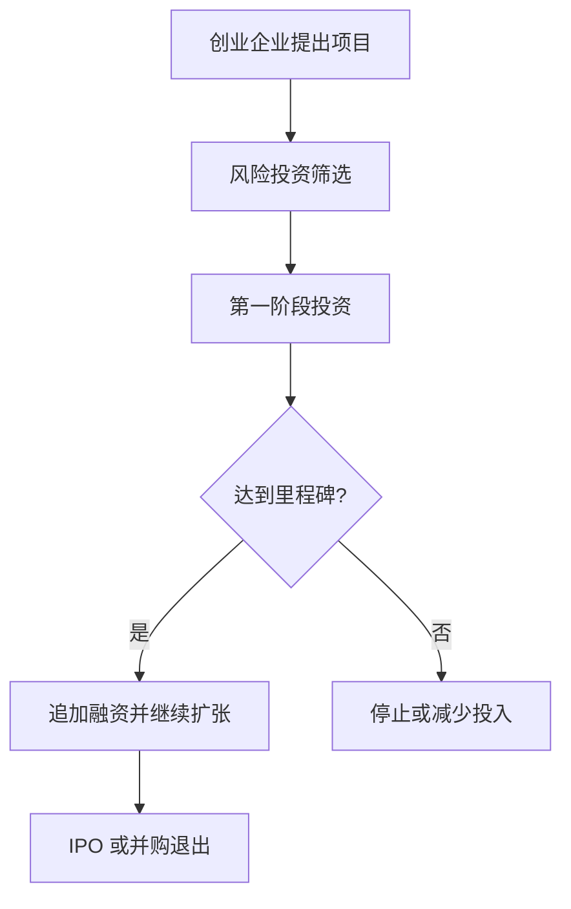
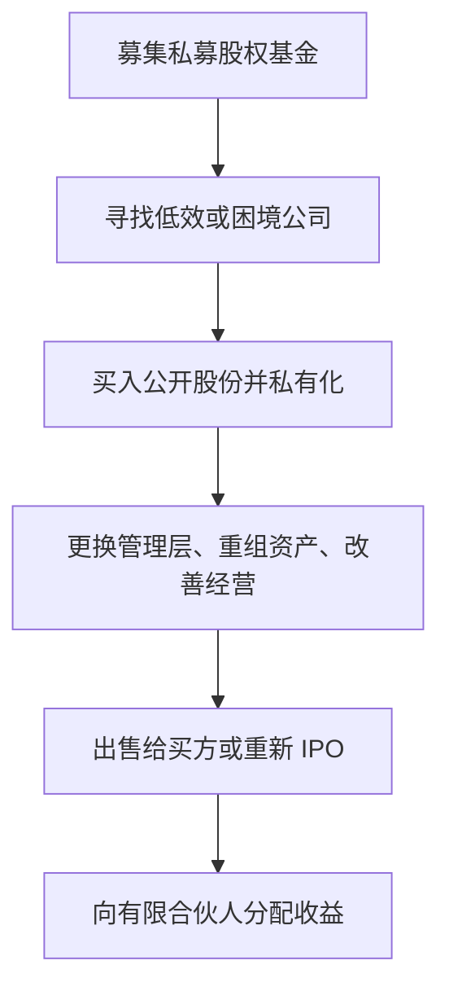

# 26.6 风险投资、私募股权与创业融资

来源：

- 主线：Mishkin/Eakins Ch.22
- 补充：Mishkin《货币金融学》Ch.2 中金融中介类型

## 公开市场之外还有一套股权融资

谈到投资，人们最容易想到股票和债券。公开发行的股票和债券可以在证券市场交易，受证券监管，前面经纪商和交易商处理的大多数交易也发生在这些公开证券上。

但并不是所有股权投资都发生在公开市场。私募股权投资是另一条路径：不是向公众发行证券，而是由有限合伙制基金从少数高净值个人和机构投资者那里募集资金，再投资于未上市企业或收购上市公司。

私募股权中最常见的两类，是风险投资和私募股权收购。风险投资通常投资年轻创业企业，帮助它们成长到能够上市或被收购；私募股权收购则常常购买成熟企业，甚至把上市公司私有化，重组后再出售或重新上市。

原书先讲风险投资，因为它解决的是创业企业为什么难以通过传统渠道融资。

## 为什么创业企业很难从银行和公开市场融资

想象你开发出一种新工艺，认为它有很大成功机会。但它还没有经过市场验证，公司没有稳定收入，没有可抵押资产，也没有长期财务报表。商业银行不愿贷款，因为贷款需要按期付息还本，而你的企业还没有稳定现金流。

公开发行股票也很难。公司太新，公众投资者无法判断技术是否可行、产品是否有市场、管理层是否可靠。投资银行也很难把这样一个未被证明的企业卖给公众投资者。

如果没有其他资金来源，一个有潜力的想法可能没有机会发展。风险投资就是为这种融资缺口而存在。它向年轻、未上市、高不确定性但可能高增长的企业提供资金。

风险投资不是普通贷款。它通常持有股权，收益来自企业价值大幅上升。它也不是普通公开股票投资，因为被投企业没有公开交易市场，投资期限很长，流动性很低。

## 风险投资如何处理信息不对称

创业企业的信息问题比成熟企业更严重。管理者比外部投资者更了解技术、产品和团队真实情况。外部投资者还担心管理者浪费资金、租昂贵办公室、追求个人声誉而不是投资回报，或者投入某些看似前沿但商业价值很低的研究。

这些问题正是前面反复讨论的逆向选择和道德风险。风险投资机构缓解它们的方式，与银行和保险公司不同。

第一，风险投资持有股权，而不是只收固定利息。创业企业早期没有稳定现金流，债务还本付息压力太大；股权融资允许企业在成长前不支付固定利息。若企业成功，风险投资通过股权增值获得高回报。

第二，风险投资不是被动投资者。它通常进入董事会，参与重大决策，帮助企业招聘管理层，介绍客户、供应商、战略伙伴和后续投资者。它通过经验和关系为企业增加价值。

第三，风险投资分阶段投入资金。它不会一次性把全部资金交给创业公司，而是根据产品开发、客户验证、收入增长或监管审批等里程碑逐步投入。若项目停滞或市场变化，后续资金可以停止，以限制损失。

第四，风险投资通过组合分散风险。它会在一个基金中投资多家年轻公司。多数创业项目可能失败，少数成功项目提供高回报，弥补失败损失。

## 风险投资和长期增长

风险投资在美国高科技和创业经济中扮演了重要角色。原书提到，Apple、Cisco、Genentech、Microsoft、Netscape、Sun Microsystems 等公司都曾获得风险投资支持，一些服务业公司如 Staples、Starbucks、TCBY 也受益于风险融资。

风险投资的宏观意义在于，它把长期资本投入高度不确定的创新项目。许多创新项目无法用银行贷款支持，因为早期没有现金流；也无法直接进入公开市场，因为信息不透明。风险投资填补了金融体系中的一个空白，使技术进步、就业创造和生产率增长更可能发生。

但这并不意味着风险投资适合所有投资者。它高风险、长期锁定、信息不透明。只有能承受长期流动性缺失和高失败率的投资者，才适合进入这类基金。

## 风险投资的起源和资金来源变化

原书把第一家真正的风险投资公司追溯到 1946 年成立的 American Research & Development。它最著名的成功来自对 Digital Equipment Company 的 70,000 美元早期投资，这笔投资后来在数十年中大幅增值。

早期风险投资不完全等同于今天的科技创业投资。20 世纪 50 和 60 年代，风险资金很多用于房地产和油田开发。到 60 年代后期，资金逐渐转向科技创业企业，高科技后来成为风险投资的主导领域。

资金来源也发生变化。早期风险资本更多来自富裕个人，后来养老金和企业资金越来越重要。1979 年，美国劳工部对养老金投资规则作出解释，允许养老金在审慎原则下投资部分高风险资产，推动养老金资金进入风险投资。企业也开始减少内部集中研发，转而投资外部创业公司；如果项目成功，企业可以收购这些创业公司。

这和前一章养老金作为长期机构投资者的内容相连。养老金长期负债稳定，能够承受一部分非流动、高风险投资，从而成为创业融资的重要资金来源。

## 风险投资基金的组织结构

早期风险投资基金曾采用封闭式基金结构。封闭式基金发行固定数量份额，筹到资金后不允许投资者像开放式基金那样随时赎回。这个结构适合风险投资，因为创业项目需要多年时间发展，基金不能在中途被投资者大规模赎回。

后来风险投资更多采用有限合伙制。有限合伙人提供资金，通常包括养老金、企业和富裕个人；普通合伙人负责寻找项目、投资、监督和退出。有限合伙制通常可以豁免一些公开证券监管要求，因为投资者数量少、资金规模大、专业能力强。

有限合伙人承诺出资后，资金不会一次性全部进入基金。风险投资基金根据投资需要发出资本调用，要求有限合伙人按承诺缴款。这种方式适合长期、分阶段投资。

基金期限通常很长，资金可能被锁定 7 到 10 年。原因是创业企业从概念到产品、收入、盈利和上市或被收购，需要多年时间。普通投资者希望每年看到股息或市场价格，风险投资则必须等待企业成熟。

## 一笔风险投资交易的生命周期

风险投资交易通常经历募资、投资和退出三个阶段。

募资阶段，风险投资机构向有限合伙人募集承诺资金。投资者可能是养老金、企业和富裕个人。因为最低投资额很高，普通个人通常无法直接参与。

投资阶段，基金寻找创业项目。基金可能专注某一两个行业，也可能更广泛寻找机会；可能集中某个地理区域，以便更容易监督企业。投资阶段又可分为种子期、早期和后期。

种子投资发生在企业还没有明确产品或组织结构时，资金用于验证想法、开发原型和建立团队。早期投资用于已有初步产品或商业计划的企业，资金用于完善产品、进入市场和建立运营。后期投资用于已有一定收入和规模的企业，帮助其成长到足以吸引公开融资或战略买方。

| 阶段 | 企业状态 | 资金用途 | 主要风险 |
| --- | --- | --- | --- |
| 种子期 | 想法或原型 | 技术验证、团队搭建 | 技术和市场都不确定 |
| 早期 | 初步产品和组织 | 产品完善、市场进入 | 商业模式未充分证明 |
| 后期 | 已有收入和增长 | 扩张规模、准备退出 | 增长能否持续 |

退出阶段，风险投资基金把长期持有的非流动股权转化为现金或可分配证券。常见方式是 IPO 或并购。

## 退出：IPO 和并购

风险投资的目标不是永远持有创业企业，而是帮助企业成熟到能获得替代资本。成功退出通常希望在 7 到 10 年内完成，后期投资可能更快。

IPO 是最显眼的退出方式。企业上市后，风险投资机构作为早期股东获得公开股票。但它作为内部人，通常受到出售限制，不能立即全部卖出。股票完全可交易后，基金可以把股票或现金分配给有限合伙人。

并购是另一种常见退出。大公司可能购买创业企业，以获得技术、团队、客户或市场位置。风险投资基金获得现金或收购方股票，并分配给有限合伙人。

退出环境受宏观市场影响很大。股市活跃、风险偏好强、IPO 市场开放时，退出更容易；衰退、信用收缩或科技股估值下降时，退出困难，基金回报下降。

## 私募股权收购：从上市公司到私有公司

风险投资是让年轻私有公司成长，最终上市或被收购。私募股权收购则常常方向相反：把公开上市公司买下来，变成私有公司。

典型私募股权收购中，有限合伙制基金从投资者那里筹集资金，寻找经营不佳但有改善潜力的上市公司，购买公开流通股票，使公司退市。退市后，公司不再受到公开上市公司同样的披露、监管和多元股东压力。

私有化的一个优势，是管理层不必每个季度都面对公开市场盈利压力，可以有更多时间执行重组。另一个优势，是管理层可以获得较大股权激励。原书提到，一些知名管理者愿意进入私募股权控制的公司，因为他们可以用较低现金薪酬换取较大所有权份额，利益与私募基金更一致。

但私募股权收购也可能使用大量债务融资。债务提高股东回报潜力，也提高违约风险。如果公司改善失败或经济下行，债务负担会压垮企业。

## 私募股权收购的生命周期

私募股权收购也有自己的生命周期。

第一，成立合伙企业并募集资金。投资者通常承诺较大金额，并同意资金在多年内由基金控制。

第二，寻找表现不佳但有改善空间的公司。基金用投资者提供的股权资金，加上可能的债务融资，购买上市公司股份，使公司私有化。

第三，更换或调整管理层和董事会，出售非核心资产，削减成本，改善收入和盈利。私募股权管理合伙人通常积极参与公司管理。

第四，公司改善后，基金通过出售给另一家公司或重新 IPO 退出。投资者的收益来自公司被重组后价值高于买入价格。

## 小结

风险投资和私募股权都属于公开市场之外的股权融资。风险投资为年轻、高风险、信息不透明的创业企业提供资金，并通过董事会参与、分阶段投资和组合分散降低信息问题。它的退出通常依赖 IPO 或并购。

私募股权收购则常常购买成熟或上市公司，将其私有化并重组。私有化可能减少公开市场短期压力，改善管理激励，但如果使用大量债务，也会提高财务脆弱性。

二者共同说明，金融市场不只服务成熟上市公司，也为创新、企业控制权重组和资本重新配置提供渠道。它们与宏观增长、信用周期、养老金长期资金和资本市场风险偏好密切相关。

## 自测问题

- 为什么创业企业很难从银行贷款或公开股票市场融资？
- 风险投资为什么通常采用股权而不是债务？
- 风险投资如何通过董事会席位和分阶段投资缓解信息问题？
- 风险投资基金为什么需要长期锁定资金？
- IPO 和并购作为退出方式有什么区别？
- 私募股权收购为什么是“公开公司变私有公司”？
- 私募股权收购为什么既可能改善企业效率，也可能提高财务风险？
