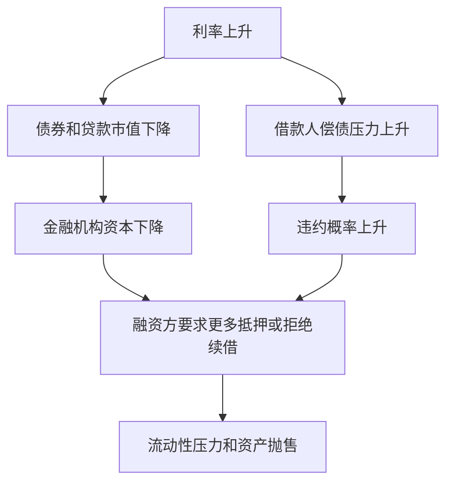

# 27.1 金融机构面临的主要风险

来源：

- 主线：Mishkin/Eakins Ch.23, Ch.24
- 补充：Mishkin《货币金融学》MyLab Additional Chapter: Financial Derivatives
- 延伸：Bodie/Kane/Marcus《Investments》Ch.14, Ch.16, Ch.26

## 为什么金融机构必须专门管理风险

金融机构的日常业务，本来就是和风险打交道。银行把短期存款转化为长期贷款，保险公司收取保费并承诺未来赔付，养老金把现在的缴费投资到未来，券商和投行持有证券、承销发行或提供交易服务。它们的利润来自承担和管理风险，而不是完全避免风险。

问题在于，风险一旦管理不好，金融机构的损失不会只停留在自身账面。银行收缩贷款，会影响企业投资和家庭消费；保险公司偿付能力下降，会影响投保人的保障；养老金资产缩水，会影响退休收入；证券机构流动性紧张，会影响市场交易和资产价格。金融机构的风险管理因此直接连接到宏观经济中的信用供给、资产价格、总需求和金融稳定。

从 20 世纪 70 年代以后，利率波动加大，债券和股票市场也经历了多次剧烈波动。利率一变，债券价格、贷款收益、存款成本和金融机构净值都会变化。与此同时，借款人违约、抵押品价格下跌和市场流动性枯竭，也会让金融机构遭受损失。风险管理变成金融机构经营的核心，而不是附属工作。

## 风险管理不是消除风险

零基础读者容易把风险管理理解成“不要冒险”。这不对。金融机构如果完全不冒险，就无法创造利润，也无法发挥金融中介功能。银行贷款给企业，本来就承担企业可能违约的风险；保险公司承保火灾和死亡风险，本来就承担未来赔付不确定性；养老金投资股票和债券，本来就承担资产价格波动。

风险管理要解决的问题，是弄清楚风险来自哪里、规模有多大、是否与机构资本相匹配，以及是否能通过合同、资产负债调整或金融工具降低不必要的暴露。

可以把金融机构风险管理理解为三个连续问题：

这三个步骤贯穿本章。信用风险需要筛选、监督和抵押品；利率风险需要收入缺口和久期缺口分析；市场风险和外汇风险可以用远期、期货、期权和互换对冲；衍生品本身又会带来杠杆和交易对手风险。

## 信用风险：借款人可能不还钱

信用风险是借款人或债务发行人不能按约定履行付款义务的风险。银行贷款、公司债、抵押贷款、信用卡贷款、商业票据、保险公司持有的债券，都包含信用风险。

信用风险的根源仍然是前面反复出现的信息不对称。借款人通常比贷款人更了解自己的项目、收入、财务压力和真实行为。贷款发放前，坏信用风险更积极寻找资金，这就是逆向选择；贷款发放后，借款人可能把钱投向更冒险的项目，或者降低偿债努力，这就是道德风险。

例如，一个企业如果项目成功会获得巨大利润，失败则主要由债权人承担损失，它就更愿意借高利率贷款去冒险。贷款人如果只提高利率，可能反而吸引更冒险的借款人，因为稳健借款人觉得利率太高而退出。这就是为什么金融机构不能只靠“提高利率”管理信用风险。

信用风险管理的基本工具包括筛选、监督、长期客户关系、贷款承诺、抵押品、补偿性余额和信用配给。这些工具会在下一节详细展开。

## 利率风险：利率变化会改变收入和净值

利率风险是利率变化导致金融机构收益和资产负债价值波动的风险。它对银行、储蓄机构、保险公司、养老金和债券投资者都很重要。

前面债券章节已经建立了一个核心事实：债券价格和利率反向变化。利率上升，已有固定利率债券价格下降；利率下降，已有固定利率债券价格上升。这个逻辑放到金融机构资产负债表上，就会影响净值。

银行还面临另一层利率风险：利息收入和利息支出的重新定价速度不同。很多银行“短借长贷”：用较短期或可随市场调整利率的负债，支持较长期、固定利率的贷款或证券。如果市场利率上升，存款和短期融资成本可能很快上升，而长期固定利率贷款收入不变，净利息收入就会下降。

这和宏观经济联系很紧。中央银行提高政策利率时，不只是影响家庭贷款利率和企业融资成本，也会影响金融机构的净息差、资产价格和资本。如果金融机构利率风险过高，货币政策收紧可能通过金融机构资产负债表放大对实体经济的冲击。

## 市场风险、外汇风险和股票价格风险

金融机构还会面临市场价格变化。债券价格、股票价格、外汇汇率和商品价格波动，都会影响资产价值和交易头寸。

外汇风险来自汇率变化。银行、企业或投资者如果未来要收取外币，担心外币贬值；如果未来要支付外币，担心外币升值。汇率波动会改变本币价值，影响利润和资产负债表。

股票价格风险对共同基金、养老金、保险公司和证券公司尤其重要。即使组合已经充分分散，仍然可能随整个市场下跌而亏损。系统性风险不能靠买很多只股票完全消除，因为经济衰退、利率上升和风险偏好下降会同时影响大多数股票。

这些风险推动了金融衍生品的发展。远期、期货、期权和互换之所以重要，是因为它们能把某些价格风险从不愿承担的人转移给愿意承担或更适合承担的人。

## 流动性风险和融资风险

流动性风险指金融机构在需要现金时，无法以合理成本获得现金或卖出资产。银行最典型：存款人提款、批发融资到期、贷款承诺被客户使用，都需要现金。如果银行资产主要是长期贷款或不活跃证券，就可能在短时间内难以变现。

流动性风险和偿付能力风险不同。一个机构从长期看可能资产大于负债，但如果今天无法支付到期债务，也会陷入危机。金融危机中，许多机构的问题正是资产难以出售、短期融资续不上、市场交易冻结。

流动性风险也会和市场风险互相强化。机构为了获得现金被迫卖出资产，资产价格下跌；价格下跌又使其他机构账面亏损和抵押品价值下降，迫使更多卖出。这就是危机章节讲过的火售机制。

## 操作风险和治理风险

操作风险来自内部流程、人员、系统或外部事件失败。比如交易录入错误、模型使用错误、系统宕机、内部欺诈、网络攻击、法律文件缺陷，都可能造成损失。

操作风险看起来不像信用风险和利率风险那样宏观，但大型金融机构的操作错误可能迅速放大。交易系统错误可能造成大量错误订单，风险模型错误可能低估投资组合损失，内部控制失败可能让单个交易员积累巨大头寸。

治理风险则是管理层、风险部门、董事会和激励机制不能有效约束风险承担。金融机构员工可能按短期利润拿奖金，却不承担长期损失；业务部门可能压制风险管理部门；高层可能看不懂复杂产品却允许扩大规模。许多危机都不是因为完全没人知道风险存在，而是风险没有被正确衡量、报告或约束。

## 风险之间会相互转化

本章分开讲信用风险、利率风险、市场风险、流动性风险和操作风险，是为了学习方便。但现实中，它们常常连在一起。

利率上升可能降低债券价格，这是市场风险；同时提高借款人还款压力，变成信用风险；资产价格下跌使抵押品缩水，进一步增加违约损失；市场不愿交易相关资产，又变成流动性风险；如果机构用衍生品对冲不当，还可能出现交易对手风险和操作风险。

宏观经济中的冲击，正是通过这些风险链条进入金融体系，再通过信用收缩和资产价格下跌反馈到实体经济。

从投资学角度看，金融机构风险管理也是组合风险管理的机构版本。信用风险对应违约损失和信用利差，利率风险对应久期和凸性，市场风险对应 beta、汇率和价格因子，流动性风险对应折价和融资约束。真正困难的是这些风险在压力状态下会相关性上升：资产价格下跌、抵押品缩水、融资收紧和交易对手疑虑会同时出现。

## 小结

金融机构的风险管理不是消除风险，而是识别、衡量和控制风险，使风险承担与资本、收益和机构功能相匹配。信用风险来自借款人违约，根源是信息不对称；利率风险来自利率变化对净利息收入和资产负债价值的影响；市场风险、外汇风险和股票价格风险来自金融价格波动；流动性风险来自无法及时获得现金或变现资产；操作和治理风险来自系统、流程、人员和激励失灵。

这些风险不是彼此孤立的。利率、资产价格、违约、抵押品、融资条件和市场流动性会互相影响。理解金融机构风险，是理解金融危机、货币政策传导和金融稳定的基础。

## 自测问题

- 为什么金融机构不能把风险管理理解为完全不冒险？
- 信用风险中的逆向选择和道德风险分别如何出现？
- 利率上升为什么可能同时影响金融机构收入和净值？
- 流动性风险为什么可能让看似有偿付能力的机构陷入危机？
- 操作风险和治理风险为什么也会造成重大金融损失？
- 为什么不同类型风险在危机中会相互转化？
- 为什么金融机构不能只分别管理单个风险，还要关注压力时期风险相关性上升？
