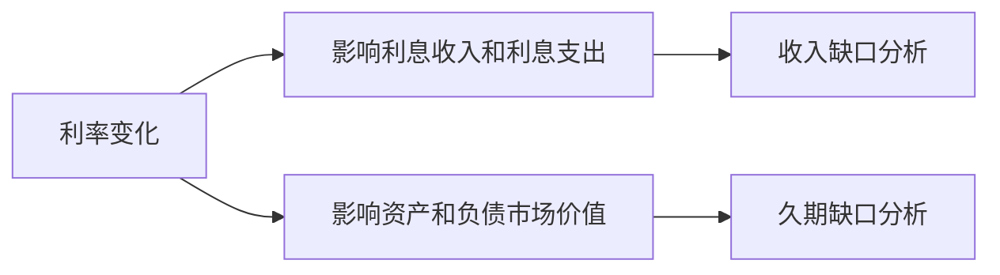

# 27.3 利率风险管理：收入缺口与久期缺口

来源：

- 主线：Mishkin/Eakins Ch.23
- 补充：Mishkin《货币金融学》MyLab Additional Chapter: Financial Derivatives
- 延伸：Bodie/Kane/Marcus《Investments》Ch.14, Ch.16

## 利率风险为什么会伤到金融机构

金融机构经常同时持有资产和负债。资产带来利息收入，例如贷款和债券；负债带来利息支出，例如存款、同业借款、商业票据和长期债务。利率变化时，收入和支出不一定同步变化，资产和负债的市场价值也不一定同步变化。

因此，利率风险有两种观察角度。第一，看当期收入：利率变动会不会让利息收入少于利息支出，压缩净利息收入。第二，看市场价值：利率变动会不会让资产价值下降得比负债价值更多，从而侵蚀净值。

这两个角度分别对应收入缺口分析和久期缺口分析。



前者更像看“今年利润会怎样”，后者更像看“机构真实经济价值会怎样”。

## 哪些资产和负债对利率敏感

收入缺口分析的第一步，是判断哪些资产和负债会在某个时间窗口内重新定价。会在一年内到期、重置利率或自动跟随市场利率变化的项目，称为利率敏感资产或利率敏感负债。

例如，短期证券一年内到期，利率会重新确定；浮动利率抵押贷款会随市场利率调整；一年内到期的商业贷款也会重新定价。这些属于利率敏感资产。

负债端也类似。货币市场存款账户、浮动利率存单、一年内到期的存单、联邦基金借款、一年内到期的其他借款，通常属于利率敏感负债。支票存款和储蓄存款虽然利率可以调整，但银行不一定马上调整，因此常常只把其中一部分视为利率敏感。

还有一些项目看似长期固定，实际也有利率敏感部分。30 年固定利率抵押贷款看起来不会在一年内重新定价，但借款人可能提前还款。银行根据历史经验估计一年内会提前还款的比例，这部分资金会重新贷出，因此也要计入利率敏感资产。

## First National Bank 的收入缺口

假设 First National Bank 有 1 亿美元资产。管理者估计，一年内利率敏感资产包括：

| 利率敏感资产 | 金额 |
| --- | ---: |
| 一年内到期证券 | 500 万美元 |
| 浮动利率抵押贷款 | 1,000 万美元 |
| 一年内到期商业贷款 | 1,500 万美元 |
| 固定利率抵押贷款中预计一年内提前偿还部分 | 200 万美元 |
| 合计 | 3,200 万美元 |

利率敏感负债包括：

| 利率敏感负债 | 金额 |
| --- | ---: |
| 货币市场存款账户 | 500 万美元 |
| 浮动利率和一年内到期存单 | 2,500 万美元 |
| 联邦基金 | 500 万美元 |
| 一年内到期借款 | 1,000 万美元 |
| 支票存款中估计敏感部分 | 150 万美元 |
| 储蓄存款中估计敏感部分 | 300 万美元 |
| 合计 | 4,950 万美元 |

这里利率敏感负债大于利率敏感资产。若利率上升，负债成本上升得比资产收入更多，银行利润下降。

## 收入缺口公式

收入缺口用 GAP 表示：

```text
GAP = RSA - RSL
```

其中，RSA 是利率敏感资产，RSL 是利率敏感负债。

First National Bank 的缺口是：

```text
GAP = 3,200 万美元 - 4,950 万美元 = -1,750 万美元
```

如果利率上升 1 个百分点，即 0.01，银行收入变化为：

```text
ΔI = GAP × Δi
ΔI = -1,750 万美元 × 0.01 = -17.5 万美元
```

负缺口意味着利率上升会降低净利息收入，利率下降会提高净利息收入。若利率下降 1 个百分点，计算方向相反，银行净利息收入增加 17.5 万美元。

这个结果也可以用净利息边际理解。净利息边际是利息收入减利息支出再除以资产。该银行 1 亿美元资产上减少 17.5 万美元收入，净利息边际下降 0.175 个百分点。

## 到期桶：把时间拆得更细

基本收入缺口分析把所有一年内重新定价项目放在一起，速度快，但粗糙。现实中，一年内、1 到 2 年、2 年以上的资产和负债反应不同。管理者可以使用到期桶方法，把资产负债按重新定价时间分组。

例如，1 到 2 年这个时间段内，银行可能有 500 万美元证券、1,000 万美元商业贷款，以及 200 万美元预计提前偿还抵押贷款，共 1,700 万美元利率敏感资产；对应负债可能有 500 万美元 1 到 2 年存单、500 万美元 1 到 2 年借款、150 万美元支票存款敏感部分和 300 万美元储蓄存款敏感部分，共 1,450 万美元利率敏感负债。

该到期桶的缺口为：

```text
GAP = 1,700 万美元 - 1,450 万美元 = 250 万美元
```

如果利率维持高出 1 个百分点，第二年收入会增加：

```text
ΔI = 250 万美元 × 0.01 = 2.5 万美元
```

到期桶方法让管理者看到利率变化在不同年份的影响，而不是只看一个总数。

## 久期缺口：看净值而不只看收入

收入缺口分析关注利息收入和支出，但金融机构还关心资产和负债市场价值。利率上升时，固定收益资产价格下降；负债的市场价值也可能下降。真正影响净值的是资产价值变化和负债价值变化之间的差额。

久期是衡量债券或现金流组合对利率变化敏感度的工具。久期越长，价格对利率变化越敏感。前面债券章节已经建立过这个直觉：长期、低息票债券的久期通常更高，因此利率风险更大。

久期近似公式是：

```text
%ΔP ≈ -DUR × Δi / (1 + i)
```

它的意思是：利率上升时，价格下降；久期越大，下降幅度越大。

金融机构可以计算资产平均久期和负债平均久期，再看二者是否匹配。因为资产和负债规模不同，负债久期要按负债与资产的比例调整。

久期缺口公式是：

```text
DUR gap = DURa - (L / A) × DURl
```

其中，DURa 是资产平均久期，DURl 是负债平均久期，L 是负债市场价值，A 是资产市场价值。

## First National Bank 的久期缺口

假设 First National Bank 的资产为 1 亿美元，负债为 9,500 万美元，资产平均久期为 2.70 年，负债平均久期为 1.03 年。那么久期缺口为：

```text
DUR gap = 2.70 - (95 / 100) × 1.03
DUR gap = 1.72 年
```

久期缺口为正，说明资产对利率变化比负债更敏感。若利率上升，资产价值下降幅度大于负债价值下降幅度，净值减少。

若利率从 10% 上升到 11%，即 Δi = 0.01，净值占资产比例变化近似为：

```text
ΔNW / A ≈ -DUR gap × Δi / (1 + i)
ΔNW / A ≈ -1.72 × 0.01 / 1.10
ΔNW / A ≈ -1.6%
```

资产为 1 亿美元，所以净值减少约 160 万美元。若银行原本资本只有 500 万美元，160 万美元损失相当于资本的近三分之一。利率风险因此不是抽象数字，而是可能直接侵蚀银行资本。

## 正缺口和负缺口的含义

收入缺口和久期缺口可以是正，也可以是负。

收入缺口为负，表示利率敏感负债多于利率敏感资产。利率上升时，负债成本上升更多，收入下降。收入缺口为正，表示利率敏感资产更多，利率上升反而提高收入。

久期缺口为正，表示资产市场价值比负债更怕利率上升。久期缺口为负，表示负债价值对利率变化更敏感，利率上升可能提高净值。

| 指标 | 正值时 | 负值时 |
| --- | --- | --- |
| 收入缺口 | 利率上升提高净利息收入 | 利率上升降低净利息收入 |
| 久期缺口 | 利率上升降低净值 | 利率上升提高净值 |

不同金融机构可能方向不同。传统银行常有短借长贷特征，容易在利率上升时受损；某些金融公司资产重定价快、负债期限长，可能在利率上升时受益。

## 如何降低利率风险

收入缺口和久期缺口的价值，不只是告诉管理者“风险很大”，还告诉管理者怎样调整。

如果银行有负收入缺口，担心利率上升，可以增加浮动利率贷款、减少短期负债、发行更长期固定利率债务，或使用利率互换把固定利率收入转换为浮动利率收入。

如果银行有正久期缺口，担心利率上升侵蚀净值，可以缩短资产久期、延长负债久期，出售长期固定利率债券，增加短期或浮动利率资产，或使用期货、期权、互换进行对冲。

这些调整都不是免费的。改变资产负债表会产生交易成本，也可能放弃机构在某些贷款上的信息优势。金融衍生品之所以发展，就是因为它们能在不大幅改变资产负债表的情况下，对冲一部分利率风险。

收入缺口和久期缺口分别对应短期利润风险和经济价值风险。对投资组合来说，这类似于区分现金流再定价风险和资产净值久期风险：短期债券基金可能净值波动小，但再投资收益会随利率下降而降低；长期债券基金当前收益可能较高，却在利率上升时承受更大资本损失。金融机构管理利率风险，本质上是在管理资产负债的期限结构和再投资风险。

## 小结

利率风险既影响金融机构当期收入，也影响资产负债市场价值。收入缺口分析关注利率敏感资产和利率敏感负债的差额，公式是 `GAP = RSA - RSL`，收入变化近似为 `ΔI = GAP × Δi`。

久期缺口分析关注净值对利率变化的敏感度，公式是 `DUR gap = DURa - (L / A) × DURl`。正久期缺口意味着利率上升会降低净值，负久期缺口则方向相反。

这些工具把宏观利率变化翻译成金融机构资产负债表语言。中央银行加息或降息，不只是改变市场利率，也会通过收入缺口、久期缺口和资本变化影响金融机构行为。

## 自测问题

- 收入缺口分析和久期缺口分析分别关注什么？
- 什么是利率敏感资产和利率敏感负债？
- 如果一家银行 `GAP < 0`，利率上升会怎样影响净利息收入？
- 为什么久期缺口为正时，利率上升会降低净值？
- 到期桶方法比基本收入缺口分析多解决了什么问题？
- 金融机构为什么有时更愿意用衍生品对冲，而不是直接调整资产负债表？
- 为什么收入缺口为零并不一定意味着机构没有利率风险？
