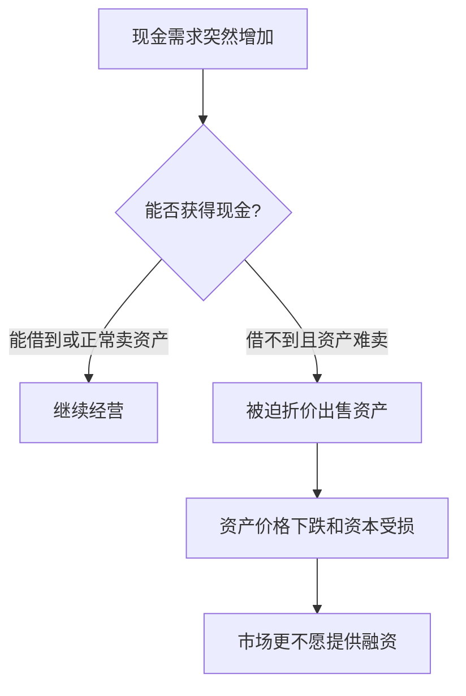
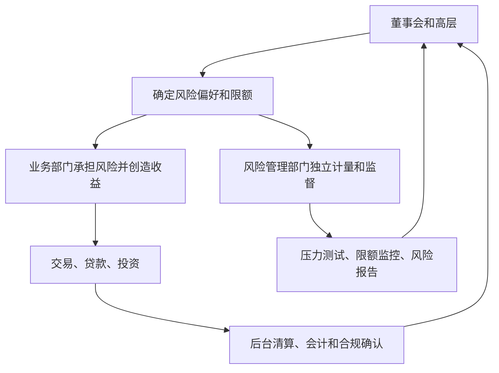

# 27.4 流动性风险、操作风险与风险治理

来源：

- 主线：Mishkin/Eakins Ch.23, Ch.24
- 补充：Mishkin《货币金融学》MyLab Additional Chapter: Financial Derivatives
- 延伸：Bodie/Kane/Marcus《Investments》Ch.24, Ch.26

## 为什么还要单独讲流动性和治理

前两节已经讨论了信用风险和利率风险。信用风险问的是“借款人会不会还钱”，利率风险问的是“利率变化会怎样影响收入和净值”。但金融机构出问题，往往不只是因为某个贷款违约或某个债券价格下跌，而是因为它在需要现金时拿不到现金，或者内部管理机制没有及时限制风险。

流动性风险和操作、治理风险看似不如信用风险、利率风险那样有清晰公式，却常常决定危机是否爆发。一个机构如果亏损不大，但短期债权人拒绝续借，仍可能倒下；一个机构如果模型错误、交易权限失控或风险报告失真，也可能在短时间内积累巨大损失。

金融机构风险管理因此不能只停留在资产定价和公式测量。它还必须处理资金来源稳定性、资产可出售性、内部控制、职责分离和高层激励。

## 流动性风险：账面有资产，不等于今天有现金

流动性风险指金融机构无法在需要时以合理成本获得现金。现金需求可能来自存款流出、债务到期、客户动用贷款承诺、衍生品保证金要求、保险赔付、基金赎回或交易对手要求追加抵押品。

流动性风险有两种形式。第一是融资流动性风险，即机构无法借到钱或续借短期融资。第二是市场流动性风险，即机构无法快速卖出资产，除非接受很大折价。

这里的关键是时间。一个长期看有价值的贷款组合，今天未必能立刻变成现金。一个债券如果市场交易冻结，也可能只能以很低价格出售。流动性风险就是这种“价值”和“可用现金”之间的断裂。

## 银行流动性风险

银行特别容易面临流动性风险，因为它们用短期负债支持长期资产。存款人可以提款，短期批发资金会到期，企业也可能在压力时期动用信用额度；而银行资产端的商业贷款、抵押贷款和长期证券不一定能快速收回。

前面银行经营章节讲过，银行会持有准备金和流动性资产，以应对存款流出。准备金收益较低，但能保证支付；长期贷款收益较高，但流动性差。银行必须在盈利和流动性之间权衡。

如果银行持有太少流动资产，一旦存款人或短期债权人担心银行安全，提款和拒绝续借会迅速放大。银行被迫卖出资产，资产价格下跌又使外界更担心银行资本，形成自我强化的压力。

这就是为什么中央银行有最后贷款人功能。最后贷款人向暂时缺乏流动性但仍有偿付能力的金融机构提供资金，防止流动性恐慌变成全面金融危机。但如果机构根本资不抵债，单纯提供流动性不能解决最终损失问题。

## 贷款承诺和表外流动性

流动性风险不只来自资产负债表上已经发生的项目，也来自表外承诺。贷款承诺就是典型例子。银行承诺未来在一定额度内向企业提供贷款，平时看起来只是合同承诺；当企业需要资金时，它会变成真实现金流出。

经济平稳时，很多企业不会动用全部额度。经济下行或市场融资困难时，企业同时动用额度的概率上升。此时银行正面临违约风险上升、存款流出或市场融资困难，贷款承诺又增加资金需求。

表外承诺的风险在于，正常时期它们不占用太多现金，却在压力时期集中转化为现金需求。金融机构必须把这种潜在提款纳入流动性压力测试，而不能只看今天资产负债表上的现金。

## 市场流动性和火售

市场流动性是资产能否快速以接近公允价格卖出。国库券市场流动性通常很高，出售成本低；复杂结构化产品、长期贷款、非标准化债券和私募资产流动性较差。

当许多机构同时需要现金时，即使平时较流动的资产也可能变得难卖。买方担心价格继续下跌，要求更大折价；卖方越急，价格越低。被迫折价出售资产称为火售。

火售会把单个机构流动性压力传导给整个系统。某机构低价卖出资产，市场价格下降；其他机构持有同类资产，也必须按更低价格估值；资本下降后，债权人要求更多抵押品或减少融资；更多机构被迫卖出。

这和金融危机章节中的“资产价格下跌、资产负债表恶化、信用收缩”完全一致。流动性风险不是单个机构的内部问题，而是会通过市场价格变成系统性问题。

## 操作风险：流程、系统和人员的失败

操作风险来自内部流程、人员、系统或外部事件失败。它不一定来自市场价格变化，也不一定来自借款人违约，但同样可能造成重大损失。

常见操作风险包括：交易录入错误、支付系统故障、网络攻击、模型参数错误、法律文件缺陷、内部欺诈、越权交易、客户资料处理错误、合规流程失效。

金融机构越复杂，操作风险越难管理。一个衍生品交易可能涉及前台报价、中台风险计量、后台清算、法律确认、抵押品管理和会计处理。任何环节出错，都可能让机构承担没有意识到的风险。

操作风险的特点是，它常常在正常时期被低估。因为很多操作事件概率低、损失分布尾部厚，平时看不出问题；一旦发生，可能集中暴露内部控制缺陷。

## 风险治理：谁有权承担风险，谁负责约束风险

风险治理是金融机构内部如何分配风险决策权、监督权和责任。它回答几个基本问题：谁可以批准交易？谁衡量风险？谁向董事会报告？业务部门的利润目标和风险限额怎样平衡？风险管理部门是否有足够独立性？

如果业务部门既创造利润又独自衡量风险，容易高估收益、低估风险。因为奖金和晋升通常与短期利润有关，而风险损失可能几年后才出现。有效治理要求前台业务、中台风险、后台清算和高层监督分离。

一个简单结构如下：

风险治理的重点，是让承担风险的人不能单独决定风险是否被正确记录，也不能在亏损出现前一直扩大头寸。

## 激励问题

金融机构风险治理绕不开激励。员工和管理层可能根据当年利润拿奖金，但许多金融风险具有长期性。短期看赚钱的业务，可能只是卖出了隐含保险、承担了尾部风险，真正损失要到危机时才出现。

例如，卖出信用保护或持有高收益证券，在正常时期会不断产生收入；如果没有足够资本和风险准备，危机中一次损失可能超过多年收益。若员工拿走了正常时期奖金，却不承担危机损失，机构就会鼓励过度冒险。

这与前面道德风险完全一致。存款保险可能让银行股东冒险，贷款合同可能让借款人冒险，奖金制度也可能让金融机构员工冒险。风险治理就是在机构内部设计“限制性条款”和“监督机制”。

## 压力测试和风险限额

风险管理不能只看正常时期平均情况。金融机构需要压力测试，即假设不利情景发生，检查资本、流动性和损益会怎样变化。情景可以包括利率大幅上升、资产价格下跌、信用利差扩大、存款流出、交易对手违约或外汇汇率剧烈波动。

风险限额则规定某类风险最多能承担多少。比如单一借款人贷款上限、行业集中度上限、交易头寸上限、久期缺口上限、流动性覆盖要求、衍生品交易对手敞口上限。

限额本身不是目的。关键是限额必须被真实计量、及时报告，并且突破限额时有人有权要求减仓或停止交易。如果限额可以随意调整，或者风险管理部门没有独立性，限额就只是形式。

## 风险治理和宏观稳定

单个金融机构的治理失败，会通过金融系统放大。大型机构如果因为内部控制薄弱而积累过多风险，危机中可能突然收缩贷款、抛售资产或需要政府救助。多个机构如果采用相似模型和相似激励，在同一时期买入同类资产、使用同类融资方式，风险会高度相关。

宏观审慎监管之所以重要，是因为单个机构看似理性的风险选择，合在一起可能造成系统性脆弱。每家机构都认为自己可以在价格下跌前卖出资产，但所有机构同时卖出时，市场不会有足够买方。

因此，风险治理不只是公司内部管理，也和监管、央行和金融稳定政策相连。资本要求、流动性要求、压力测试、风险披露和高管责任，都是把机构内部风险控制和宏观稳定连接起来的制度安排。

投资学中的流动性溢价在这里变成机构生存问题。正常时期，持有不流动资产可能带来更高收益；压力时期，同一资产可能因为缺少买方而必须大幅折价出售。开放式基金、券商、银行和保险公司都可能面对“资产流动性低于负债流动性”的错配。风险治理的重点，是在收益看起来最稳定的时候就准备尾部流动性，而不是等市场关闭后才寻找现金。

## 小结

流动性风险指金融机构在需要现金时无法以合理成本筹资或出售资产。它可能来自存款流出、短期融资中断、贷款承诺被动用、保证金要求或市场交易冻结。流动性风险会通过火售和资产价格下跌传导为系统性风险。

操作风险来自流程、人员、系统和外部事件失败；风险治理则决定机构能否识别、报告和约束风险。有效治理需要职责分离、独立风险管理、合理激励、压力测试和风险限额。

信用风险和利率风险可以用模型衡量，但如果流动性储备不足、内部控制失效或激励扭曲，模型本身不能防止危机。金融机构风险管理最终是资产负债表、现金流、制度和人的共同管理。

## 自测问题

- 流动性风险和偿付能力风险有什么区别？
- 为什么贷款承诺会在压力时期变成流动性风险？
- 火售如何把单个机构的问题传导到整个市场？
- 操作风险包括哪些常见来源？
- 风险治理为什么要求业务部门和风险管理部门分离？
- 压力测试和风险限额分别解决什么问题？
- 为什么不流动资产在正常时期可能提高收益，却在压力时期威胁机构生存？
