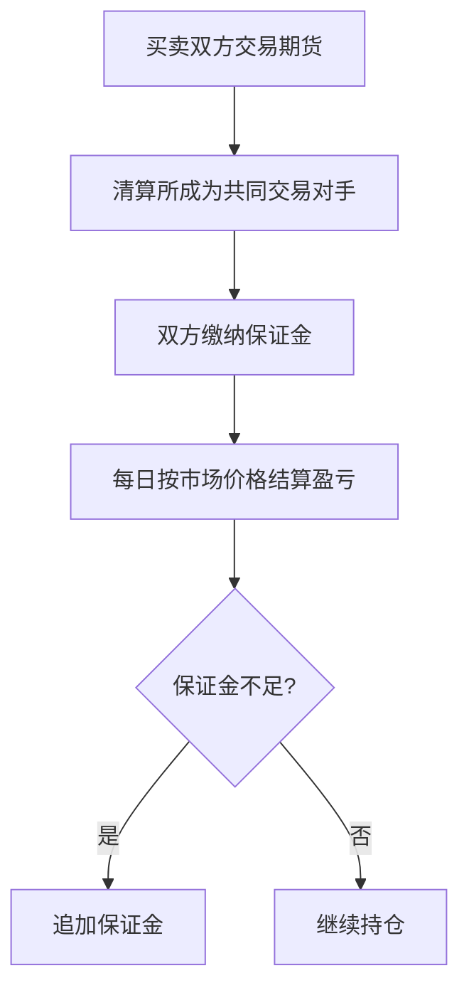

# 27.5 远期、期货、期权、互换

来源：

- 主线：Mishkin/Eakins Ch.24
- 补充：Mishkin《货币金融学》MyLab Additional Chapter: Financial Derivatives

## 为什么会出现衍生品

利率、汇率、股票价格和债券价格都会波动。金融机构如果持有长期债券，担心利率上升导致债券价格下跌；企业如果未来要收取欧元，担心欧元贬值；养老金如果持有股票组合，担心股市下跌。衍生品就是为了管理这类价格风险而发展出来的工具。

衍生品的价值来自其他资产或价格。它本身不是普通贷款或股票，而是一个合约，其收益取决于债券、股票指数、外汇、利率或信用事件等基础变量。

使用衍生品的核心思想是套期保值。套期保值是通过另一个金融交易抵消已有风险。如果你已经持有某项资产，担心价格下跌，可以建立一个价格下跌时赚钱的头寸来抵消损失。如果你未来必须买入某项资产，担心价格上涨，可以提前锁定购买价格。

本节先理解四类最重要工具：远期、期货、期权和互换。

## 多头和空头

理解衍生品前，要先理解多头和空头。多头是从价格上涨中受益的头寸。持有债券、股票或外币，通常就是多头。价格上升，持有人获利；价格下降，持有人亏损。

空头是从价格下跌中受益的头寸。如果你承诺未来按固定价格卖出某项资产，那么未来市场价格下跌时，你可以用较低价格买到资产再按较高合同价格卖出，从而获利。

套期保值的基本原则是：用空头抵消已有多头风险，或用多头抵消已有空头风险。持有长期债券是多头，担心债券价格下跌，就可以卖出相关期货形成空头；未来要购买债券是未来多头需求，担心债券价格上涨，就可以买入期货锁定价格。

## 远期合约

远期合约是两个交易方约定在未来某个日期，以今天确定的价格买卖某项资产。合约要规定标的资产、数量、价格和交割日期。

例如，First National Bank 持有 500 万美元面值、2043 年到期、票息 6% 的长期国债。现在这些债券按面值交易，收益率为 6%。银行担心一年后利率上升，债券价格下跌。为了锁定价格，它可以与 Rock Solid Insurance Company 签订远期合约，约定一年后按今天的价格把这些债券卖给保险公司。

银行现在持有债券，是多头；远期合约中承诺未来卖出债券，是空头。若一年后利率上升，债券市场价格下跌，银行持有债券亏损，但远期合约让它仍能按原价格卖出，抵消价格风险。

保险公司为什么愿意当买方？它预计一年后收到 500 万美元保费，打算投资这些债券，担心未来利率下降、债券价格上涨、收益率下降。远期合约让它锁定今天的 6% 收益率。

远期合约优点是灵活。双方可以按实际需要定制资产、数量和日期。缺点也明显：第一，不容易找到刚好需求相反的交易对手，市场流动性低；第二，存在违约风险。若未来价格对一方不利，它可能不履约，另一方只能诉诸法律，成本高且不一定能追回损失。

## 期货合约

期货合约与远期合约类似，也是约定未来买卖金融工具。但期货在有组织交易所交易，合约条款标准化，并通过清算所降低违约风险。

以国债期货为例，合约规定交割的债券面值、可交割债券范围、交割月份和报价方式。买入期货的人取得多头，承诺未来买入；卖出期货的人取得空头，承诺未来卖出。

期货相对于远期有几个重要差异。

第一，标准化提高流动性。合约规模和交割日期固定，更多交易者能参与同一市场。第二，期货合约可以在到期前反向交易平仓，不一定真的交割标的资产。第三，交易通过清算所进行，买卖双方不直接承担彼此违约风险。

期货市场还要求保证金，并每日盯市。保证金是交易者存入账户的一笔资金，用来吸收合约价格变化造成的损失。每日盯市是每天把期货价格变动产生的盈亏计入保证金账户。若账户余额低于维持保证金，交易者必须追加资金。

保证金和每日盯市降低了违约风险。亏损不会一直累积到到期日才暴露，而是每天结算。

## 期货如何克服远期问题

远期合约的两个主要问题是流动性低和违约风险高。期货合约正是围绕这两个问题设计。

标准化合约让买卖双方更容易匹配。交易所允许合约不断买卖，持仓者可以通过反向交易退出。可交割资产范围通常不是单一证券，而是一组符合条件的证券，这减少了某个参与者囤积标的资产、逼迫空头高价买入的可能。

清算所、保证金和每日盯市则降低违约风险。交易者不必逐个调查交易对手信用，只需要相信清算所和交易所规则。

这些制度安排解释了为什么金融期货市场比许多远期市场更活跃。期货牺牲了一部分定制化灵活性，换来流动性和安全性。

## 期权合约

期权给买方一种权利，而不是义务。看涨期权给买方在规定期限内按执行价格买入标的资产的权利；看跌期权给买方按执行价格卖出标的资产的权利。期权买方为这种权利支付期权费，也称权利金或保险费。

期权和期货的关键差别在于收益形状。期货盈亏是线性的，标的价格每变动一单位，盈亏按固定方向变化。期权买方的最大损失通常限于已支付的权利金，但有机会从有利价格变化中获利。

假设某人买入一份国债期货看涨期权，执行价格为 115，权利金为 2,000 美元。如果到期时期货价格低于或等于 115，买方不会行权，损失为权利金 2,000 美元。如果期货价格升到 120，买方按 115 买入再按 120 价值计算，获得 5,000 美元收益，扣除 2,000 美元权利金，净赚 3,000 美元。

看跌期权方向相反。若标的价格低于执行价格，买方可以按较高执行价格卖出，获得收益；若价格高于执行价格，买方不行权，损失限于权利金。

| 工具 | 买方权利或义务 | 主要特征 |
| --- | --- | --- |
| 期货 | 有义务按合约买入或卖出 | 盈亏线性，每日盯市 |
| 看涨期权 | 有权按执行价买入 | 价格上涨时受益，损失限于权利金 |
| 看跌期权 | 有权按执行价卖出 | 价格下跌时受益，损失限于权利金 |

期权像保险。买方支付权利金，换来对不利价格变化的保护，同时保留有利价格变化的部分收益。

## 期权价格为什么会变

期权费受几个因素影响。对看涨期权来说，执行价格越高，越难赚钱，期权费越低；对看跌期权来说，执行价格越高，越容易赚钱，期权费越高。

到期时间越长，看涨和看跌期权通常都更贵。因为时间越长，标的价格大幅上涨或下跌的可能性越大。期权买方有“有利时行权，不利时放弃”的权利，所以波动空间越大，期权越有价值。

标的价格波动率越高，看涨和看跌期权也通常都更贵。波动越大，极端有利结果的机会越多；不利结果下买方最多损失权利金。这种“有利时受益，不利时损失有限”的结构，使波动率提高期权价值。

## 互换合约

互换是双方约定交换一组未来现金流。最常见的是利率互换和货币互换。本节重点是利率互换。

普通利率互换中，一方支付固定利率，收取浮动利率；另一方支付浮动利率，收取固定利率。合约会规定固定利率、浮动利率基准、名义本金和交换期限。名义本金只是计算利息的基础，通常不实际交换。

例如，Midwest Savings Bank 同意在未来 10 年按 100 万美元名义本金向 Friendly Finance Company 支付固定 5%；Friendly Finance Company 同意向 Midwest 支付一年期国库券利率加 1%。每年双方交换利息差额。

为什么双方都愿意？Midwest Savings 可能短借长贷，利率上升会让负债成本上升快于资产收入。它希望把一部分固定收入换成浮动收入。Friendly Finance Company 可能资产重定价快、负债较固定，担心利率下降使资产收入下降，因此希望获得固定收入。

利率互换的好处是，不必直接改变资产负债表。金融机构可以继续做自己擅长的贷款和融资，同时通过互换改变利率风险暴露。

## 小结

远期、期货、期权和互换都是衍生品，价值来自基础资产或基础价格。远期灵活但流动性低、违约风险高；期货标准化、交易所清算、保证金和每日盯市降低违约风险并提高流动性；期权给买方权利而非义务，损失通常限于权利金；互换让双方交换未来现金流，常用于调整利率风险。

这些工具共同服务于同一个基本思想：用一个金融头寸抵消另一个头寸的不利风险。理解多头、空头和套期保值原则，是理解衍生品的基础。

## 自测问题

- 衍生品为什么能用于风险管理？
- 多头和空头分别是什么意思？
- 远期合约的灵活性和缺点分别是什么？
- 期货合约如何通过清算所、保证金和每日盯市降低违约风险？
- 期权和期货的收益结构有什么根本区别？
- 利率互换为什么可以在不改变资产负债表的情况下改变利率风险？
