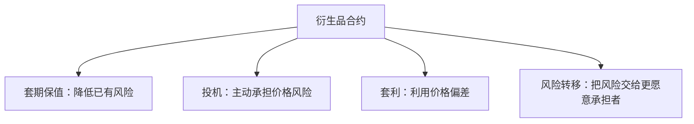

# 27.6 衍生品的功能：套期保值、投机、套利、风险转移

来源：

- 主线：Mishkin/Eakins Ch.24
- 补充：Mishkin《货币金融学》MyLab Additional Chapter: Financial Derivatives

## 同一种工具可以服务不同目的

远期、期货、期权和互换本身没有固定“好坏”。同一份衍生品合约，可以被一家银行用于降低风险，也可以被另一个交易者用于押注价格方向。区别不在工具名称，而在使用者原本有什么风险、合约是否抵消这种风险、头寸规模是否超过真实风险暴露。

本节讨论四种功能：套期保值、投机、套利和风险转移。原书主线强调套期保值，因为金融机构使用衍生品最重要的正当理由，是降低利率、汇率和股票市场风险。但理解投机和套利也很重要，因为衍生品市场要有愿意承担风险的人，也要有发现价格偏差的人。



判断衍生品用途的关键问题是：这笔交易是减少已有风险，还是新增风险？

## 套期保值：抵消已有暴露

套期保值的基础原则是，用方向相反的头寸抵消已有头寸。已经持有资产，担心价格下跌，就建立价格下跌时盈利的头寸；未来需要购买资产，担心价格上涨，就建立价格上涨时盈利的头寸。

First National Bank 持有长期国债时，面临利率上升、债券价格下跌的风险。它可以卖出国债期货或签订远期卖出合约。如果利率上升，原债券价格下降，但空头期货或远期头寸盈利，损失被抵消。

这类对冲某一项具体资产的做法，称为微观套保。微观套保针对单个债券、单笔外汇收款、某一笔贷款承诺或某个具体资产。

另一种是宏观套保。宏观套保不是对冲某个单项资产，而是对冲整个资产负债表或整个投资组合的风险。例如，一家银行久期缺口为正，担心利率上升使净值下降，可以卖出利率期货，使利率上升时期货盈利，抵消资产负债表净值损失。

| 套保类型 | 对冲对象 | 例子 |
| --- | --- | --- |
| 微观套保 | 单项资产、负债或交易 | 用期货对冲某笔长期国债 |
| 宏观套保 | 整体组合或资产负债表 | 用利率期货对冲银行久期缺口 |

微观套保更直观，宏观套保更接近金融机构整体风险管理。

## 外汇风险套保

外汇套保可以用远期或期货。假设一家美国企业两个月后将收到 1,000 万欧元。现在 1 欧元约等于 1 美元，但企业担心两个月后欧元贬值。如果欧元跌到 0.90 美元，1,000 万欧元只值 900 万美元，企业损失 100 万美元。

企业未来会收到欧元，相当于持有未来欧元多头。为了对冲，它应建立欧元空头：签订远期合约，约定两个月后按今天确定的汇率卖出 1,000 万欧元。这样无论未来欧元汇率如何变化，企业都锁定美元收入。

也可以用欧元期货。若每份欧元期货合约规模为 125,000 欧元，要对冲 1,000 万欧元，需要卖出：

```text
10,000,000 / 125,000 = 80 份合约
```

远期和期货都能对冲外汇风险。远期更容易定制金额和日期，适合大型银行客户；期货标准化、交易所交易，可能更便于较小规模或需要流动性的交易者。

## 股票组合套保

共同基金、养老金和保险公司常持有股票组合。即使组合已经分散，仍然会受到整体市场下跌影响。股票指数期货就是为管理这种系统性风险而发展出来的重要工具。

假设 Rock Solid Insurance Company 管理一个 1 亿美元股票组合，组合百分比变化与 S&P 500 指数一比一，也就是 beta 为 1。若 S&P 500 指数期货每份合约价值为 250,000 美元，管理者想对冲市场下跌风险，可以卖出：

```text
100,000,000 / 250,000 = 400 份合约
```

如果市场下跌 10%，股票组合损失约 1,000 万美元；卖出的指数期货因指数下跌而获利约 1,000 万美元，二者抵消。

如果组合 beta 为 2，说明组合波动约为市场两倍。市场下跌 10%，组合平均下跌 20%。这时只卖出 400 份不够，需要卖出 800 份。一般公式是：

```text
期货合约数 = beta × 组合价值 / 每份合约价值
```

这说明套保不是机械买卖，而要理解原头寸对市场变化的敏感度。

如果被套保资产和期货标的不完全一致，还要考虑最优套保比率。一个常用形式是：

```text
h* = Cov(ΔS, ΔF) / Var(ΔF)
```

其中 `ΔS` 是被套保资产价格变化，`ΔF` 是期货价格变化。现货和期货价格相关性越高，套保效果越好；相关性越低，套保只能抵消一部分风险。

套保还会留下**基差风险**。基差通常是现货价格减期货价格。期货到期时两者会收敛，但在到期前基差会变化。航空公司用原油期货对冲航空燃油、农产品企业用相近品种期货对冲库存，都可能因为标的不完全一致而面临基差风险。

## 期权套保：保留下行保护和上行机会

期货套保能较完整地抵消风险，但也会抵消有利价格变化带来的收益。持有债券并卖出期货后，利率上升时债券亏损被期货盈利抵消；但利率下降时债券盈利也会被期货亏损抵消。

期权提供另一种结构。债券持有人担心利率上升、债券价格下跌，可以买入债券期货看跌期权。如果债券价格下跌，看跌期权盈利，抵消债券损失；如果债券价格上涨，投资者不行权，只损失权利金，同时保留债券上涨收益。

这就是期权像保险的原因。买保险的人支付保费，灾害发生时得到赔付；灾害不发生时保费损失，但保留正常状态的好处。期权买方支付权利金，价格不利变化时获得保护，价格有利变化时仍可受益。

金融机构有时愿意用期权而不用期货，正是因为期权保护不利方向，同时不完全放弃有利方向。但期权的成本是权利金，套保者必须判断这笔保险费是否值得。

## 利率互换套保

利率互换常用于管理收入缺口。假设一家储蓄机构短借长贷，利率敏感负债比利率敏感资产多 100 万美元。利率上升时，负债成本上升多于资产收入，净利息收入下降。

它可以进入一个利率互换：支付固定利率，收取浮动利率。这样它相当于把 100 万美元固定利率资产收入转化为浮动利率收入。利率上升时，互换收到的浮动利率收入增加，抵消负债成本上升。

另一家金融公司可能正好相反。它资产重定价快、负债较固定，担心利率下降使资产收入下降。它愿意支付浮动、收取固定。双方通过互换把各自不想承担的利率风险交换出去。

互换的优势在于不需要卖掉原有贷款或证券。金融机构可能在某类贷款上有信息优势，不愿改变客户关系和资产结构。互换让它保留原业务，同时调整利率风险。

## 投机：主动承担风险以追求收益

投机是指没有需要对冲的基础风险，却主动建立衍生品头寸，押注价格变化。投机者认为利率会下降，可以买入债券期货；认为股市会下跌，可以卖出股指期货或买入看跌期权；认为某公司信用会恶化，可以买入信用保护。

投机并不必然有害。投机者愿意承担套保者想转出的风险，为市场提供流动性。如果所有人都只想降低风险，没有人愿意承担风险，套保交易就很难完成。

但投机的危险在于杠杆。衍生品通常只需要少量保证金或权利金，就能控制很大名义本金。价格小幅不利变化，可能造成相对本金很大的损失。投机规模如果超过机构资本承受能力，就会威胁机构生存。

套保和投机的分界，有时不在合约本身，而在头寸规模。一个航空公司买入燃油期货对冲未来燃油成本，是套保；如果买入远超实际燃油需求的合约，就是投机。

## 套利：利用价格关系偏离

套利是利用不同市场或不同工具之间价格关系偏离来获利。理论上，套利者同时买入低估资产、卖出高估资产，锁定相对低风险收益。

在衍生品市场中，套利者会比较现货价格、远期价格、期货价格、利率和持有成本。如果期货价格相对现货价格过高，套利者可能买入现货、卖出期货；如果期货价格过低，则反向操作。

套利有助于价格发现。套利者的买卖会把相互矛盾的价格拉回合理关系，使市场价格更一致。没有套利者，远期、期货、现货和期权之间可能长期出现明显偏差。

现实套利并非完全无风险。交易成本、融资成本、保证金要求、模型误差、流动性冲击和交易对手风险，都可能让看似安全的套利变成亏损。金融危机中，一些“相对价值套利”失败，正是因为价格偏差持续扩大，而套利者融资无法支撑到价格回归。

## 风险转移：谁最终承担风险

衍生品不会让风险从世界上消失。它们只是改变风险由谁承担。套保者把风险转给投机者、套利者、做市商或其他有相反风险暴露的人。

这种风险转移可以提高效率。保险公司未来要投资债券，担心利率下降；银行持有债券，担心利率上升。二者通过远期合约，各自锁定想要的结果。风险被放到更适合的位置。

但风险转移也可能制造新的不透明性。如果风险通过复杂合约在金融机构之间层层转移，监管者和市场可能不知道最终谁承担了集中风险。信用违约互换市场在金融危机中暴露的问题，正是风险看似被分散，实际却集中在少数保护卖方身上。

因此，衍生品的社会价值取决于两个条件：它们是否真正把风险转移给愿意且有能力承担的人；市场和监管是否能看清风险集中在哪里。

## 小结

衍生品最重要的功能是套期保值，即用方向相反的头寸抵消已有风险。远期和期货可用于利率和外汇风险，股指期货可用于股票市场系统性风险，期权提供类似保险的保护，利率互换可在不改变资产负债表的情况下调整利率暴露。套保并不消灭风险，基差风险、保证金流动性风险和模型误差仍然需要管理。

衍生品也可用于投机和套利。投机者承担风险以追求收益，并为套保者提供交易对手；套利者利用价格偏差交易，帮助市场价格保持一致。风险转移是衍生品的本质，但风险不会消失，只会换到其他资产负债表上。

衍生品是否有益，取决于使用方式、头寸规模、杠杆、透明度和承担风险者的资本能力。

## 自测问题

- 如何判断一笔衍生品交易是套保还是投机？
- 微观套保和宏观套保有什么区别？
- 企业未来收取外币时，为什么通常要卖出该外币远期或期货？
- 为什么股指期货套保要考虑组合 beta？
- 期权套保相对于期货套保的优势和成本分别是什么？
- 衍生品为什么只能转移风险，而不能消灭风险？
