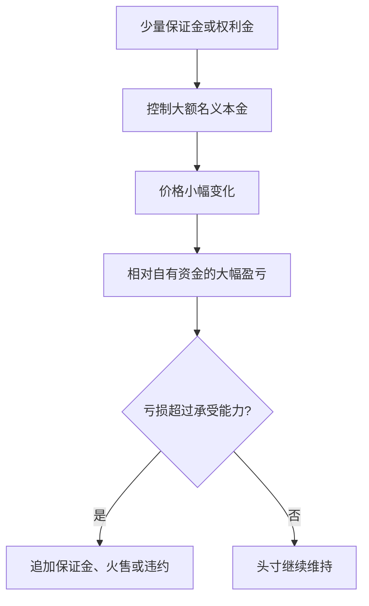
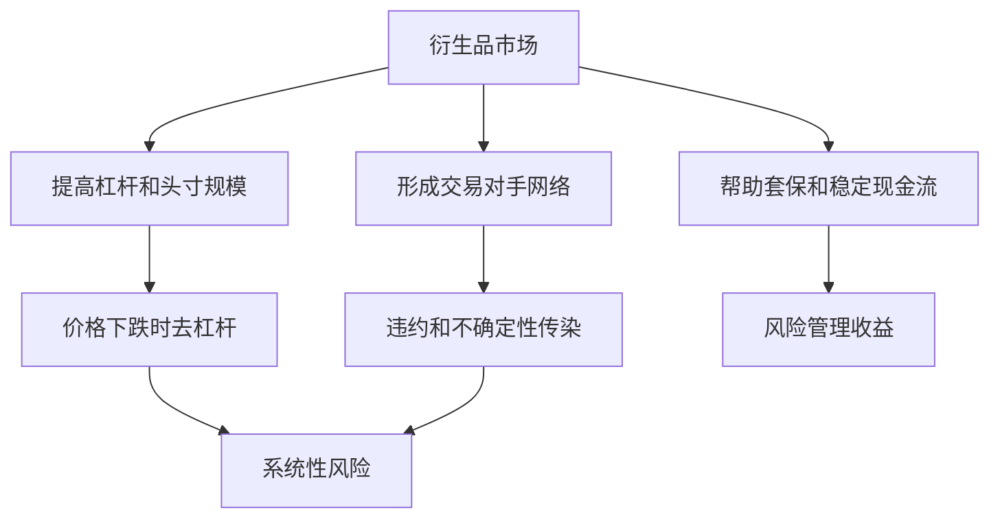

# 27.7 金融衍生品、杠杆与系统性风险

来源：

- 主线：Mishkin/Eakins Ch.24
- 补充：Mishkin《货币金融学》MyLab Additional Chapter: Financial Derivatives
- 延伸：Bodie/Kane/Marcus《Investments》Ch.20, Ch.21, Ch.26

## 为什么有用的工具也可能危险

衍生品能帮助金融机构降低风险。远期可以锁定未来价格，期货可以对冲利率和股票市场风险，期权可以像保险一样限制损失，互换可以调整资产负债表的利率暴露。正因为这些工具有用，它们才会被广泛使用。

但同样的工具也可能放大风险。衍生品往往只需要少量初始资金，就能控制很大的名义金额。它们也可能让风险从一个机构转移到另一个机构，使外部人难以看清最终风险集中在哪里。若使用者不理解合约、低估极端情形，或头寸规模超过资本承受能力，衍生品会从风险管理工具变成风险放大器。

这不是说衍生品本身必然有害。更准确的理解是：衍生品把风险管理能力和风险承担能力都放大了。用得好，可以稳定现金流；用得坏，可以让小价格变化造成巨大损失。

## 杠杆：用少量资金控制大量风险

杠杆是衍生品危险性的核心。杠杆意味着用较少自有资金控制较大资产或风险暴露。期货只需要保证金，期权只需要权利金，互换通常不交换名义本金。这样，交易者可以用很少现金建立很大头寸。

假设一份期货合约对应 100,000 美元债券，而交易者只需缴纳 2,000 美元保证金。债券价格变动 1%，合约价值变化约 1,000 美元。相对于 100,000 美元标的，这是 1%；相对于 2,000 美元保证金，却是 50%。杠杆让小幅价格变化变成大比例盈亏。

杠杆本身不是错误。套保者使用杠杆，可以用较少现金快速对冲大额资产风险。但投机者使用杠杆，可能在价格不利变化时迅速亏掉资本，并被迫追加保证金或平仓。

宏观层面，多个机构同时使用杠杆时，价格下跌会触发保证金追加和强制减仓，进一步压低价格，形成去杠杆循环。

## 名义本金不等于真实风险，但也不能忽视

衍生品讨论中常出现名义本金。利率互换中，双方可能约定在 1 亿美元名义本金上交换固定和浮动利息。但通常并不交换这 1 亿美元本金，只交换按本金计算出的利息差额。

因此，看到“衍生品名义本金巨大”时，不能直接把名义本金等同于可能损失。一个 1 亿美元利率互换，若固定利率与浮动利率差额为 1%，一年现金流差额约 100 万美元，而不是 1 亿美元。

但名义本金也不能完全忽视。它表示合约对基础价格变化的规模。价格变化越大、期限越长、对手方越多，潜在风险越复杂。名义本金虽然不是损失上限，却是衡量系统连接程度和潜在市场敏感度的重要起点。

教材对这一点的处理很平衡：银行持有巨大名义金额的利率和货币互换，并不必然意味着银行会遭受同等规模损失，因为实际信用暴露通常远低于名义本金；但如果衍生品用于高杠杆投机，或者集中在少数机构手中，风险就会真实威胁系统。

## 交易对手风险

衍生品是合约，就会有交易对手风险。交易对手风险是对方不能履约的风险。远期和互换尤其明显，因为它们常在场外市场交易，合约定制化，双方直接承担彼此信用风险。

如果一方的衍生品头寸盈利，另一方就有支付义务。盈利方真正关心的是：对方到时候有没有能力支付。若对方破产，账面盈利可能无法兑现。

期货市场通过清算所、保证金和每日盯市降低交易对手风险。场外衍生品也可以通过抵押品、净额结算、集中清算和资本要求降低风险。

净额结算很重要。两家机构之间可能有多份方向相反的合约。如果逐笔结算，名义金额巨大；如果净额结算，只需要支付净差额，风险暴露会明显降低。集中清算则让清算机构成为共同交易对手，并通过保证金制度控制风险。

## 信用衍生品和信用违约互换

信用衍生品的收益取决于信用事件，例如债券违约。最著名的是信用违约互换。买方定期支付费用，卖方承诺在参考债务违约时赔付损失。它像保险，但并不总是受传统保险中的可保险利益约束。

信用违约互换可以用于套保。持有公司债的投资者担心该公司违约，可以买入信用保护。如果公司违约，保护卖方赔付，抵消债券损失。

它也可以用于投机。即使不持有该公司债券，投资者也可能买入信用保护，押注该公司信用恶化；也可能卖出信用保护，赚取费用，押注违约不会发生。

问题在于，信用风险在危机中高度相关。正常时期，卖出信用保护看起来不断收取费用，像稳定收入；危机来临时，许多债务同时恶化，保护卖方面临集中赔付。若卖方没有足够资本，风险会传导给购买保护的机构。

## AIG 案例的教训

AIG 的问题说明，衍生品风险不只在传统银行内。AIG 是大型保险集团，但其金融产品部门卖出了大量信用违约互换，为抵押贷款相关证券提供信用保护。房地产价格下跌、证券价值下降和评级压力上升后，AIG 需要提供更多抵押品，并面对巨额潜在赔付。

这个案例的关键不是“所有 CDS 都坏”，而是少数机构在复杂信用衍生品上积累了过大、过集中、与资本不匹配的头寸。市场一旦怀疑其履约能力，问题就不只属于 AIG 自身，因为许多金融机构依赖 AIG 的保护来降低自己的风险暴露。

也就是说，一家机构卖出的保护，可能被其他机构当作风险已经转移的证据。如果保护卖方不能履约，风险会突然回到买方资产负债表上，并打击市场信心。

这和前面金融危机机制一致：信息不确定性上升、资产价格下跌、金融机构净值恶化和信用收缩会相互强化。衍生品在其中可能是风险转移工具，也可能是风险不透明和传染的通道。

## 复杂性和模型风险

衍生品可能很复杂。普通远期和期货容易理解，复杂期权、结构化信用产品、嵌入式衍生品和多层互换则需要模型估值。模型要假设波动率、相关性、违约概率、回收率、流动性和极端情形。

模型风险是模型错误或假设失效造成的风险。正常时期估计出的相关性，在危机中可能突然升高；历史违约率可能低估未来违约；流动性折价可能在压力时期急剧扩大。若机构过度相信模型，可能低估尾部损失。

复杂性还会削弱治理。董事会和高管如果不能理解业务部门的风险报告，就难以有效监督。风险管理部门如果依赖业务部门提供参数，也可能无法独立判断风险。

因此，衍生品风险管理不能只依赖数学模型，还需要压力测试、情景分析、独立估值、限额管理、抵押品管理和清晰披露。

## 监管如何降低系统性风险

衍生品监管的重点，不是禁止所有衍生品，而是降低不透明杠杆和交易对手传染。主要方向包括集中清算、保证金要求、资本要求、交易报告和风险披露。

集中清算让标准化合约通过清算机构结算，减少双边交易对手风险。保证金要求让亏损及时反映，避免风险长期累积。资本要求迫使机构为潜在损失持有缓冲。交易报告帮助监管者看到市场规模和风险集中。风险披露让市场参与者更容易评估对手方稳健性。

但监管也有边界。过度标准化可能降低合约对真实风险的匹配度；过高保证金可能在压力时期加剧流动性需求；复杂场外合约不一定都适合交易所交易。监管必须在风险降低、市场效率和真实套保需求之间权衡。

## 衍生品和宏观金融稳定

衍生品通过三个渠道影响宏观金融稳定。

第一，风险管理渠道。企业和金融机构能对冲利率、汇率和价格风险，现金流更稳定，投资和贷款更容易持续。这是衍生品的稳定作用。

第二，杠杆渠道。衍生品让机构用较少资金承担较大头寸，繁荣时期放大风险承担，逆转时触发追加保证金、减仓和资产出售。

第三，网络渠道。衍生品把金融机构通过合约连接起来。一家机构违约，可能让许多对手方遭受损失或失去保护。网络越复杂，市场越难判断风险最终位置，不确定性越容易上升。

这就是本章最后要得到的平衡理解：衍生品不是金融危机的唯一原因，也不是纯粹的技术工具。它们是金融体系中转移、集中、放大和管理风险的制度安排。

系统性风险的关键不是衍生品本身，而是衍生品、杠杆、短期融资和相似交易同时出现。一个机构用衍生品对冲，可能降低自身某项风险；但如果很多机构用相同模型、相同抵押品和相同融资渠道，在压力时期同时补保证金、平仓和抢流动性，风险会从个体对冲变成系统拥挤交易。监管和风控必须关注净敞口、集中度、抵押品链条和交易对手网络。

## 小结

衍生品能降低风险，也能放大风险。杠杆使交易者用少量保证金或权利金控制大额名义本金，小幅价格变化可能造成相对资本的大额损失。名义本金不等于真实损失，但能反映风险规模和市场连接程度。

交易对手风险、信用衍生品、复杂模型和风险集中，是衍生品系统性风险的主要来源。AIG 案例说明，非银行机构如果在信用衍生品上承担过大集中头寸，也可能威胁整个金融系统。

有效监管应关注集中清算、保证金、资本、披露和交易报告。真正的目标不是消灭衍生品，而是让风险转移更透明，让承担风险的人有足够资本和流动性承受损失。

## 自测问题

- 为什么衍生品会产生杠杆？
- 名义本金为什么不能直接等同于可能损失？为什么又不能忽视？
- 交易对手风险在远期、互换和期货中有什么不同？
- 信用违约互换如何既能套保又能投机？
- AIG 案例说明了衍生品风险管理中的哪些问题？
- 衍生品监管为什么强调清算、保证金、资本和披露？
- 为什么许多机构使用相似衍生品策略时，个体对冲可能演变成系统性拥挤交易？
