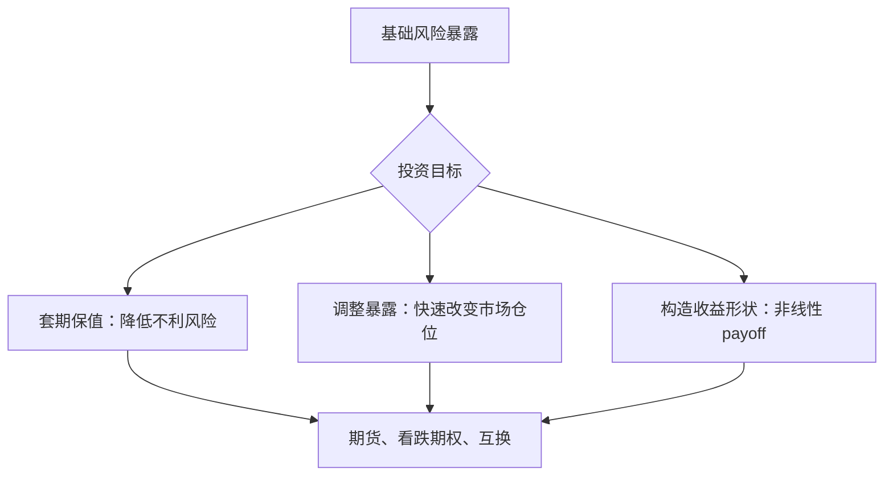

# 28.4 衍生证券在投资环境中的角色

来源：

- 主线：Bodie/Kane/Marcus《Investments》Ch.2
- 相关旧笔记：本笔记 Ch.27

## 为什么在资产类别中要单独看衍生品

债券和股票本身代表融资关系或所有权关系。衍生品不同，它的价值来自另一个基础变量，例如股票价格、债券价格、市场指数、利率、汇率或商品价格。因为衍生品的收益取决于其他资产或价格，所以它也被称为衍生资产或或有要求权。

衍生品容易被误解为纯粹投机工具。实际上，它们在投资环境中承担三类重要功能：转移风险、改变组合收益形状、提高或降低某种市场暴露。企业可以用衍生品锁定未来采购成本，金融机构可以用衍生品管理利率风险，基金经理可以用股指期货快速调整股票市场暴露，投资者可以用期权限制下行损失。

衍生品可以用来管理信用风险、利率风险、汇率风险和流动性压力，也可以把一个组合的风险收益形状重新“雕刻”出来。直接持有股票是一条线性收益曲线，持有股票加看跌期权就变成带保险的组合；持有债券加利率互换，就可能把固定利率暴露改成浮动利率暴露。

本节只建立衍生品的基本地图：期权策略、二叉树定价、Black-Scholes 模型、期货定价和互换风险管理都属于这张地图中的细分区域。

## 看涨期权：获得买入权利

看涨期权给持有人一种权利：在规定期限内，按事先确定的执行价格买入某项资产。这个权利不是义务。如果到期前基础资产价格高于执行价格，持有人可以用较低执行价格买入，再按较高市场价值持有或卖出，获得收益。如果基础资产价格低于执行价格，持有人可以不行权，损失通常限于一开始支付的期权费。

例如，某股票当前价格接近 280 美元，投资者买入执行价格为 280 美元的看涨期权。如果未来股票价格升到 300 美元，期权让投资者仍能按 280 美元买入，权利本身就有价值。如果未来股价跌到 260 美元，按 280 美元买入没有意义，投资者可以放弃行权。

看涨期权适合表达看多观点。它的收益不是线性的：股价越高，收益越大；股价下跌时，买方最大损失通常是期权费。这种“向上参与、向下有限损失”的结构，使看涨期权不同于直接买股票。

风险不能只用“涨跌方向”描述。直接买股票和买看涨期权都可能从股价上涨中获利，但它们的时间价值、最大损失、对波动率的敏感性和到期约束都不同。方差和标准差能描述一部分波动，期权风险还需要考虑非线性和波动率。

## 看跌期权：获得卖出权利

看跌期权给持有人按执行价格卖出基础资产的权利。它在资产价格下跌时变得更有价值。如果投资者拥有一只股票，同时担心股价大幅下跌，可以买入看跌期权作为保险。若股价下跌，看跌期权的收益可以部分抵消股票损失；若股价上涨，投资者不必行权，只损失期权费。

看跌期权的直觉类似保险。保险费是确定成本，灾难发生时获得赔付；如果灾难没有发生，保险费不会退还。看跌期权买方支付期权费，换取在不利价格下跌中保护组合的权利。

看涨和看跌的区别可以这样整理：

| 工具 | 买方获得的权利 | 何时更有价值 | 典型用途 |
| --- | --- | --- | --- |
| 看涨期权 | 按执行价买入 | 基础资产价格上涨 | 看多、杠杆化上行暴露 |
| 看跌期权 | 按执行价卖出 | 基础资产价格下跌 | 保护下行、表达看空观点 |

## 期货合约：锁定未来交易价格

期货合约约定在未来某一日期按约定价格买入或卖出某项资产。与期权不同，期货买卖双方通常都有义务履约。期货可以用于商品、股指、债券、外汇和利率等市场。

期货的基本用途是锁定未来价格。例如，农产品生产者担心未来价格下跌，可以卖出期货锁定销售价格；食品加工企业担心未来原料涨价，可以买入期货锁定采购成本。金融投资者也可以用股指期货快速增加或减少股票市场风险暴露，而不必立即买卖大量个股。

期货也有杠杆特征。交易者通常只需缴纳保证金，而不是支付全部合约价值。保证金制度提高了资金效率，也放大了风险。如果价格朝不利方向变动，交易者可能需要追加保证金，甚至被迫平仓。

## 互换：交换未来现金流

互换是双方约定交换一组未来现金流的合约。最常见的是利率互换和货币互换。利率互换中，一方支付固定利率、收取浮动利率，另一方反过来支付浮动利率、收取固定利率。货币互换则涉及不同货币现金流的交换。

互换的意义在于，它可以改变风险暴露，而不必直接改变资产负债表。例如一家金融机构持有固定利率贷款，但负债成本随市场利率上升而上升，它可以通过互换收取浮动利率、支付固定利率，从而缓解利率上升带来的压力。

互换通常在场外市场定制，灵活性强，但也带来交易对手风险和估值复杂性。金融危机后，许多衍生品合约加强了清算、保证金和报告要求，就是为了降低场外衍生品网络中的系统性风险。

## 衍生品怎样改变组合风险

衍生品最重要的特点，是可以把某种风险从基础资产中分离出来交易。直接买股票会同时获得公司特定风险、市场风险和股利现金流；买看涨期权则更集中地获得上涨方向的非线性暴露。持有长期债券会暴露在利率风险下；用利率期货或互换可以部分对冲这种风险。

从组合角度看，衍生品可以实现三种操作。

第一，套期保值。已有头寸面临不利价格变化时，建立方向相反的衍生品头寸，减少损失。例如持有股票组合时买入股指看跌期权。

第二，改变暴露。基金经理可以用股指期货快速提高股票仓位，也可以用债券期货调整久期，而不用马上交易大量现货证券。

第三，构造收益形状。期权可以创造直接买卖基础资产做不到的非线性收益，例如限制最大损失、放弃部分上行换取期权费，或押注波动率变化。

## 衍生品为什么也会放大风险

衍生品能管理风险，也能放大风险。原因有三点。

第一，杠杆高。少量保证金或期权费就能控制较大名义本金，价格小幅变化可能带来很大比例盈亏。

第二，结构复杂。衍生品收益可能非线性，风险随价格、波动率、时间和利率同时变化。投资者如果只看表面成本，可能低估极端情形下的损失。

第三，合约相互连接。许多机构通过衍生品互为交易对手，一方违约可能影响另一方的风险管理安排。若市场同时质疑多个机构信用，衍生品网络会把压力传导得更快。

因此，衍生品不应被简单地贴上“好”或“坏”的标签。它们是强力工具。是否有益，取决于使用者是否理解基础风险、保证金机制、交易对手风险和极端情形下的现金流需求。

这个判断和经济学中的激励分析一致。同一个合约，在套期保值者手中可能降低经营风险，在高杠杆投机者手中可能放大系统性风险。制度设计的关键不是禁止所有风险转移，而是让风险被透明地定价、抵押、清算和披露，避免风险被隐藏在看不见的资产负债表之外。

## 小结

衍生品的价值来自其他资产或价格变量。看涨期权给买方按执行价格买入的权利，看跌期权给买方按执行价格卖出的权利；期货合约锁定未来买卖价格；互换让双方交换未来现金流。

衍生品在投资环境中主要用于套期保值、调整市场暴露和构造非线性收益形状。它们能帮助投资者更精确地管理风险，但也可能因为杠杆、复杂性和交易对手连接而放大损失。

## 自测问题

- 为什么衍生品被称为衍生资产或或有要求权？
- 看涨期权和看跌期权分别给买方什么权利？
- 期货和期权在“权利还是义务”上有什么根本区别？
- 互换为什么能在不直接买卖原资产的情况下改变风险暴露？
- 衍生品如何帮助套期保值？
- 为什么衍生品既能降低风险，也可能放大风险？
