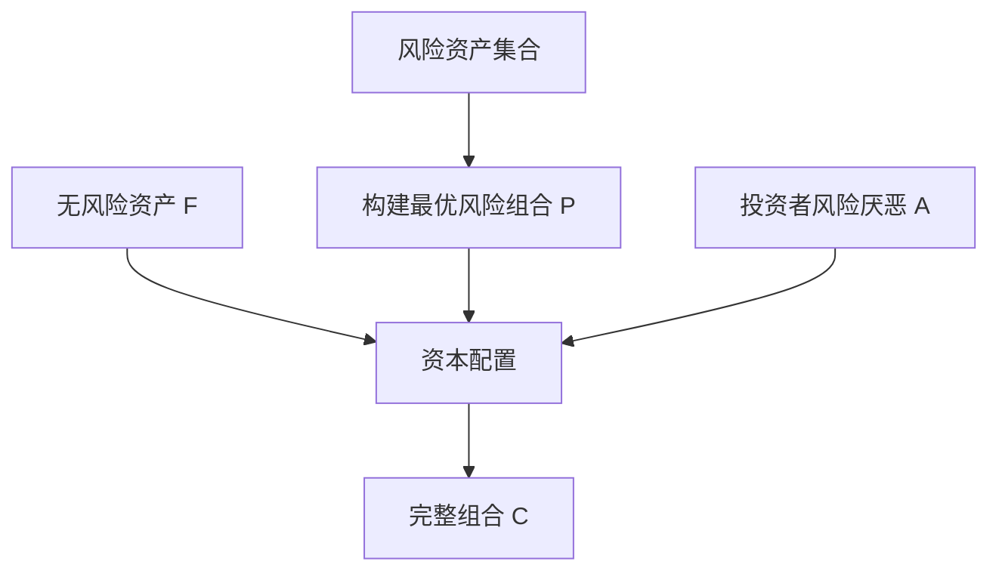

# 29.6 最优风险资产组合与资本配置线

来源：

- 主线：Bodie/Kane/Marcus《Investments》Ch.6
- 相关旧笔记：本笔记 Ch.9, Ch.24

## 投资者最终要选择完整组合

上一节说明，只要给定一个风险组合 P 和一个无风险资产 F，投资者就能通过调整风险组合权重 `y`，得到一整条资本配置线。现在的问题是：投资者应该选择线上哪一点？

这就是完整组合选择问题。完整组合不是单纯的风险资产组合，也不是单纯的安全资产，而是投资者实际持有的全部投资组合。一个人可能持有 60% 股票指数基金和 40% 国库券；另一个人可能持有 30% 股票指数基金和 70% 货币市场基金；还有人可能用杠杆持有 120% 股票指数基金并借入 20% 资金。它们都在同一条资本配置线上，只是位置不同。

投资者选择哪一点，取决于两类因素：市场机会和个人偏好。市场机会由无风险收益率、风险组合预期收益和风险组合波动率决定；个人偏好由风险厌恶程度决定。

## 用效用最大化选择风险资产比例

完整组合的预期收益和风险分别是：

```text
E(rC) = rf + y[E(rP) - rf]
σC = yσP
```

把它们代入效用函数：

```text
U = E(rC) - 1/2 x A x σC^2
```

可以得到：

```text
U = rf + y[E(rP) - rf] - 1/2 x A x y^2 x σP^2
```

这里有一个清楚的权衡。提高 `y` 会线性增加预期收益，因为投资者获得更多风险溢价；但提高 `y` 也会以平方形式增加风险惩罚，因为组合方差随 `y^2` 增加。刚开始增加风险资产比例时，额外收益可能大于额外风险惩罚；到某一点之后，风险惩罚增长更快，效用开始下降。

效用最大化的最优风险资产权重为：

```text
y* = [E(rP) - rf] / [A x σP^2]
```

这个公式非常有解释力。

第一，风险溢价越高，`y*` 越大。风险资产给的补偿越多，投资者愿意投更多。

第二，风险厌恶系数越高，`y*` 越小。越保守的投资者，越少持有风险组合。

第三，风险组合方差越高，`y*` 越小。注意分母是方差而不是标准差，说明风险上升对最优权重的压低作用很强。

## 一个数字例子

假设无风险收益率为 2%，风险组合预期收益率为 10%，风险组合标准差为 22%。风险溢价为 8%。如果投资者风险厌恶系数 `A = 4`，最优风险资产权重是：

```text
y* = (0.10 - 0.02) / [4 x 0.22^2]
   = 0.08 / 0.1936
   ≈ 0.41
```

这个投资者应把约 41% 财富投入风险组合，59% 投入无风险资产。完整组合的预期收益为：

```text
2% + 0.41 x 8% = 5.28%
```

完整组合标准差为：

```text
0.41 x 22% = 9.02%
```

这不是说 41% 对所有人最优。若投资者更保守，例如 `A = 8`，最优风险资产权重会减半。若投资者风险承受能力更强，例如 `A = 2`，最优权重会翻倍。市场机会相同，个人偏好不同，完整组合不同。

## 无差异曲线和资本配置线的相切

也可以用图形理解最优选择。资本配置线表示市场能提供的风险收益组合。无差异曲线表示投资者觉得同样满意的风险收益组合。投资者希望达到尽可能高的无差异曲线，但只能选择资本配置线上的点。

最优点是资本配置线与某条无差异曲线相切的位置。在这个点上，投资者再多承担一点风险所获得的市场补偿，刚好等于他主观上要求的风险补偿。如果市场补偿高于主观要求，他会愿意增加风险资产；如果市场补偿低于主观要求，他会减少风险资产。

这个图形也说明，投资建议不能只说“这个基金夏普比率高”。高夏普比率说明市场机会好，但投资者仍需要选择适合自己的风险水平。对非常保守的人，即使资本配置线很陡，也可能只选择靠近无风险资产的位置。

## 风险组合和完整组合的分工

这里出现一个重要思想：风险组合的选择和风险资产比例的选择可以分开。

假设所有投资者面对同一个无风险资产和同一组风险资产，并且他们对风险资产的预期收益、风险和相关性有相同判断。那么他们都会认为某个风险组合 P 的夏普比率最高。不同投资者的区别不在于风险组合 P 内部的股票和债券比例，而在于他们把多少财富放入 P、多少放入无风险资产。

这就是分离定理的直觉。投资管理行业可以先构建一个高质量风险组合，例如市场指数基金或某个最优风险组合；投资者再根据自己的风险厌恶程度决定持有多少。共同基金、ETF 和目标日期基金的发展，都和这个思想有关。

当然，现实中投资者对预期收益、风险、税收、流动性和投资期限的判断并不完全相同。有人有人力资本风险，有人有房产集中风险，有人有养老金负债，有人有短期现金需求。因此分离思想是基准框架，不是机械规则。但它帮助我们理解为什么资产配置可以分层处理。

## 最优风险组合和资产配置的先后顺序

从理论上看，完整投资组合可以按两个步骤构建。

第一步，在风险资产内部找到最优风险组合。这个组合应在给定风险下提供最高预期收益，或在给定预期收益下提供最低风险。Markowitz 模型、有效边界和指数模型就是为这个问题服务的。

第二步，把最优风险组合与无风险资产混合。投资者根据风险厌恶程度，选择风险组合权重 `y*`。这一步就是本章的资本配置。



这个顺序与实际投资也相似。一个投资者可以先决定使用哪些低成本指数基金或主动基金作为风险资产池，再决定股票、债券、现金等大类资产比例。专业机构也常先设计模型组合，再根据客户风险等级提供保守、平衡、成长等不同版本。

## 为什么风险组合质量仍然重要

虽然不同投资者可以通过调整 `y` 改变风险水平，但风险组合 P 的质量仍然至关重要。如果 P 的夏普比率很低，资本配置线很平，投资者每承担一单位风险只能获得很少预期补偿。即使投资者愿意冒险，也没有好的风险收益交换。

改进风险组合有两条路。第一，提高预期收益，例如通过更好的证券分析或资产配置预测。第二，降低不必要风险，例如通过分散化减少公司特有风险。分散化可以在不牺牲预期收益的情况下减少一部分风险，这等于提高风险组合的夏普比率，使资本配置线变陡。

这也解释了为什么投资组合理论重视“组合”而不是单个高收益资产。一个资产单独看预期收益很高，但如果风险也极高，或与其他资产高度相关，未必能改善完整组合。真正有价值的是能提高整个风险组合风险收益权衡的资产。

## 资本配置中的现实约束

公式中的最优权重有时会给出不现实结果。例如风险溢价很高、风险厌恶较低时，`y*` 可能大于 1，意味着投资者应借钱投资风险组合。现实中，杠杆受到保证金要求、借款成本、监管约束和心理承受能力限制。

相反，如果风险溢价很低或投资者非常保守，`y*` 可能接近 0，甚至如果预期风险溢价为负，投资者会完全避开风险资产。现实中，一些长期投资者仍可能持有少量风险资产，因为他们认为长期风险溢价为正，或需要抵御通胀和长寿风险。

还有税收和流动性约束。应税账户中频繁再平衡可能产生资本利得税；退休账户和养老金有负债期限；保险公司有监管资本要求；普通家庭有购房、教育和医疗支出。这些约束会使实际组合偏离简单效用公式。

因此，公式提供的是基准答案。真实投资决策要在基准答案上加入制度、税收、流动性和行为约束。

投资者可以通过共同基金和 ETF 持有风险组合。一个股票指数 ETF 可以作为风险组合 P 的一部分或整体。投资者不必自己买入几百只股票，只需决定把多少财富放入这个 ETF，再搭配货币市场基金或短期债券基金。

目标日期基金也是资本配置思想的实际应用。年轻投资者距离退休较远，可以承受较高股票权重；随着退休临近，基金逐步降低风险资产比例，提高债券和现金比例。它不是每天预测市场，而是根据投资期限和风险承受能力调整资本配置。

在投资政策中，这些思想会落到更具体的流程上：先明确目标、期限、流动性和风险承受能力，再决定战略资产配置和再平衡规则。

分层处理还有一个实践价值：它能把“市场判断”和“个人约束”分开。市场判断包括风险资产的预期收益、波动率、相关性和估值；个人约束包括工作收入稳定性、住房资产集中度、未来支出、税收账户和能否使用杠杆。两者混在一起时，投资者容易把短期市场观点误当成长期资产配置原则，也容易把个人现金流压力误解释为市场一定会下跌。

## 小结

投资者最终选择的是完整组合，即风险组合和无风险资产的混合。给定风险组合 P 和无风险资产 F，完整组合的风险资产权重 `y` 决定预期收益和标准差。效用最大化给出最优权重：

```text
y* = [E(rP) - rf] / [A x σP^2]
```

风险溢价越高，最优风险资产权重越大；风险厌恶越强或风险组合方差越高，最优权重越小。图形上，最优完整组合是资本配置线与投资者无差异曲线的相切点。

风险组合选择和资本配置可以分层处理。投资管理者可以构建高夏普比率风险组合，投资者再根据自身风险厌恶程度决定投入比例。现实中，杠杆限制、借款成本、税收、流动性和投资期限会使实际配置偏离简单模型，但模型提供了理解资产配置的核心框架。

## 自测问题

- 完整组合和风险组合有什么区别？
- 最优风险资产权重 `y*` 由哪些因素决定？
- 为什么风险组合方差越高，最优风险资产权重越低？
- 无差异曲线和资本配置线相切代表什么含义？
- 为什么风险组合构建和资本配置可以分层处理？
- 现实中哪些约束会使投资者偏离公式给出的最优权重？
- 为什么把市场判断和个人约束分开，有助于形成更稳定的资产配置？
