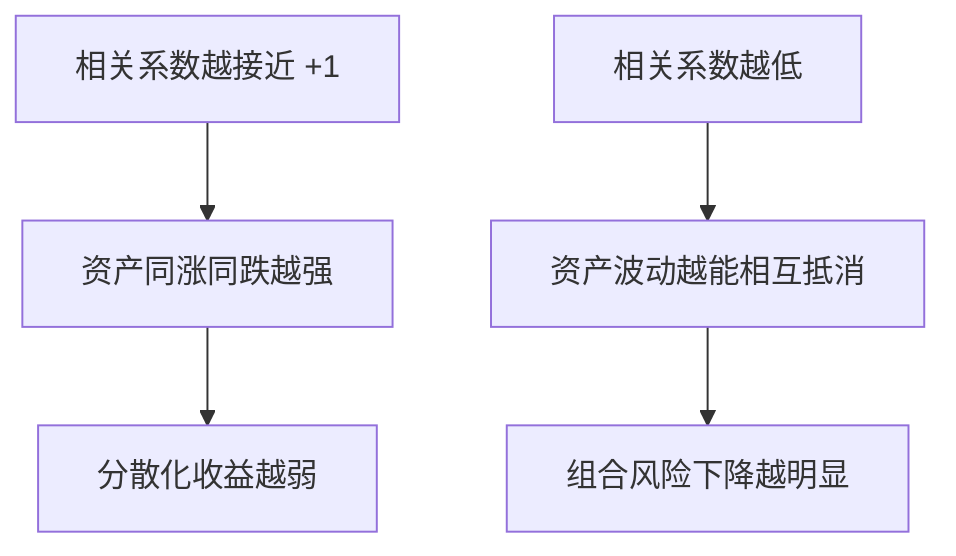

# 30.2 两种风险资产的组合

来源：

- 主线：Bodie/Kane/Marcus《Investments》Ch.7
- 相关旧笔记：本笔记 Ch.7, Ch.9

## 从直觉分散化到有效分散化

上一节讲的是分散化直觉：多持有一些不完全相关的资产，可以降低公司特有风险。但投资组合理论不能停留在“多买一点”这种朴素规则上。有效分散化要回答更精确的问题：给定一组资产，怎样组合才能在某个预期收益水平下获得最低风险？

最简单的情况是两种风险资产。例如一个长期债券基金 D 和一个股票基金 E。债券基金预期收益较低、波动较小；股票基金预期收益较高、波动较大。投资者可以把一部分资金放入债券基金，另一部分放入股票基金。不同权重会产生不同的组合收益和组合风险。

这个两资产例子非常重要。虽然现实组合有很多证券，但多资产组合的基本逻辑已经包含在两资产组合里：组合预期收益是加权平均，组合风险取决于各资产自身波动和它们之间的共同运动。

## 组合预期收益：简单的加权平均

设债券基金权重为 `wD`，股票基金权重为 `wE`，并且：

```text
wD + wE = 1
```

组合收益率是两项资产收益率的加权平均：

```text
rp = wD rD + wE rE
```

组合预期收益率也是预期收益率的加权平均：

```text
E(rp) = wD E(rD) + wE E(rE)
```

如果债券基金预期收益为 8%，股票基金预期收益为 13%，投资者把 60% 放入债券基金、40% 放入股票基金，那么组合预期收益为：

```text
0.6 x 8% + 0.4 x 13% = 10%
```

这一点很直观。预期收益没有“分散化红利”。组合的预期收益只是各资产预期收益按权重平均。分散化真正改变的是风险。

## 组合方差为什么不是简单平均

很多初学者会以为，组合风险也应该是各资产风险的加权平均。但这通常是错的。组合方差不仅取决于每个资产自己的方差，还取决于资产之间如何一起波动。

两资产组合方差为：

```text
σp^2 = wD^2 σD^2 + wE^2 σE^2 + 2 wD wE Cov(rD, rE)
```

前两项是各资产自身波动对组合风险的贡献。第三项是协方差项，反映两种资产收益是否一起高于或低于各自平均值。

如果债券和股票经常同时高于平均、同时低于平均，协方差为正，组合风险较高。如果一个资产高于平均时另一个资产常低于平均，协方差为负，组合风险明显降低。如果两者没有系统关系，协方差接近零。

这就是分散化的数学来源。预期收益是线性相加，风险不是线性相加。只要资产之间不是完全同向波动，组合标准差就可能低于单个资产标准差的加权平均。

## 相关系数：把协方差标准化

协方差有单位，不容易直接比较。相关系数把协方差标准化到 -1 到 +1 之间：

```text
ρDE = Cov(rD, rE) / (σD σE)
```

相关系数为 +1，表示两个资产完全正相关，收益总是按固定方向一起变化。这时分散化没有真正降低风险，组合标准差就是两个标准差的加权平均。

相关系数为 0，表示两个资产没有线性相关关系。它们不系统同涨同跌，组合风险会低于加权平均。

相关系数为 -1，表示两个资产完全负相关。一个资产上涨时另一个按固定比例下跌。此时可以通过合适权重构造零风险组合，因为一个资产的波动完全抵消另一个资产的波动。

现实中，多数股票之间相关系数为正，但小于 +1。股票和长期债券之间的相关性会随宏观环境变化，有时较低甚至为负，有时在通胀冲击下同时下跌。相关性不是自然常数，而是经济环境、政策和市场情绪共同作用的结果。

## 相关性如何决定分散化收益

假设债券基金标准差为 12%，股票基金标准差为 20%。如果两者完全正相关，组合标准差会沿着 12% 和 20% 之间的直线变化。增加股票权重，风险几乎按比例上升；增加债券权重，风险按比例下降。分散化没有额外好处。

如果相关系数为 0.30，情况不同。少量股票加入债券组合，可能提高预期收益，同时组合标准差未必马上上升很多，甚至可能先下降。原因是股票和债券并不完全同涨同跌，部分波动相互抵消。

如果相关系数为 0，分散化效果更强。若相关系数为 -1，理论上可以找到一组权重，让组合标准差为 0。这个极端情况在现实中少见，但它帮助我们理解：分散化不是来自资产数量，而是来自收益的不完全同步。



## 最小方差组合

在两资产组合中，可以寻找风险最低的权重，这个组合称为最小方差组合。它不一定有最高预期收益，也不一定是每个投资者最想要的组合，但它说明分散化可以把风险降到单个资产风险以下。

继续用债券基金和股票基金例子。债券标准差 12%，股票标准差 20%，相关系数 0.30。虽然债券本身比股票风险低，但加入少量股票后，组合标准差可能低于 12%。这是因为股票收益中有一部分与债券不同步，能抵消债券波动。

这对投资者很反直觉：加入一个单独看更高风险的资产，可能降低整个组合风险。原因在于组合风险不是单个资产风险的平均，而是整个组合现金流共同波动的结果。如果高风险资产与原组合相关性足够低，它可以起到稳定器作用。

这也是全球资产配置、股票债券混合、另类资产配置的核心理由。一个资产是否“危险”，不能只看它自身波动，还要看它与已有组合的关系。

## 卖空和权重超过 100%

在理论模型中，权重可以小于 0 或大于 1。若股票基金权重为 -20%，表示卖空股票基金，并把所得资金加到债券基金中；若股票基金权重为 120%，表示借入或卖空其他资产来增加股票暴露。

允许卖空会扩大可行组合集合。投资者可以构造更极端的风险收益组合，也可能获得更高预期收益或更低风险。但现实中卖空和杠杆受到限制：有保证金要求、借款成本、卖空成本、监管约束和强制平仓风险。

因此，理论有效边界常先在允许卖空的环境中推导，再根据现实约束调整。理解无约束模型的价值在于，它让我们看清风险、收益和相关性的纯粹关系；现实约束则决定投资者能否真的实施这些权重。

两资产组合背后是边际思维。投资者不是问“股票好不好”或“债券好不好”，而是问：在当前组合中，增加一点股票、减少一点债券，会怎样改变预期收益和风险？资产配置是边际替换问题。

资产需求取决于预期收益、风险、流动性和相对其他资产的表现。这里的“相对其他资产”通过协方差和相关性进入模型。一个资产可能自身风险高，但因为能在其他资产表现差时表现好，仍然有较高组合价值。

这就是投资组合理论比单资产分析更进一步的地方：资产的价值不只由自身决定，也由它放入组合后的边际贡献决定。

相关性还具有状态依赖性。平稳时期估计出来的股票债券相关性、行业相关性或国际市场相关性，可能在通胀冲击、金融危机或全球避险时期明显改变。投资者如果把相关系数当作永远不变的自然常数，就可能高估分散化保护。组合分析需要把历史估计、经济机制和压力情景放在一起使用。

## 小结

两种风险资产组合的预期收益是各资产预期收益的加权平均，但组合方差不是各资产方差的加权平均。组合方差还包含协方差项，反映资产收益之间的共同运动。

相关系数越低，分散化收益越强。完全正相关时，分散化不能降低风险；不完全相关时，组合标准差低于加权平均；完全负相关时，理论上可以构造零风险组合。最小方差组合说明，加入一个单独看更高风险的资产，也可能降低整体组合风险。

资产配置要关注资产对组合的边际贡献，而不是只看资产自身风险。这个思想会推广到多资产 Markowitz 模型和后续资本资产定价模型。

## 自测问题

- 为什么组合预期收益是加权平均，而组合风险通常不是？
- 协方差在组合方差公式中表示什么？
- 相关系数为 +1、0、-1 时，分散化效果分别如何？
- 为什么加入一个高标准差资产有时会降低组合标准差？
- 最小方差组合是什么？
- 权重小于 0 或大于 1 在投资组合中表示什么？
- 为什么压力时期相关性变化会削弱平时看起来有效的分散化？
