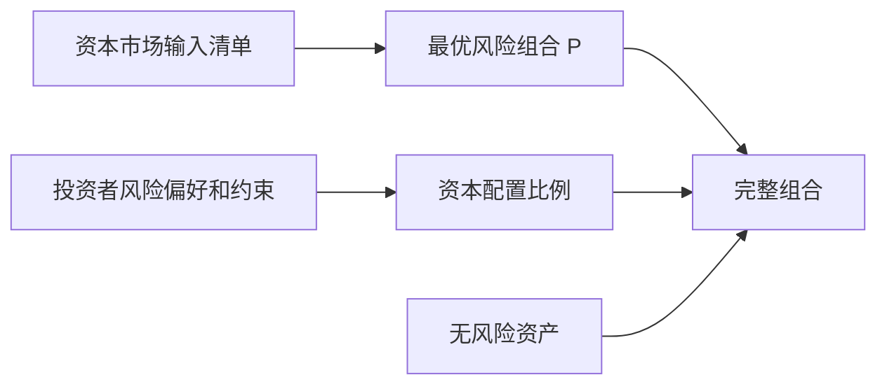

# 30.4 无风险资产、最优风险组合与分离定理

来源：

- 主线：Bodie/Kane/Marcus《Investments》Ch.7
- 相关旧笔记：本笔记 Ch.9, Ch.24

## 为什么要把无风险资产加回来

第 30.3 节只讨论风险资产之间怎样组合，得到有效边界。但真实投资者通常还能持有无风险资产，例如短期国库券或货币市场基金。加入无风险资产后，问题会发生重要变化：投资者不必直接在风险资产有效边界上选择完整组合，而是可以先选择一个最优风险组合，再与无风险资产混合。

资本配置线和有效边界在这里合到一起。若风险组合 P 已经给定，投资者只决定在 P 和无风险资产之间分配多少资金；现在要问的是：风险组合 P 应该是哪一个？

答案是：选择能和无风险资产形成最高资本配置线的那个风险组合。

## 从无风险资产画向有效边界

在预期收益-标准差图上，无风险资产位于纵轴上，因为它的标准差为 0。风险资产有效边界是一条向右上方弯曲的曲线。我们可以从无风险资产点出发，向有效边界上的不同风险组合画资本配置线。

每条资本配置线的斜率等于对应风险组合的夏普比率：

```text
斜率 = [E(rP) - rf] / σP
```

投资者希望斜率越高越好，因为斜率表示每承担一单位风险能获得多少预期超额收益。因此，最优风险组合就是使资本配置线斜率最大的风险资产组合。

图形上，这条最高斜率的资本配置线会与风险资产有效边界相切。切点组合称为最优风险组合或切点组合。它不是标准差最低的组合，也不一定是预期收益最高的组合，而是夏普比率最高的组合。

## 最优风险组合的含义

最优风险组合 P 是所有风险资产组合中风险收益交换最好的组合。给定无风险利率和输入清单，没有其他风险组合能提供更高夏普比率。

一旦找到 P，投资者就不需要在有效边界上的其他风险组合之间选择。因为任何其他风险组合与无风险资产形成的资本配置线都更平，意味着单位风险补偿更低。投资者如果想要更低风险，可以少持有 P、多持有无风险资产；如果想要更高风险，可以多持有 P，甚至用杠杆持有 P。没有必要选择一个夏普比率更低的风险组合。

这说明无风险资产的加入改变了风险资产选择逻辑。没有无风险资产时，风险厌恶程度不同的投资者可能选择有效边界上的不同点；有无风险资产时，在理想条件下，所有投资者都选择同一个最优风险组合，只是持有比例不同。

## 分离定理

这个结果称为分离性质或分离定理。它说，投资组合选择可以分成两个独立任务。

第一，技术任务：根据预期收益、方差和协方差，找到最优风险组合 P。这个任务不取决于某个投资者的风险厌恶程度。

第二，个人任务：根据投资者自身风险厌恶、投资期限、现金需求和约束，决定在 P 和无风险资产之间分配多少财富。



这个思想解释了投资管理行业为什么能够规模化。基金经理可以为许多客户构造同一个风险组合，客户再通过现金、货币市场基金或短期债券调整总体风险。不同客户不必各自拥有完全不同的股票组合。

## 为什么这不等于所有人都买同一个基金

分离定理是一个基准模型，不是现实的机械描述。现实中，不同投资者可能面对不同税率、不同投资期限、不同法律限制、不同货币、不同负债和不同人力资本风险。因此，他们的有效风险组合可能不同。

例如，养老基金要匹配长期负债，可能需要更多长期债券；保险公司受监管资本约束，不能只按夏普比率最大化；个人投资者如果工资收入高度依赖科技行业，可能不应在金融资产中再过度集中科技股票；高税率投资者可能偏好市政债或低换手率基金。

此外，不同投资管理人对预期收益、风险和相关性的估计不同。一个经理认为国际股票预期收益高，另一个经理可能认为估值过高；一个经理看重历史协方差，另一个经理担心危机相关性上升。输入不同，最优风险组合自然不同。

因此，分离定理的真正价值不在于命令所有人买同一个组合，而在于提供清晰分工：先问“市场中哪个风险组合的单位风险补偿最好”，再问“这个风险组合我应该持有多少”。

## 被动投资和最优风险组合

如果投资者没有能力产生高质量主动预期收益估计，一个广泛市场指数基金可能是合理的风险组合近似。原因是，错误的主动输入可能导致低质量优化，而低成本指数基金至少提供广泛分散化和市场平均暴露。

这和第 28.6 节基金费用联系紧密。主动管理要战胜被动组合，需要提供更好的风险收益交换。否则，投资者可以用一个市场指数基金加货币市场基金构造完整组合，费用低、透明度高、分散化充分。

当然，市场指数不一定等于理论上的最优风险组合。指数权重由市场市值决定，不直接根据投资者预期收益和风险优化。但在信息高度竞争、主动预测困难的市场中，市场指数常作为现实中的基准风险组合。

## 分离性质和资产配置层次

投资决策可以理解为自上而下过程：资本配置、资产配置、证券选择。分离性质让这个层次更清楚。

资本配置决定总体承担多少风险：风险组合和无风险资产之间怎么分。资产配置决定风险组合内部在股票、债券、国际资产、房地产等大类资产之间怎么分。证券选择决定每个大类内部具体买哪些证券。

理论上，资产配置和证券选择都可以看作同一个优化问题：在所有风险资产中寻找最优风险组合。实践中，把它们分开有助于管理复杂性。先确定大类资产暴露，再在每类资产内部选择证券，是许多机构投资流程的基本结构。

这种分层也更适合真实投资流程：宏观经济、利率、通胀和政策影响大类资产配置；信息不对称、公司治理和估值分析影响证券选择；风险厌恶和负债需求影响资本配置。

## 约束下的分离

如果投资者有特殊约束，分离性质仍然有用，但要在约束后的资产集合中重新寻找最优风险组合。例如不能卖空、必须持有一定比例债券、不能投资某些行业、需要最低现金比例、必须满足监管资本要求，这些都会改变有效边界和切点组合。

约束后的最优风险组合通常夏普比率较低，因为可选范围变小。但它可能更符合投资者的真实目标。对一个养老基金来说，能否支付未来养老金比单纯夏普比率更重要；对一个有明确伦理限制的基金来说，排除某些资产是投资政策的一部分。

因此，投资组合理论不是要忽视约束，而是帮助投资者看清约束的代价和影响。先在无约束模型中理解最优选择，再逐步加入现实约束，能更清楚地知道每个约束改变了什么。

## 小结

加入无风险资产后，投资者应寻找与无风险资产形成最高斜率资本配置线的风险组合。这个组合位于风险资产有效边界与资本配置线的切点，称为最优风险组合或切点组合，具有最高夏普比率。

分离定理说明，投资组合选择可以分成两个任务：先由投资管理人根据市场输入构造最优风险组合，再由投资者根据自身风险偏好决定在该组合和无风险资产之间的配置比例。风险厌恶影响资本配置比例，不影响理想模型中的最优风险组合本身。

现实中，税收、负债、监管、投资期限、人力资本和投资者预期差异都会使不同投资者持有不同风险组合。但分离思想仍提供了清晰框架：先改善风险组合的夏普比率，再根据个人情况调整总体风险暴露。

## 自测问题

- 为什么加入无风险资产后，要寻找夏普比率最高的风险组合？
- 切点组合是什么？
- 分离定理把投资组合选择分成哪两个任务？
- 为什么不同风险厌恶程度的投资者在理论上可以持有同一个风险组合？
- 为什么现实中并不是所有投资者都会买同一个风险组合？
- 资产配置和证券选择在理论上有什么共同点，在实践中为什么常被分开？
