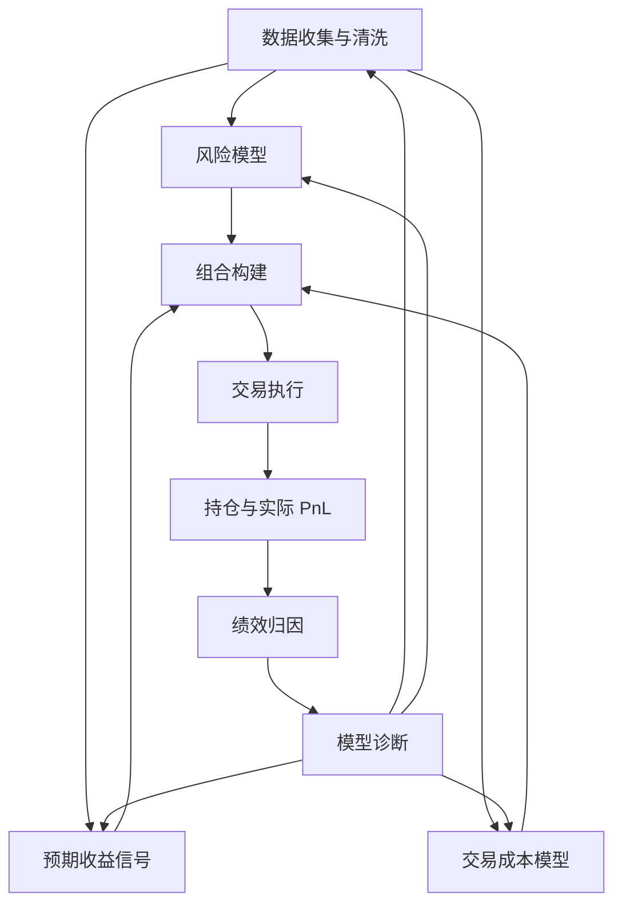

# 36.4 量化投资流程：信号、风险、组合与执行

来源：

- 主线：Paleologo《The Elements of Quantitative Investing》Ch.1
- 相关旧笔记：本笔记 Ch.27, Ch.29-Ch.35

有了证券、交易场所、市场参与者和超额收益来源之后，量化投资才进入真正的工作流程。一个常见误解是把量化投资等同于“找信号”。信号当然重要，但它只是流程中的一部分。一个信号如果不进入风险模型、成本模型和组合构建，就只是研究结果；只有当它变成仓位并经过真实交易，才会产生盈亏。

完整的量化投资流程可以按时间分为三段：交易前、交易中、交易后。交易前准备数据、风险、收益和成本模型；交易中把这些输入合成为组合和订单；交易后用实际盈亏、风险和归因结果反过来检验模型。这个流程把前面投资学的收益、风险、组合和绩效评价，变成一个可重复运行的系统。

## 数据不是原材料，而是已被加工的市场记录

量化投资从数据开始，但数据不是天然干净的事实。价格、成交量、财务报表、分析师预测、指数成分、债券条款、利率曲线、信用利差、新闻文本和另类数据，都是经过制度、市场和供应商处理后的记录。

以股票价格为例，研究者需要处理拆股、分红、退市、并购、换代码、停牌和交易所变更。若只保留当前仍上市的公司，会产生幸存者偏差；若使用未来才发布或未来才修订的数据，会产生前视偏差；若不正确调整分红和拆股，收益率会出现虚假跳变。

以债券为例，数据问题更复杂。许多债券不频繁交易，价格可能来自估值服务或交易商报价，而不是连续成交。公司债还涉及信用评级、契约条款、赎回条款、流动性等级和发行规模。把债券价格当作和大盘股票一样的高质量连续交易价格，会低估数据不确定性。

因此，数据阶段已经包含经济判断。研究者必须知道某个数字代表什么：成交价、报价、中间价、估值价、复权价、公告日数据，还是回填后的数据库字段。

## 交易前：三个核心输入

交易前模型主要有三类：风险模型、预期收益模型和交易成本模型。

**风险模型**回答“如果持有这些仓位，组合可能怎样波动”。第 30 章已经说明，组合风险不只是单个资产风险相加，还取决于资产之间的协方差。一个看似分散的股票组合，如果全部暴露于同一行业、同一风格或同一宏观因子，危机时可能一起下跌。后面第 39-42 章会用因子模型把共同风险和特质风险分开。

**预期收益模型**回答“哪些资产未来可能有更高收益”。在量化语境中，这类模型常被称为信号。信号可以来自价格动量、估值、盈利质量、分析师修正、资金流、宏观变量、期限结构、波动率、新闻文本等。一个现代系统往往有很多信号，而不是单一预测变量。

**交易成本模型**回答“把信号变成仓位要付出多少成本”。成本包括佣金、税费、买卖价差、市场冲击、借券费、融资成本和延迟执行损失。交易成本决定了信号的可交易期限。一个预测未来一个月收益的信号可以承受较低换手；一个预测未来十分钟收益的信号必须极其强，才能覆盖频繁交易成本。

这三个输入必须一起看。只看预期收益，会得到高换手、高集中、不可执行的组合；只看风险，会得到稳定但没有收益来源的组合；只看成本，会错过需要承担一定风险才能获得的机会。

## 交易中：组合构建不是简单排序

交易中最关键的步骤是组合构建。很多入门理解会把量化投资想成“买入信号最高的股票，卖出信号最低的股票”。真实组合构建要复杂得多。

首先，要处理**风险约束**。策略可能不想承担市场 beta、行业暴露、国家暴露、利率久期、信用等级集中或单一证券集中风险。如果不约束，优化器可能把仓位集中到历史信号最强但风险也最集中的资产上。风险约束可以是硬限制，也可以是目标函数中的惩罚项。

其次，要处理**信号聚合**。两个信号可能表达同一信息。例如价值因子和某些盈利收益率指标可能高度相关；多个动量指标也可能只是不同窗口的同一趋势。如果简单相加，就会重复计算。信号聚合要考虑预测力、相关性、稳定性、交易成本和容量。

第三，要处理**对冲决策**。一个策略也许想赚个股相对收益，不想承担整体市场涨跌；也许想赚信用利差，不想承担利率上行；也许想赚商品期限结构，不想承担美元风险。对冲的目的不是消除所有风险，而是把不想要、没有收益补偿或无法解释的风险尽量移除。

第四，要处理**执行路径**。组合目标仓位和实际交易之间还有距离。大单怎样拆分，在哪些场所交易，是否使用暗池，如何控制冲击成本，是否等待流动性，都会影响实际收益。第 46 章会把交易成本放进优化问题。

## 交易后：盈亏必须被解释

交易完成后，投资者看到的是实际 PnL。只知道赚了或亏了不够，必须解释它来自哪里。第 35 章已经介绍绩效评价，量化投资中的绩效归因更细：它要把收益拆成信号贡献、因子暴露、特质收益、对冲效果、交易成本和仓位大小贡献。

假设一个股票多空策略本月赚钱。可能原因有很多：

- 选股信号真的有效；
- 组合无意中暴露于市场上涨；
- 行业配置碰巧正确；
- 小盘股风格本月表现好；
- 对冲不足带来系统性收益；
- 交易成本低于预期；
- 只是运气。

如果不做归因，研究团队无法知道应该增加哪个信号、减少哪个风险、修正哪个成本模型。反过来，策略亏损也不一定说明信号失效。亏损可能来自短期风格逆风、风险模型低估波动、执行成本异常或仓位过大。

绩效归因的目的不是写漂亮报告，而是让投资过程学习。好的归因系统会把交易后结果反馈到数据、信号、风险、成本和组合构建中。

## 动态风险和杠杆

量化投资还要决定跨时间如何分配风险。一个策略长期 Sharpe Ratio 很高，并不意味着每天都应该使用同样杠杆。如果近期波动率上升、流动性恶化、信号表现衰减，继续维持原有风险可能导致不可接受的回撤。反过来，如果风险下降且机会增加，降低仓位可能浪费资本。

这里与第 29 章的风险厌恶、第 35 章的投资政策、第 48 章的 Kelly Criterion 相连。静态组合优化回答某一时点持有什么；动态风险配置回答不同时间承担多少风险。杠杆不是简单放大收益，它同时放大误差、成本、流动性压力和尾部亏损。

## 一个完整闭环

量化投资流程可以整理成闭环：

这个闭环解释了为什么量化投资是一套系统，而不是一个公式。数据错误会污染信号；信号错误会导致仓位错误；风险模型错误会导致过度集中；成本模型错误会让高换手策略虚假盈利；执行错误会吃掉 alpha；归因不足会让团队无法判断到底哪里出了问题。

## 小结

量化投资流程包括交易前、交易中和交易后。交易前建立数据、风险、预期收益和交易成本模型；交易中通过组合构建、风险约束、信号聚合、对冲和执行，把模型转化为真实仓位；交易后通过 PnL、风险和绩效归因检查结果，并反馈给研究流程。

这一流程把前面课程的核心概念连接起来：收益率和风险来自第 29 章，组合优化来自第 30 章，市场效率和 alpha 来自第 31 章，衍生品和对冲来自第 34 章，绩效评价来自第 35 章。后续章节会沿着这个流程展开：先研究收益和波动率，再建立因子风险模型，再评价 alpha，最后进入组合优化、交易成本、对冲、动态风险和绩效归因。

## 自测问题

1. 为什么量化投资不能被简化为“寻找一个收益预测信号”？
2. 价格数据、财务数据和债券数据分别可能有哪些质量问题？
3. 风险模型、收益模型和交易成本模型分别回答什么问题？
4. 为什么组合构建不是简单买入信号最高的资产？
5. 对冲为什么是组合构建的一部分，而不是交易后的附加操作？
6. 绩效归因如何帮助区分技能、风险暴露和运气？
7. 杠杆为什么会同时放大收益、误差和流动性压力？
