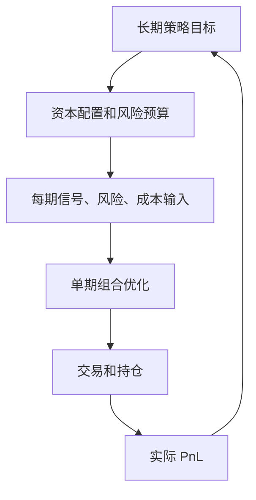

# 38.1 期望收益与可投资收益

来源：

- 主线：Paleologo《The Elements of Quantitative Investing》Ch.3
- 相关旧笔记：本笔记 Ch.29, Ch.35

前面两章分别回答了两个基础问题：量化投资买卖什么，收益率和波动率怎样定义。现在要问一个更直接的问题：一个策略到底表现好不好？回答这个问题不能只看“赚了多少钱”。同样赚 100 万美元，对一个管理 1000 万美元的小基金和一个管理 100 亿美元的大基金，意义完全不同；同样年化收益 10%，如果一个策略承担巨大回撤风险，另一个策略波动很低，它们也不能被同等评价。

因此，投资绩效评价首先需要把盈亏转化为可比较的收益率。量化投资中常用的起点是把策略 Profit and Loss，即 PnL，除以 Assets under Management，即 AuM。PNL 是策略在某段时间赚或亏的金额，AuM 是用于产生这笔盈亏的管理资产规模。二者相除，得到相对于资本规模的收益。

## 为什么不用绝对 PnL 评价策略

绝对 PnL 很直观，但不适合比较。一个策略一年赚 5000 万美元，看起来很强；如果它占用了 50 亿美元资本，收益率只有 1%。另一个策略一年只赚 500 万美元，但占用资本 2000 万美元，收益率是 25%。仅看金额会把规模和能力混在一起。

第 35 章讲投资绩效评价时已经强调，绩效不能脱离基准、风险和资本。量化投资进一步要求把 PnL 标准化，因为研究者需要比较不同资产、不同时间、不同策略、不同资金规模下的表现。收益率就是这种标准化方式。

收益率有两个重要性质。

第一，它相对更稳定。策略规模扩大十倍，若交易条件不变，PNL 可能大致扩大十倍，但收益率不应机械改变。用收益率可以把“策略好坏”和“资金大小”分开。

第二，它是强度指标，而不是总量指标。经济学中常区分总量和比率。GDP 是总量，人均 GDP 是标准化后的强度指标；公司利润是总量，ROE 是资本回报率。投资中也是如此，PNL 是总量，收益率是资本使用效率。

## 期望收益不是历史平均的同义词

期望收益指策略未来收益的概率平均。它不是过去收益的简单描述，而是对未来分布的模型判断。历史平均收益可以用来估计期望收益，但二者不能混为一谈。

如果一个策略过去 100 天平均日收益为 0.05%，这只是样本平均。真实期望收益可能更高，也可能更低。样本期可能碰巧顺风，可能包含一次大盈利，也可能受交易成本估计错误影响。尤其在金融市场中，收益噪声很大，均值估计非常困难。第 37 章已经说明，收益均值通常比波动率更难估。

这对量化研究很重要。一个回测平均收益为正，不等于策略真实期望收益为正。研究者必须问：

- 这个收益是否有经济逻辑？
- 是否来自已知风险暴露？
- 是否在样本外仍存在？
- 是否扣除了真实成本？
- 是否由少数极端日贡献？
- 是否容量足够？

期望收益是投资决策的核心输入，但也是最不容易估计的输入之一。

## 单期目标和多期目标

策略可以在单个投资期内优化，也可以在整个生命周期内优化。单期问题问的是：在当前信息下，下一期应该持有什么组合？多期问题问的是：长期如何在不同时间调整风险、杠杆和资本，以最大化长期表现。

在实际量化系统中，二者通常被拆开处理。每天、每小时或每个调仓时点，系统解决一个单期组合问题：给定当前信号、风险和成本，计算目标仓位。与此同时，风险委员会或上层配置系统管理更长期的问题：策略是否扩容，是否降低杠杆，是否暂停，是否重新分配资本。

可以把它理解为两层：

单期收益最大化如果不受约束，很容易导致过度交易、过度集中和过度杠杆；长期收益最大化如果不落到单期决策，又无法实际执行。因此，期望收益既是每期优化目标，也是长期资本增长问题的一部分。

## 可投资收益要扣除现实摩擦

期望收益还要区分“纸面收益”和“可投资收益”。纸面收益是模型认为资产会产生的收益；可投资收益是在真实交易后、扣除成本、考虑容量和约束后的收益。

例如，一个短期信号预测某股票未来一天上涨 0.08%。如果买卖价差、佣金和冲击成本合计 0.10%，这个信号即使方向正确也没有经济价值。再如，一个小盘股策略在 100 万美元规模下表现很好，但在 10 亿美元规模下买卖会显著影响价格，原有收益就不能简单外推。

这与第 36 章的流动性和第 46 章的交易成本直接相连。量化投资中的期望收益必须最终落到可交易、可扩展、可解释的收益上。否则，模型预测再漂亮，也只是统计现象。

## 期望收益在组合优化中的角色

在均值-方差框架中，期望收益通常出现在目标函数中。投资者希望在给定风险和成本下提高期望收益，或者在达到某个期望收益目标时最小化风险。也可以把期望收益作为约束，例如要求组合预期收益不低于某个门槛。

这说明绩效度量和组合构建不是分离的。我们怎么定义收益，决定了优化器追求什么；我们怎么估计收益，决定了仓位如何倾斜。如果期望收益估计很嘈杂，优化器可能把噪声当成机会，给出极端仓位。后面第 45 章讨论模型误差时，这会成为核心问题。

## 小结

期望收益是策略未来 PnL 相对于资本规模的概率平均。用收益率而不是绝对 PnL，可以比较不同规模、不同时间和不同策略的资本使用效率。但期望收益不是历史平均的简单同义词，历史平均只是带噪声的估计。

量化投资关心的是可投资收益：扣除交易成本、融资成本、市场冲击并考虑容量之后仍能实现的收益。期望收益既是组合优化的目标，也是长期资本配置的输入，但它估计困难、噪声很大，必须和风险、成本、约束一起使用。

## 自测问题

1. 为什么绝对 PnL 不适合直接比较两个策略？
2. PnL / AuM 为什么比 PnL 更适合做绩效指标？
3. 历史平均收益和期望收益有什么区别？
4. 为什么收益均值通常比波动率更难估计？
5. 单期组合优化和多期资本增长问题有什么不同？
6. 什么是可投资收益？它和纸面预测收益有什么区别？
7. 为什么期望收益估计误差会在优化器中被放大？
