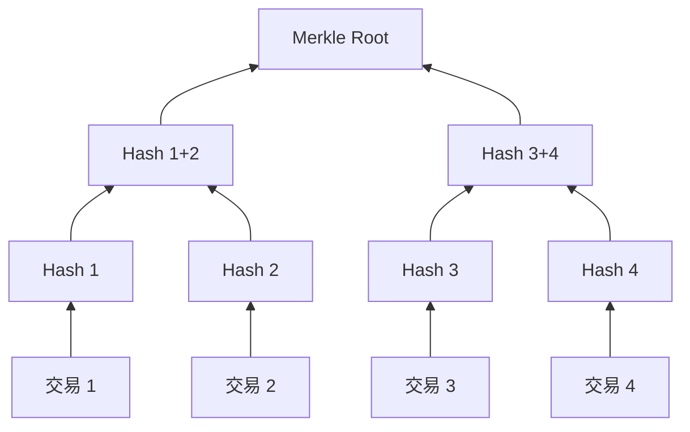

# 50.3 哈希、数字签名、Merkle Tree 与不可篡改性

来源：Marco Di Maggio, *Blockchain, Crypto and DeFi: Bridging Finance and Technology*, Chapter 1, "Blockchain in 16 Questions"；补充参照本笔记第 5 章关于信息不对称、第 27 章关于交易机制的讨论。

区块链之所以能在没有单一管理员的情况下维护账本，离不开几个密码学工具。它们听起来很技术化，但在金融语境里可以用一个简单问题来理解：如果许多人共同维护账本，怎样证明一条记录没有被改过，怎样证明一笔交易确实由有权人发起，怎样在不重新检查所有数据的情况下确认某笔交易属于某个区块？

这一节讨论三个基础工具：哈希、数字签名和 Merkle Tree。它们不是区块链的全部，但构成了账本可验证性的底层语言。

## 哈希是数据的指纹

哈希函数可以把任意长度的信息转换成固定长度的字符串。这个字符串可以理解为数据的“指纹”。同样的数据输入同一个哈希函数，会得到同样的输出；只要输入发生极小变化，输出就会完全不同。

例如，一句话末尾多一个标点，哈希结果就会变成另一串看似随机的字符。对普通读者来说，不需要手工计算哈希，只要理解它的金融含义：哈希让数据篡改变得容易被发现。

一个好的密码学哈希函数通常有几个性质：

| 性质 | 含义 | 对区块链账本的作用 |
| --- | --- | --- |
| 确定性 | 同一输入总是得到同一输出 | 节点可以独立验证结果 |
| 固定长度 | 输入多长，输出长度都固定 | 大量交易可以被压缩表示 |
| 单向性 | 从输出很难反推出输入 | 可用于承诺和验证 |
| 雪崩效应 | 输入微小变化导致输出巨大变化 | 篡改记录会立刻暴露 |
| 抗碰撞 | 很难找到两个不同输入产生同一输出 | 防止用假数据替换真数据 |

把哈希放进金融语境，就是把一份交易记录、一个区块或一组数据变成可验证的摘要。银行内部系统也会使用类似技术，但区块链把这种验证能力开放给网络节点，而不是只留给系统管理员。

## 区块为什么要引用前一个区块

区块链中的每个区块通常包含区块头、交易列表、时间戳、前一区块哈希、nonce 和 Merkle root 等信息。这里最关键的是：新区块会包含前一区块的哈希。

这就形成了链式结构。假设有人想改动很早以前的一笔交易。那笔交易所在区块的哈希会改变；由于后一个区块引用了这个哈希，后一个区块也会变得无效；再后面的区块又引用后一个区块，于是整条后续历史都需要重新计算。

这就是“不可篡改性”的直觉来源。严格说，区块链不是逻辑上绝对不能改，而是经济上和计算上极难改。攻击者不仅要改目标区块，还要追上并超过诚实网络之后不断新增的区块。如果网络足够大、共识机制足够强，篡改成本就会高到不值得做。

这和传统金融中的审计日志不同。传统系统也可以记录修改痕迹，但如果管理员权限足够高，仍然可能修改数据库和日志。区块链试图通过许多节点共同保存历史和哈希链接，使单点管理员无法轻易改写过去。

## 数字签名证明“谁有权花这笔钱”

仅仅证明记录没被改过还不够。金融账本还需要确认交易是谁发起的。银行转账需要身份认证，证券交易需要账户权限，支票需要签名。区块链中的对应工具是数字签名。

数字签名依赖一对密钥：私钥和公钥。私钥像签字权，必须保密；公钥可以公开，用来验证签名。用户发起交易时，用私钥对交易信息签名。其他节点不需要知道私钥，只要用对应公钥验证签名，就能确认这笔交易确实由掌握私钥的人授权。

这套机制带来两个结果。

第一，链上资产控制权高度依赖私钥。谁能产生有效签名，谁就能移动资产。这使得链上产权非常直接，也使私钥管理成为核心风险。

第二，系统不需要中心机构逐笔批准交易。节点只需检查签名是否有效、余额是否足够、交易是否符合协议规则。身份从“某个机构认识你”转变为“你能证明自己掌握相应私钥”。

这个变化和金融中的 KYC、反洗钱、账户实名制之间存在张力。链上地址可以证明控制权，却不天然证明现实身份。后面讨论监管时会看到，这正是加密金融和传统金融制度发生摩擦的地方。

## Merkle Tree 让大量交易可以高效验证

一个区块可能包含许多交易。如果每次验证都要下载并检查全部交易，效率会很低。Merkle Tree 的作用，是把许多交易哈希逐层合并，最后形成一个根哈希，也就是 Merkle root。

可以把它想象成一棵倒过来的树。最底层是每笔交易的哈希。相邻两个哈希合并后再哈希，形成上一层节点。这个过程不断重复，直到只剩一个根。这个根被写入区块头，成为整批交易的摘要。

Merkle Tree 的价值在于高效证明。若要证明某笔交易包含在某个区块里，不必展示全部交易，只需要展示从该交易到根节点路径上的相关哈希。验证者可以重新计算路径，看看最终是否得到区块头中的 Merkle root。

在金融上，这相当于一种低成本审计机制。你不需要完全复制一家机构的所有内部账，也能验证某条记录是否属于某个已确认账本。当然，在公链中，完整节点仍然保存和验证完整数据；轻节点则可以借助 Merkle proof 降低验证成本。

## 不可篡改性来自技术和经济的结合

很多介绍区块链的文章会说“区块链不可篡改”，但这句话需要谨慎理解。哈希和 Merkle Tree 只能让篡改容易被发现；数字签名只能证明某笔交易由私钥授权；真正让篡改难以成功的，是这些密码学工具和共识机制、经济激励结合在一起。

如果一个私有链只有少数节点，且这些节点都由同一机构控制，那么即使使用哈希结构，也不一定比传统数据库更抗篡改。如果一个公链的算力或质押高度集中，攻击者也可能通过控制共识来重组交易历史。技术结构提供可能性，经济分散和制度约束决定这种可能性是否可靠。

这点对应经济学中的“制度不能只看规则文本，还要看执行激励”。一个规则写得再漂亮，如果违反规则的收益大、成本低，制度就不稳。区块链的可验证性，是密码学、网络结构和参与者激励共同形成的结果。

## 从“防伪”到“防双花”

理解这些密码学工具时，可以把问题进一步具体化为数字货币的“防双花”问题。实物现金天然不容易双花，因为一张纸币交给别人后，付款人就不再持有这张纸币。但数字文件可以复制。如果一枚数字货币只是电脑里的一个文件，付款人完全可以复制多份，分别发给不同的人。

传统电子支付通过中心化账本解决双花。银行知道每个账户余额，支付时检查余额是否足够，成功后扣减付款方并增加收款方。只要银行账本可信，同一笔钱就不能重复花。

Bitcoin 的挑战是：没有银行时，谁来判断某笔钱有没有花过？答案不是单个工具，而是一整套组合。数字签名证明“这笔交易确实由控制者发起”；交易历史证明“这笔币此前没有被花掉”；区块和哈希链让历史记录难以被改写；PoW 共识让网络选择一条成本最高、最难伪造的历史。哈希、签名和 Merkle Tree 因此不是孤立技术，而是共同服务于同一个金融目标：在开放网络里防止重复支付。

这个问题和第 6 章货币支付体系直接相连。任何支付系统都必须解决最终性问题：收款人什么时候可以确信自己真的收到钱？银行转账依赖银行和清算系统确认，现金支付依赖实物交割，Bitcoin 依赖区块确认和后续区块不断累积。不同支付系统给最终性的方式不同，但要解决的问题相同。

## 为什么“可验证”不等于“可理解”

区块链经常强调公开透明，因为交易、地址和合约代码都可以被查看。但技术上的可验证，并不等于普通用户真正理解风险。

一个用户可能可以在区块浏览器中看到某笔交易的哈希、区块高度和确认数，却不知道这笔交易调用的合约函数意味着什么；可以看到一个 DeFi 协议的总锁仓量，却不知道抵押品相关性、清算深度和预言机机制；可以看到一个 token 的发行合约，却不理解团队解锁、治理权限和升级后门。

这和传统金融中的信息披露问题相似。上市公司年报公开，并不等于所有投资者都能正确估值；基金持仓披露，并不等于普通投资者能理解组合风险。区块链把许多原本封闭的信息公开出来，这是进步；但公开信息仍然需要专业解释和风险管理。后面讨论链上数据因子、DeFi 风险和监管时，都要记住这一点。

## 小结

哈希函数把数据变成固定长度的指纹，使记录改动容易被发现；区块引用前一区块哈希，使历史记录形成链式约束；数字签名证明交易由掌握私钥的人授权；Merkle Tree 把大量交易压缩成可高效验证的根哈希。它们共同提供了区块链账本的可验证性。但不可篡改性不是单靠密码学实现的，还依赖共识机制、网络分散程度和经济激励。理解这一点，可以避免把区块链神秘化，也能看清它在金融记录、审计和合约执行中的真实作用。

## 自测问题

1. 哈希函数为什么可以被理解为数据的指纹？
2. 为什么新区块引用前一区块哈希会提高历史记录的篡改难度？
3. 数字签名在链上支付中解决了什么金融问题？
4. Merkle Tree 为什么能降低交易包含性证明的成本？
5. 为什么说区块链的不可篡改性来自技术和经济机制的结合？
