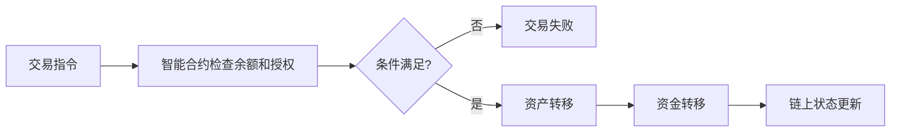

# 50.5 支付、清算、结算与托管的链上重组

来源：Marco Di Maggio, *Blockchain, Crypto and DeFi: Bridging Finance and Technology*, Chapter 1, "Blockchain in 16 Questions" and the Lightning Network discussion；补充参照本笔记第 6 章关于支付体系、第 20 章关于货币市场、第 27 章关于交易和市场微观结构的讨论。

金融市场里的“交易完成”并不只是买卖双方口头同意价格。一个完整交易至少包括几个环节：支付指令发出，交易双方应收应付被确认，资产和资金最终交割，资产被安全托管。对应的术语就是支付、清算、结算和托管。

这些词听起来像后台流程，但它们决定金融系统的安全和效率。许多金融危机并不是因为人们不会报价，而是因为交易后流程、抵押品、清算和资金交割出现问题。区块链进入金融系统，最核心的影响也集中在这些后台基础设施上。

## 支付是账本余额的转移

支付的本质是价值从一个主体转移到另一个主体。在现金支付中，价值通过实物转移完成；在银行支付中，价值通过银行账本和银行间清算系统更新完成；在链上支付中，价值通过地址余额和交易记录更新完成。

传统电子支付看似瞬间完成，但背后可能存在多个层次。消费者扫码付款，商户看到收款提示，并不总是意味着资金已经在最终清偿资产中完成结算。银行、支付机构、清算网络和中央银行支付系统之间，还会有批量清算和最终结算。

区块链支付的特别之处在于，链上资产可以直接从一个地址转到另一个地址。只要交易被网络确认，账本状态就发生变化。这使支付和资产登记更紧密地结合在一起。

但链上支付也有明显限制。以 Bitcoin 为例，主链区块容量有限、出块时间较长，不能像传统零售支付系统那样处理极高频的小额交易。原书讨论 Lightning Network，正是为了解释为什么主链支付能力有限，以及为什么需要第二层网络把大量小额交易放到链下完成。

## 清算是算清楚谁欠谁

清算发生在交易达成之后、最终交割之前。它的任务是确认各方应收应付、净额头寸、保证金要求和风险敞口。传统证券和衍生品市场中，清算机构尤其重要，因为交易双方未必彼此信任，且市场价格会不断变化。

区块链试图通过公开账本和智能合约改变清算流程。如果交易双方都使用链上资产，合约可以自动检查余额、锁定抵押品、计算应付金额并执行转移。这种机制减少了“交易已经成交但后台尚未确认”的时间差。

在 DeFi 中，许多清算过程不是由人工后台完成，而是由智能合约和外部清算人共同完成。借款人抵押率低于阈值时，协议允许清算人偿还债务并获得折价抵押品。这个过程把传统金融中的风险控制规则，转化为链上可执行的条件。

这并不意味着清算风险消失。链上清算依赖价格预言机、区块确认、交易排序、市场流动性和清算人激励。一旦价格剧烈波动或网络拥堵，自动清算也可能失败或产生连锁反应。

## 结算是权利的最终转移

结算强调最终性。交易可以成交，清算可以算清，但只有资产和资金完成最终转移，交易才真正落地。

传统金融中，结算常常存在时间差。股票交易可能 T+1 或 T+2 结算，跨境支付可能经过代理行网络，证券交割和资金交割还需要不同系统协调。时间差带来结算风险：一方已经履行，另一方尚未履行；市场价格变化、违约或操作错误都可能造成损失。

区块链的一个重要承诺，是缩短甚至合并交易和结算过程。若交易资产和支付资产都在同一条链上，智能合约可以实现类似“交割对付款”的机制：资产转移和资金转移要么同时发生，要么同时不发生。

这个过程在链上看起来很直接，但它也有边界。如果交易对象是链下股票、房产、应收账款或商品，链上结算必须依赖法律登记、托管机构或预言机把现实权利映射到链上。没有可靠映射，链上结算只能完成代币转移，不能自动保证现实产权转移。

## 托管从机构控制变成密钥控制

托管是金融系统中最容易被低估的功能。投资者购买证券后，通常不是自己保管纸质股票，而是通过券商、托管行和登记系统持有。基金、养老金、保险公司等机构投资者也需要独立托管来防止资产挪用。

链上资产的托管逻辑不同。谁控制私钥，谁就能控制资产。用户可以自托管，也可以把资产交给中心化交易所、托管商或多签钱包。自托管减少了对中介的依赖，但也意味着用户自己承担私钥丢失、钓鱼攻击、错误授权和地址误转风险。

这形成了三类托管模式：

| 模式 | 控制权 | 优点 | 风险 |
| --- | --- | --- | --- |
| 自托管 | 用户掌握私钥 | 控制权强、无需中介批准 | 私钥丢失或被盗难以补救 |
| 中心化托管 | 交易所或托管商控制私钥 | 使用方便、可提供客服和合规接口 | 托管方挪用、破产、冻结或被攻击 |
| 智能合约托管 | 资产锁定在合约规则中 | 可自动执行交易和清算 | 合约漏洞、治理攻击和预言机风险 |

这张表说明，链上托管不是简单地从“有风险”变成“无风险”，而是在不同主体之间重新分配风险。

## Lightning Network 说明主链和二层的分工

原书用 Lightning Network 讨论 Bitcoin 支付扩展性。Bitcoin 主链安全性强，但吞吐量低、确认慢、费用可能波动。若每杯咖啡都要写入主链，系统很难成为日常支付网络。

Lightning Network 的思路，是让两方先在主链上打开支付通道，把资金锁定在多签结构中。通道打开后，双方可以在链下多次更新余额状态，不必每笔都写入主链。等通道关闭时，再把最终余额提交到主链。

这样，主链承担最终结算和安全锚定，二层网络承担高频小额支付。这类似传统金融中“净额清算”和“最终结算”的分工：大量交易先在系统内净额化，最后只把最终结果交给更高层级的结算系统。

这个类比很有用。区块链并不必然要求所有交易都在最底层主链逐笔处理。随着使用规模扩大，金融系统通常会分层：底层提供安全和最终性，上层提供速度、便宜和用户体验。传统金融如此，区块链金融也很可能如此。

## 小结

支付、清算、结算和托管是金融基础设施的核心。区块链通过共享账本、智能合约和私钥控制，试图把这些环节重新组合：链上支付直接更新地址余额，智能合约自动计算和执行清算规则，链上结算可以在同一系统内同步转移资产和资金，托管则从机构控制部分转向密钥和合约控制。但这些改变不会消除风险，而是带来新的操作风险、预言机风险、合约风险和流动性风险。Lightning Network 说明，区块链金融也需要分层结构：底层主链提供安全和最终性，二层网络提高支付效率。

## 自测问题

1. 支付、清算、结算和托管分别解决什么问题？
2. 区块链为什么可能缩短交易和结算之间的时间差？
3. 链上结算在处理现实世界资产时有什么限制？
4. 自托管、中心化托管和智能合约托管分别有哪些风险？
5. Lightning Network 如何体现主链和二层网络的分工？
