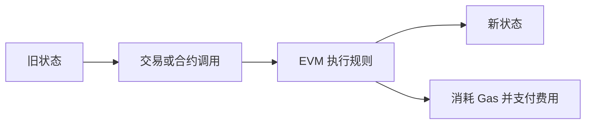

# 52.1 Ethereum 为什么是链上金融的操作系统

来源：Marco Di Maggio, *Blockchain, Crypto and DeFi: Bridging Finance and Technology*, Chapter 2, "Ethereum"；补充参照本笔记第 5 章关于金融系统功能、第 27 章关于交易机制、第 46 章关于交易成本和执行的讨论。

Bitcoin 证明了开放网络可以维护一种去中心化数字货币。Ethereum 想回答另一个问题：如果区块链不只记录货币转移，而是能够运行程序，它会变成什么？

这个问题把区块链从“电子现金账本”推向“可编程金融平台”。Bitcoin 更像一种专门为数字稀缺和支付设计的系统，Ethereum 则更像一个可以运行应用的操作系统。它不只是让用户转移 ETH，而是让开发者部署智能合约，让合约之间相互调用，让去中心化交易所、借贷协议、稳定币、NFT、DAO 和链上衍生品在同一底层状态上运转。

因此，理解 Ethereum 时，不能只把 ETH 看成另一个加密资产。更重要的是理解它作为链上金融基础设施的角色：它提供账户、状态、执行环境、手续费市场和智能合约平台。

## 从电子现金到世界计算机

Bitcoin 的脚本语言有意保持简单。它可以表达多签、时间锁等支付条件，但不鼓励复杂程序。这种设计有安全优势：功能少，攻击面小，系统更专注于稳健维护货币账本。

Ethereum 选择了另一条路。它引入更通用的执行环境，让开发者可以写出复杂合约。合约不只是规定“谁可以花这笔钱”，还可以维护状态、处理用户交互、调用其他合约、发行 token、管理抵押品和自动执行清算。

这就像从计算器走向智能手机。计算器可靠、功能明确，不容易出错；智能手机功能丰富，可以安装各种应用，但也更复杂、更容易出现软件漏洞和生态风险。Bitcoin 和 Ethereum 的差异也类似：前者追求货币层稳健，后者追求可编程性和应用生态。

金融上，这个差异很重要。传统金融不是只有支付。它还包括交易、借贷、清算、托管、衍生品、资产管理和治理。Ethereum 的目标，是让这些功能可以在链上由代码组合出来。

## 状态机视角：区块链记录的不只是余额

原书用“状态转换系统”解释 Bitcoin 和 Ethereum。这个视角很有帮助。

Bitcoin 的状态主要是未花费交易输出。交易引用旧输出，创造新输出。系统关心的是：某个 BTC 是否已经被花掉，新交易是否有有效签名，输入和输出金额是否守恒。

Ethereum 的状态更丰富。它记录每个账户的余额、nonce、合约代码和合约存储。每一笔交易不仅可以转移 ETH，还可以触发合约代码，改变合约内部状态。状态不再只是“谁有多少币”，还包括“某个借贷协议中谁抵押了多少资产”“某个流动性池中两种资产比例是多少”“某个 DAO 投票进行到哪一步”。

这个结构让 Ethereum 成为链上金融的共享计算层。所有应用虽然功能不同，但都在同一套状态和执行环境中更新。这也是 DeFi 可组合性的基础。

## 为什么说它像操作系统

操作系统本身不是某个具体应用，而是为应用提供共同环境。它管理资源，提供接口，执行程序，并让不同应用可以在同一设备上运行。Ethereum 在链上金融中也有类似作用。

它提供几类基础能力：

| 操作系统类比 | Ethereum 对应功能 | 金融含义 |
| --- | --- | --- |
| 用户账户 | 外部账户和私钥 | 用户控制资产和发起交易 |
| 程序运行环境 | EVM 和智能合约 | 金融合约自动执行 |
| 资源定价 | Gas 和手续费市场 | 计算和区块空间有成本 |
| 应用接口 | 合约地址和函数调用 | 协议之间可以组合 |
| 系统状态 | 全局账户和合约存储 | 所有应用共享可验证状态 |

这张表说明，Ethereum 的核心价值不只是转账，而是为链上应用提供共同执行层。稳定币合约、借贷合约、DEX 合约、NFT 合约都能在同一网络上运行，并通过标准接口互相连接。

这种可组合性是传统金融较难实现的。传统金融机构之间有不同数据库、接口、监管边界和营业流程。一个基金份额、一个贷款、一个期权和一个支付账户很难像软件组件一样即时组合。Ethereum 让金融功能更像软件模块，但也因此把软件风险引入金融系统。

## 开放平台带来创新，也带来拥堵

Ethereum 的开放性降低了金融应用开发门槛。开发者不需要获得银行牌照或交易所资格，就可以部署一个合约，让全球用户交互。这推动了 ICO、DeFi、NFT 和 DAO 等应用快速出现。

但开放平台也带来拥堵和风险。所有应用争夺同一条链的区块空间，需求高峰时 Gas 费上升，普通用户可能被挤出。合约一旦部署并吸收资金，代码漏洞可能造成巨大损失。应用之间可组合，也意味着一个协议出问题可能传染到另一个协议。

这和传统金融的监管准入形成鲜明对照。传统金融限制进入，牺牲一部分创新速度，换取审慎监管和消费者保护；Ethereum 降低进入门槛，释放创新和竞争，也把更多风险前置给用户、审计者和市场。

经济学上，这仍然是权衡。低准入提高竞争和实验速度，但可能增加欺诈、信息不对称和系统脆弱性。高准入保护用户，但可能保护既有机构、抬高成本、压制创新。

## ETH 是平台资产，不只是支付币

Ethereum 的原生资产 ETH 有多重功能。用户支付 Gas 需要 ETH，验证者质押需要 ETH，DeFi 中 ETH 常被用作抵押品，投资者也把 ETH 视为对 Ethereum 网络增长的敞口。

这使 ETH 和 BTC 的资产属性不同。BTC 更强调固定供给和非主权价值储藏；ETH 更像平台经济中的基础资产，其价值与网络使用、手续费、质押收益、发行和销毁机制、应用生态相关。

但这也带来估值复杂性。若 Ethereum 网络使用增加，Gas 需求可能增加，更多 ETH 被燃烧，质押收益和网络安全也会变化。但 ETH 持有人是否能捕获应用层价值，还取决于费用结构、扩容方案、Layer 2 分流、竞争链和协议治理。不能简单把“Ethereum 上应用很多”直接等同于“ETH 一定值更多钱”。

## 小结

Ethereum 把区块链从电子现金账本扩展为可编程应用平台。它通过账户、状态、EVM、Gas 和智能合约，让开发者可以在链上部署金融应用，并让不同协议共享同一套可验证状态。它像链上金融的操作系统：不只是处理转账，还运行借贷、交易、稳定币、NFT 和 DAO 等应用。这种开放平台带来创新和可组合性，也带来拥堵、代码风险、信息不对称和监管挑战。ETH 的资产属性也因此不同于 BTC，更接近平台资产和网络使用权的结合。

## 自测问题

1. Ethereum 相比 Bitcoin 的核心扩展是什么？
2. 为什么说 Ethereum 记录的不只是账户余额？
3. Ethereum 像操作系统的类比具体体现在哪些方面？
4. 开放式智能合约平台为什么既促进创新又增加风险？
5. ETH 的资产属性为什么不同于 BTC？
