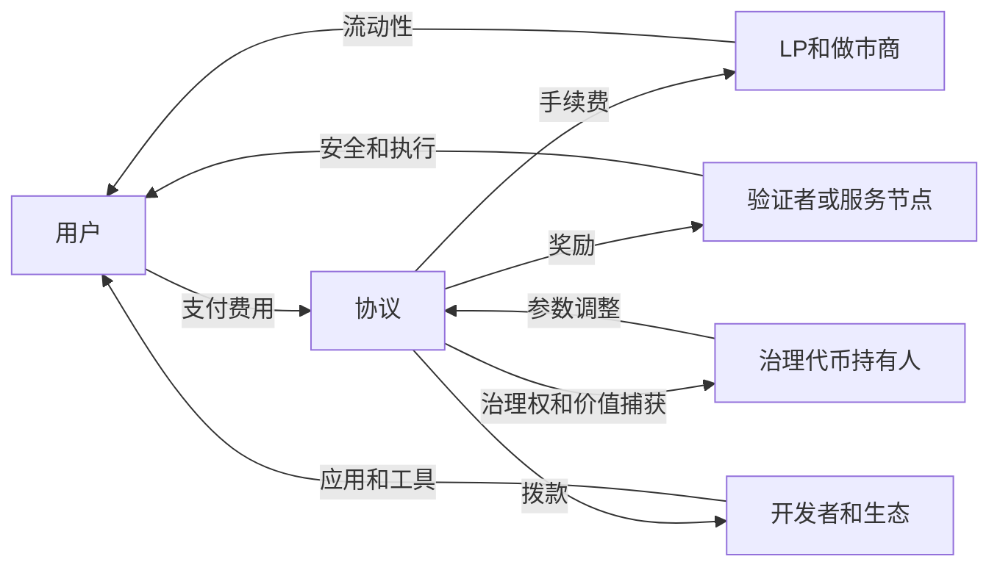

# 57.6 代币经济设计中的博弈论约束

来源：主线参考 Di Maggio《Blockchain, Crypto and DeFi》Ch.2、Ch.6、Ch.9-Ch.10；补充参考本笔记 Ch.2、Ch.10-Ch.13、Ch.24、Ch.31-Ch.33、Ch.52-Ch.56。

Token 经济不是单纯写几条发行规则。它要让许多互不认识的人在没有传统中心化管理者的情况下，愿意提供安全、流动性、治理、数据和资金。每个人都追求自己的收益，系统却希望他们的行为共同维护协议。这里的核心不是技术，而是博弈论：规则必须让个体最优行动尽量接近系统需要的行动。

## 激励相容：让正确行为成为有利选择

激励相容指的是，参与者按照自身利益行动时，也会产生系统想要的结果。PoW 让矿工投入算力获得区块奖励，同时攻击网络需要承担高昂成本；PoS 让验证者质押资产获得奖励，作恶则可能被罚没；预言机让节点提供数据并获得报酬，错误数据可能损失质押或声誉。

这些机制都不是假设参与者“善良”，而是设计收益和惩罚，使诚实行为更划算。经济学中的市场机制也是如此。企业为了利润生产商品，消费者为了效用购买商品，价格体系把分散行为协调起来。区块链协议试图用 token 奖励、罚没、费用和治理规则完成类似协调。

但激励相容不是一句口号。要判断它是否成立，需要比较诚实收益、作恶收益、作恶成本、被发现概率和退出选择。若攻击收益远高于罚没成本，质押就不足以保护系统；若数据节点错误报价不会受罚，预言机就无法可靠；若治理投票者不承担错误决策损失，投票质量会下降。

## 免费搭车：人人受益，但没人愿意付成本

许多协议面对免费搭车问题。安全审计、治理研究、风险监控、公共基础设施和长期开发会让所有 token 持有人受益，但单个持有人未必愿意付费。每个人都希望别人去研究提案、投票、发现漏洞、维护文档，自己坐享结果。

DAO 国库和协议费用可以解决一部分公共品融资问题。协议把收入的一部分用于审计、开发、教育和风险管理，相当于用集体资源购买公共服务。但这又引出治理问题：谁决定预算，如何评价贡献，如何防止浪费和利益输送？

传统政府用税收提供公共品，公司用留存利润支付研发和内控，金融机构用资本和合规部门控制风险。DeFi 协议没有天然税权和管理层，所以必须通过费用、国库和治理机制解决公共品供给不足。

## 囚徒困境：个体理性可能导致集体坏结果

流动性挖矿中常见囚徒困境。单个 LP 看到高奖励会进入池子，奖励下降就撤出；每个人这样做都理性，但系统得到的是流动性忽来忽去，用户体验不稳定。治理投票也类似：每个持有人不投票可以节省时间，但如果大家都不投票，协议就被少数人控制。

稳定币挤兑更是典型。只要用户相信其他人不会赎回，自己持有稳定币也许没问题；一旦怀疑储备不足，每个人都有动机抢先赎回。单个用户提前退出是理性选择，但集体结果可能是系统崩溃。这和银行挤兑、货币危机、回购市场冻结都有相同逻辑。

代币经济设计需要降低坏均衡发生的概率。透明储备、超额抵押、赎回机制、风险准备金、清算激励、时间锁和紧急暂停，都是让系统更难滑向恐慌均衡的工具。

## 女巫攻击和身份约束

链上地址可以低成本创建，这带来女巫攻击问题。若协议按地址发空投、按地址计票、按地址计算活跃用户，参与者可以创建大量地址获取不成比例的收益。现实世界中，一个人开多个银行账户、注册多个公司也可能套利，但法律身份和合规成本会形成约束；链上地址的成本低得多。

解决女巫攻击很难。提高交互门槛会排除真实小用户；使用 KYC 会牺牲开放性和隐私；依赖社交图谱或声誉可能引入新的中心化；按资金量分配又会偏向大户。没有完美方案，只能在公平、隐私、开放和抗攻击之间权衡。

这说明 token 分配不是简单技术问题，而是制度问题。空投规则、治理权重和奖励指标都要考虑参与者如何反向优化规则。

## 多方博弈：用户、LP、验证者、开发者和治理者

一个协议通常不是两方博弈，而是多方博弈。用户希望费用低、体验好、安全高；LP 希望手续费和奖励足以补偿风险；验证者希望奖励覆盖硬件、机会成本和罚没风险；开发者希望获得资金和清晰路线；治理者希望协议增长并维护 token 价值。

这些目标有时一致，有时冲突。降低手续费利好用户，却可能降低 LP 和验证者收入；提高 token 激励利好短期流动性，却稀释长期持有人；打开费用开关利好国库或 token 持有人，却可能赶走交易量。设计者无法让所有目标同时最大化，只能寻找稳定权衡。

可以把协议看成一张激励网络：

这张图的重点不是流程漂亮，而是提醒我们：改变一个参数，会影响多方行为。把 LP 费用降一点，可能影响交易深度；把验证者奖励降一点，可能影响安全预算；把治理权集中一点，可能提高效率但降低信任。

## 稳定机制要经受压力状态检验

很多代币经济设计在牛市中看起来有效，因为价格上涨掩盖了激励缺陷。token 奖励高、TVL 增长、用户活跃、治理参与上升，都可能只是财富效应。真正的检验发生在价格下跌、流动性下降、收益率上升、监管收紧或漏洞事件出现时。

压力状态下，参与者会重新计算收益。LP 会撤出高风险池，借款人会被清算，治理参与者会争夺国库，质押者会考虑退出，用户会寻找更安全入口。如果规则只在乐观状态下成立，系统就会在压力中暴露脆弱性。

投资学中的压力测试、情景分析和风险预算在这里非常有用。分析 token 经济不能只看基准增长假设，还要问：价格下跌 50% 时抵押系统怎样变化？激励减少时 TVL 留下多少？治理被攻击时是否有时间锁？稳定币遭遇赎回时储备是否足够？这些问题比宣传中的年化收益率更重要。

## 小结

代币经济设计的核心是博弈论约束。协议需要让参与者在追求自身收益时提供安全、流动性、治理和公共品。激励相容、免费搭车、囚徒困境、女巫攻击和多方利益冲突，是 token 规则必须面对的问题。好的设计不是承诺高收益，而是在正常和压力状态下都能让系统行为保持稳定。

## 自测问题

- 什么是激励相容？为什么区块链协议不能依赖参与者“自觉善良”？
- 公共品和免费搭车问题在 DAO 治理中怎样出现？
- 稳定币挤兑为什么可以用囚徒困境理解？
- 女巫攻击为什么会影响空投和治理设计？
- 为什么代币经济设计必须做压力状态下的情景分析？
