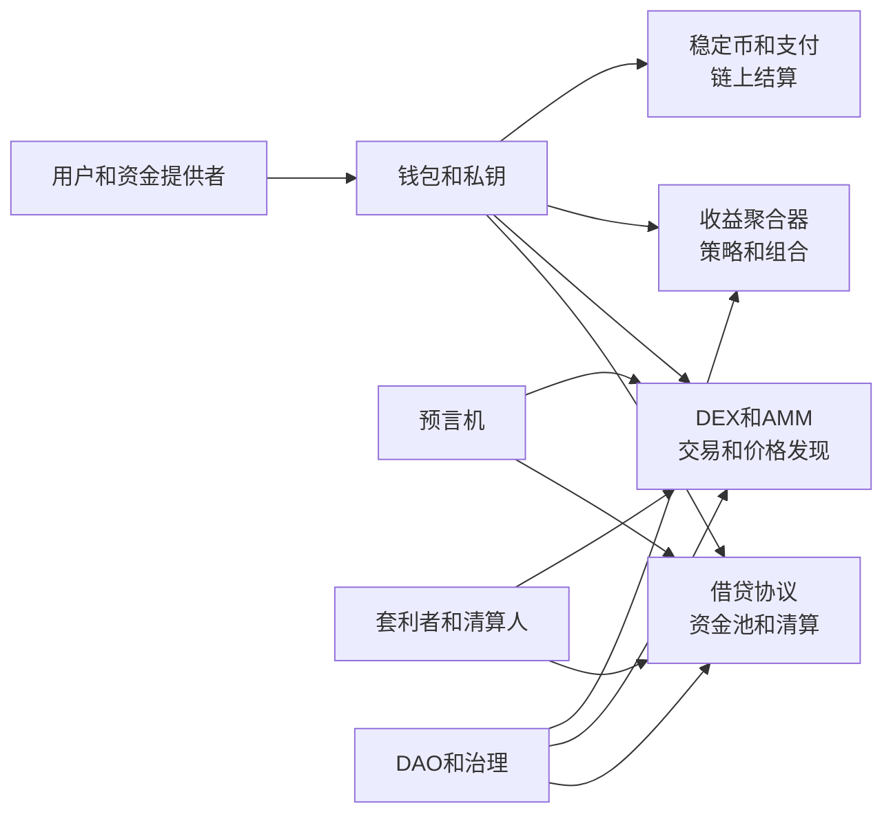

# 58.1 DeFi 如何拆解银行、券商、交易所和基金的功能

来源：主线参考 Di Maggio《Blockchain, Crypto and DeFi》Ch.6；补充参考本笔记 Ch.5、Ch.20-Ch.25、Ch.35、Ch.52-Ch.57。

DeFi 的完整名称是去中心化金融。这个名称容易让人以为它只是“没有金融机构的金融”。更准确的理解是：DeFi 试图把传统金融机构完成的功能拆开，分别交给智能合约、钱包、预言机、流动性池、DAO、清算人和套利者。中介没有消失，而是从公司资产负债表、营业网点和后台系统，转移到一组公开规则和市场参与者之间。

这一区分很重要，因为“去中心化”常常被误解成“没有人承担中介功能”。现实不是这样。借贷仍然需要资金供应者和风险控制，交易仍然需要流动性和价格发现，资产管理仍然需要策略和再平衡，支付仍然需要结算和安全。DeFi 的问题不是这些功能是否还存在，而是它们由谁、以什么激励、在什么风险约束下完成。

## 先回到金融中介为什么存在

第 5 章讲过，金融中介存在不是因为人们喜欢多一个中间环节，而是因为现实金融交易有交易成本、风险分担和信息问题。银行筛选借款人、设计贷款合同、监督还款；券商帮助投资者交易证券、托管资产、提供融资融券；交易所集中订单、形成价格、降低搜索成本；基金把小额资金汇集成组合，提供分散化和专业管理。

DeFi 不是绕过这些问题，而是换一种方式处理这些问题。交易成本由智能合约和标准化 token 接口降低；风险分担由流动性池、抵押品和清算机制完成；信息问题部分通过链上透明数据缓解，但信用信息、身份信息和资产真实性仍然难以完全解决。

因此，评价 DeFi 不能只问“有没有中介”，而要问：原来由金融机构完成的功能，现在由谁完成？成本有没有下降？风险有没有被更好地分配？信息问题是被解决，还是被转移到别处？

## 银行功能：存款、贷款和流动性转换

商业银行最典型的功能是把存款转化为贷款。存款人希望资产安全、可随时取用，借款人希望获得较长期资金。银行在中间进行资产转换：负债端短期、流动，资产端较长期、有信用风险。

DeFi 借贷协议如 Aave、Compound 不像银行那样吸收法定存款并发放信用贷款。它们通常建立资金池：资金供应者把加密资产存入池子，借款人用抵押品借出资产，利率根据资金利用率自动调整。协议不靠信贷员审查工资、企业报表或抵押登记，而是靠超额抵押、预言机价格和自动清算控制风险。

这说明 DeFi 拆解了银行功能。它保留了“资金供应者获得利息、借款人支付利息”的结构，却弱化了传统信用筛选。资金池像一个自动化资产负债表，但没有银行资本、存款保险、央行流动性支持和传统贷款关系。它提高了可访问性和透明度，也限制了无抵押信用扩张能力。

## 券商功能：交易接入、保证金和资产操作

券商在传统市场中提供交易账户、订单路由、融资融券、清算交收和客户资产托管。投资者并不直接接入每一个交易所和结算系统，而是通过券商账户操作。

DeFi 中，钱包承担了部分账户功能。用户用私钥控制地址，用钱包连接协议，通过签名授权交易。DEX、借贷协议、质押协议和收益聚合器则提供类似券商菜单的金融操作：换币、存款、借款、提供流动性、质押、参与治理。

差异在于，DeFi 钱包通常不替用户承担适当性审核、交易纠错、密码重置和客户服务。用户拥有更直接的控制权，也承担更直接的操作风险。签错交易、授权恶意合约、私钥丢失或被钓鱼，损失往往难以追回。传统券商把许多复杂性藏在后台，DeFi 则把控制权和责任一起推给用户。

## 交易所功能：价格发现和交易执行

传统交易所通过订单簿集中买卖意愿。买方挂买单，卖方挂卖单，价格在供需中形成。做市商、经纪商和清算系统保障市场连续性。

DeFi 的 DEX 可以用订单簿，也可以用 AMM。AMM 不要求某个做市商持续报价，而是让流动性池按公式给出价格。用户与池子交易，套利者再把池子价格拉回外部市场。Uniswap 这类协议把交易所、做市和部分清算功能写进合约。

这种设计降低了上市和交易门槛。任何符合标准的 token 都可能创建交易池，全球用户都能连接钱包交易。但门槛降低也带来风险：劣质资产更容易流通，流动性可能很薄，价格容易被操纵，MEV 和抢跑会影响执行质量。DeFi 交易所解决了部分准入和自动化问题，却没有消除市场微观结构问题。

## 基金功能：组合、策略和收益聚合

传统基金把投资者资金集中起来，按照策略购买资产。基金经理负责资产配置、交易执行、风险控制和报告。投资者购买基金份额，获得分散组合和专业管理。

DeFi 中也出现了类似基金功能：收益聚合器把资金在 Aave、Compound、Curve、Uniswap 等协议之间调配；指数类 token 代表一篮子资产；结构化收益产品把风险分层；自动策略合约执行再平衡或收益复投。用户不再逐一操作每个协议，而是把资金交给策略合约或金库。

这同样是中介功能的重组。表面上用户进入的是去中心化协议，实际上他可能依赖策略开发者、DAO 风控、预言机、审计机构和前端界面。基金管理费可能变成协议费用、绩效费或治理 token 激励。风险也从经理人风险，转化为智能合约风险、策略拥挤风险和组合可组合性风险。

## 一张 DeFi 功能地图

这张图说明，DeFi 不是把金融中介全部删掉，而是把中介功能拆成模块。钱包负责身份和授权，协议负责规则执行，预言机负责外部数据，套利者负责价格校准，清算人负责风险处置，DAO 负责参数和资金分配。每个模块都可能降低成本，也都可能成为新的脆弱点。

## 小结

DeFi 的核心不是“没有金融中介”，而是把银行、券商、交易所和基金的功能拆开并重新组合。借贷协议承担部分银行资金池功能，钱包和前端承担部分券商接入功能，DEX 和 AMM 承担交易所与做市功能，收益聚合器承担基金和资产管理功能。金融中介理论仍然适用：真正要评估的是交易成本、风险分担和信息问题是否被更好地处理。

## 自测问题

- 为什么说 DeFi 不是消灭中介，而是重组中介功能？
- Aave、Compound 和商业银行在贷款机制上有什么根本差异？
- 钱包承担了传统券商账户的哪些功能，又缺少哪些保护？
- AMM 如何替代部分交易所和做市功能？
- 收益聚合器为什么可以理解为一种链上资产管理工具？
