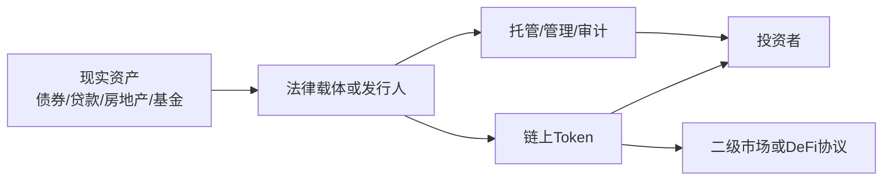

# 64.2 证券型代币、链上基金和现实世界资产

来源：主线参考 Di Maggio《Blockchain, Crypto and DeFi》Ch.9；补充参考本笔记 Ch.21、Ch.22、Ch.24、Ch.33、Ch.35。

当 token 代表债券、基金份额、股票权益、贷款收益权或房地产收益权时，它就很接近证券型资产。此时，问题不只是合约能否转账，还包括证券法、投资者资格、信息披露、托管、转让限制和赎回安排。

## 数字债券：发行、登记和结算的改造

原书提到多个数字债券案例。欧洲投资银行、汇丰、Siemens 等机构都曾尝试使用区块链或分布式账本发行债券。数字债券的目标不是改变债券现金流本质，债券仍然承诺支付利息和本金；改变的是发行、登记、转让和结算流程。

传统债券发行涉及承销、登记、托管、清算和多方对账。数字债券若能把这些信息放入共同账本，就可能减少重复记录和人工对账，提高结算速度，甚至支持同日结算。

但债券风险仍然存在。发行人可能违约，利率上升会压低债券价格，二级市场可能缺乏流动性。数字化不会让信用风险和利率风险消失。

数字债券的另一个意义，是把证券生命周期中的若干动作程序化。发行时可以自动登记持有人，付息时可以按照链上名册分配现金，转让时可以检查投资者资格，赎回时可以同步注销 token。传统市场也能完成这些动作，但通常需要多家机构之间传递数据。分布式账本的目标，是让这些数据在更少对账成本下保持一致。

不过，程序化不等于完全自动化。若发行人资金不足，合约无法凭空支付票息；若债券契约出现争议，仍要依赖法律解释；若监管要求冻结某些持有人账户，链上系统还要与合规流程配合。因此，数字债券更像证券后台的升级，而不是债券经济本质的改变。

## 链上基金份额

基金份额代币化是另一个重要方向。基金本来就有份额、净值、申购赎回和投资组合。把基金份额表示为 token，可以让持有人在链上转让、查询份额和参与某些自动化流程。

链上基金仍需要 NAV 计算。第 24 章讲过，NAV 决定申购和赎回的公平价格。如果底层资产是股票、债券或私募资产，估值仍需要市场价格、模型、会计和审计。token 只能记录份额，不能自动解决底层资产估值问题。

链上基金还要处理投资者资格和转让限制。某些基金只允许合格投资者购买，某些司法辖区限制跨境销售。智能合约可以把白名单和转让规则写入 token，但规则本身来自法律制度。

链上基金也可能改变投资者使用基金的方式。货币市场基金 token 可以被机构当作链上现金管理工具，国债基金 token 可以成为 DeFi 借贷中的抵押品，私募基金 token 可以在合规二级市场上更方便地转让。这里的重点不是基金突然变成新资产，而是基金份额从“只能在基金登记系统里移动”变成“可以嵌入其他金融流程的数字凭证”。

这会带来新的风险管理问题。若一个基金 token 被多个协议用作抵押品，NAV 更新、赎回暂停、转让限制和合规冻结都会影响下游协议。传统基金的风险主要在基金内部传导；链上基金一旦可组合，风险就可能沿着抵押和清算链条扩散。

## 房地产和私募资产

房地产、私募股权和基础设施常被认为适合代币化，因为它们交易单位大、流动性差、转让流程慢。若一个房地产项目可以被拆成小额 token，更多投资者理论上可以参与，开发商也可能更快融资。

原书中的 Fluidity 房地产案例展示了这种愿景，也提示了困难。房地产投资不只是把产权切成小份，还涉及抵押、租金、维护、税收、法律登记、投资者保护和退出市场。若项目缺少足够抵押或现金流保障，代币化投资者承担的风险可能高于传统银行贷款。

私募基金代币化同样如此。把基金份额变成 token 可以改善转让便利，但私募投资仍有长期锁定、估值不透明、经理能力和底层公司风险。流动性改善不能凭空创造底层资产价值。

房地产和私募资产还有一个共同特征：价格发现本来就困难。上市股票每天有大量成交，市场价格连续更新；一栋商业地产或一家未上市公司可能几个月甚至几年才有一次可比交易。token 交易如果很薄，链上价格未必比传统估值更准确。相反，少量投机成交还可能制造虚假的价格信号。

所以这类资产代币化时，投资者要同时看两条价格线：一条是链上二级市场报价，另一条是由评估、审计或基金管理人给出的净值。两者差距越大，越要追问流动性、赎回和信息披露是否足够。

## 现实世界资产的共同结构

RWA token 通常包含几层结构：资产发起人、特殊目的载体或基金、托管或管理人、链上 token、投资者、合规服务商和二级市场。每一层都可能产生风险。

这张图说明，token 持有人最终依赖的不只是链上合约，还依赖发行人、法律载体、托管和审计。

## 小结

证券型代币和链上基金把传统债券、基金份额、房地产权益和私募资产权利表示为 token。它们可能改善发行、登记、转让和结算效率，但底层资产风险仍然存在。数字债券仍有信用和利率风险，链上基金仍需 NAV 和投资者资格管理，房地产和私募资产仍有估值、法律和经营风险。RWA token 的价值取决于链上凭证和链下权利结构能否可靠对应。

## 自测问题

- 数字债券改变的是债券的哪一部分流程，而不是哪一部分本质？
- 链上基金为什么仍然需要 NAV 计算？
- 房地产代币化为什么不只是把产权拆小？
- RWA token 通常涉及哪些链下角色？
- 为什么证券型 token 必须考虑投资者资格和转让限制？
